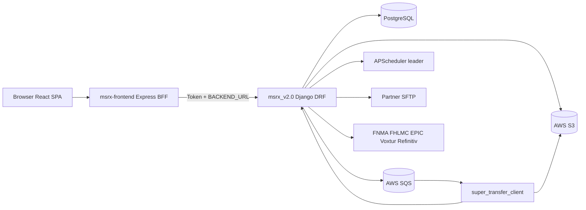
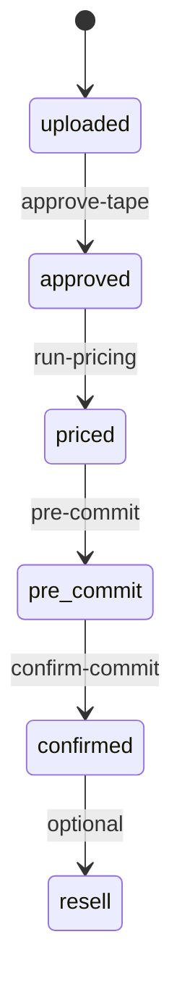
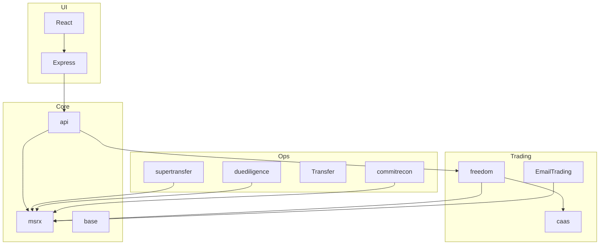
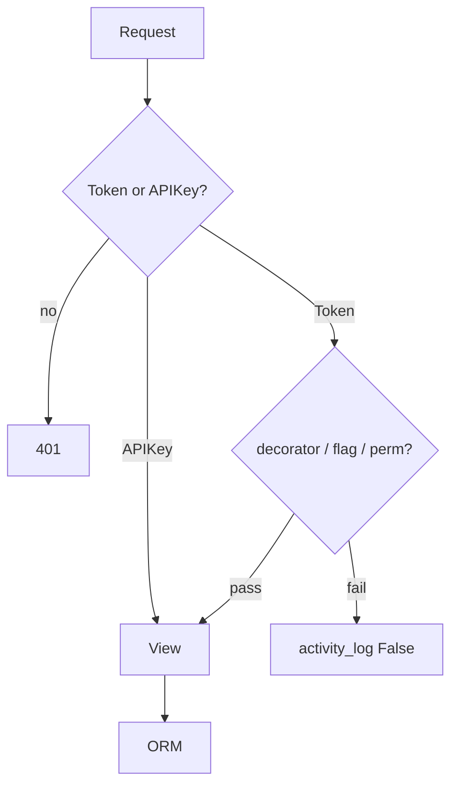

# MSRX / Blue Water — Complete Enterprise Reverse Engineering

**Scope:** Repository `d:\BLUE-WATER`  
**Proven stacks:** `msrx_v2.0` (Django/DRF), `msrx-frontend` (Express BFF + React/Redux), `super_transfer_client` (SQS/S3 OCR worker)  
**Evidence rule:** Every claim below cites repository artifacts. Anything not proven is marked **Unknown — not confirmed by the repository.**

**Related deep dives (already produced):**
- [Architecture onboarding canvas](C:\Users\AbhishekGajera\.cursor\projects\d-BLUE-WATER\canvases\msrx-architecture-onboarding.canvas.tsx)
- [Runtime call graphs](C:\Users\AbhishekGajera\.cursor\projects\d-BLUE-WATER\canvases\runtime-reverse-engineering.canvas.tsx)
- [Workflow engines](C:\Users\AbhishekGajera\.cursor\projects\d-BLUE-WATER\canvases\workflow-engines-reverse-engineering.canvas.tsx)
- [Business rules inventory](C:\Users\AbhishekGajera\.cursor\projects\d-BLUE-WATER\canvases\business-rules-inventory.canvas.tsx)
- [Background processes](C:\Users\AbhishekGajera\.cursor\projects\d-BLUE-WATER\canvases\background-processes.canvas.tsx)
- [Pricing engine](C:\Users\AbhishekGajera\.cursor\projects\d-BLUE-WATER\canvases\pricing-engine-reverse-engineering.canvas.tsx)
- [Database query audit](C:\Users\AbhishekGajera\.cursor\projects\d-BLUE-WATER\canvases\database-query-audit.canvas.tsx)
- Knowledge: `docs/knowledge/01_Project_Architecture.md`, `05_Database.md`, `09_Pricing_Engine.md`, `10_Workflow_Engine.md`, `16_Security_Audit.md`, `17_Performance_Audit.md`, `18_Business_Rules.md`, `Background_job.md`

**Citation schema used throughout:**

| Field | Meaning |
|-------|---------|
| Source file | Path under repo |
| Function / Class / Model | Named symbol |
| Line | Proven line where present |
| Database table | Django default `{app}_{model}` unless `Meta.db_table` overrides (overrides often **Unknown — not confirmed by the repository** without reading every Meta) |
| Related APIs | URL mount + view |
| Related React | `viewMaps.js` key / component |
| Related workflows / business rules | Named engines / status gates |

---

## 0. System identity (proven)

| Layer | Source | Why it exists |
|-------|--------|---------------|
| React class SPA + Redux | `msrx-frontend/client/src/` | Operator UI for MSR coissue, Freedom whole-loan, DD, SuperTransfer, analytics |
| Express BFF | `msrx-frontend/server/index.js` | CSRF cookies, JWT cookie bridge, proxy to Django, S3 helpers, title toolbox |
| Django multi-app API | `msrx_v2.0/ebdjango/` | Domain services, ORM, schedulers, partner integrations |
| ST worker | `super_transfer_client/scripts/main.py` | Long-running SQS consumer for loan/doc extraction outside web request timeouts |

**Not present (confirmed absent):** Celery, Redis cache backend, RabbitMQ. Cache is `LocMemCache` (`ebdjango/settings/shared.py:257-262`). Background work is APScheduler + SQS + request threads.

---

## 1. Why every module exists

Root URL mounts: `msrx_v2.0/ebdjango/urls.py:24-44`.  
`INSTALLED_APPS`: `msrx_v2.0/ebdjango/settings/shared.py:95-134`.

| Module | INSTALLED_APPS entry | Mount | Why it exists | Source |
|--------|---------------------|-------|---------------|--------|
| **ebdjango** | project | `/` | Django project shell, settings per `MSRX_ENV`, WSGI leader election | `ebdjango/settings/__init__.py`, `ebdjango/urls.py` |
| **msrx** | `msrx.apps.MsrxConfig` | `""` via `msrx.urls` | Core identity: users, platforms, side panels, PSA, market, coissue/seasoned tape domain models shared by pricing | `msrx/models/*` |
| **api** | `api.apps.ApiConfig` | `msrx/api/` | MSR Coissue/Seasoned HTTP surface: login, grids, upload/price/commit, aggregator admin | `api/urls/index.py` |
| **freedom** | `freedom.apps.FreedomConfig` | `freedom/` | Whole-loan BestEx pricing, rate sheets, LLPA/rules, pools/optimization, commit/pre-close | `freedom/urls.py`, `freedom/models/*` |
| **duediligence** | `duediligence.apps.DuediligenceConfig` | `duediligence/` | Loan file QC: documents, fields, QC rules, portfolios/deals, Bedrock/SFTP delivery | `duediligence/urls.py` |
| **supertransfer** | `supertransfer.apps.SupertransferConfig` | `supertransfer/` | Servicing transfer: missing docs, QC exceptions, boarding file + document SFTP delivery | `supertransfer/urls.py`, `support_super_transfer.py` |
| **Transfer** | `Transfer.apps.TransferConfig` | `transfer/` | Investor Connect / EM transfer resources, FTP dirs, roundpoint loan numbers | `Transfer/urls.py`, `Transfer/models.py` |
| **caas** | `caas.apps.CaasConfig` | `caas/` | Configurable post-commit workflows (CSV/SQL/email/SFTP) + loan builder forms | `caas/urls.py`, `caas/engine/workflow.py` |
| **commitrecon** | `commitrecon.apps.CommitreconConfig` | `recon/` | Aggregator purchase-advice / boarding reconciliation | `commitrecon/urls.py` |
| **analytics** | `analytics.apps.AnalyticsConfig` | `analytics/` | Trial balances, agency cash window, poly assumptions, LLPA analytics | `analytics/urls.py` |
| **EmailTrading** | `EmailTrading.apps.EmailtradingConfig` | `email/` | Outlook mailbox monitoring for trade emails | `EmailTrading/supporting/refresh.py` |
| **tapecrack** | `tapecrack.apps.TapecrackConfig` | `tapecrack/` | Seller tape column mapping / SQL crack / validation enums | `tapecrack/urls.py` |
| **TapeManager** | `TapeManager.apps.TapemanagerConfig` | `""` | Tape cracking log / legacy tape tools | `TapeManager/urls.py` |
| **secondlien** | `secondlien.apps.SecondlienConfig` | `secondlien/` | Second-lien client tape ingest + report delivery | `secondlien/urls.py` |
| **voxtur** | `voxtur.apps.VoxturConfig` | `voxtur/` | Title InfoEx + AOL “what you could have saved” pricing | `voxtur/urls.py`, `voxtur/README.md` |
| **benutech** | `benutech.apps.BenutechConfig` | `benutech/` | Property summary / report vendor integration | `benutech/urls.py` |
| **terms** | `terms` | `terms/` | Terms of use + privacy acknowledgement per role/platform | `terms/urls.py` |
| **middleware** | `middleware.apps.MiddlewareConfig` | `msrx/middleware/` | DPX model-fit middleware grids (admin) | `middleware/urls.py` |
| **bw_middleware** | `bw_middleware.apps.BwMiddlewareConfig` | (middleware only) | Security response headers (CSP, nosniff) | `bw_middleware/middleware/*` |
| **base** | `base.apps.BaseConfig` | — | Shared activity log model, permission decorators, encryption/`get_env_var` | `base/models.py`, `base/decorators/user_level_decorators.py` |
| **rp** | `rp.apps.RpConfig` | — | RoundPoint boarding staging table model used by recon/boarding | `rp/models.py` |
| **CRA** | **commented out** in INSTALLED_APPS (`shared.py:101`) but `CRA.urls` still included | `""` via CRA | Freddie CRA data fetch/reporting jobs still referenced from LIVE scheduler | `CRA/urls.py`; apps registration: **partially disabled** |
| **django.contrib.*** | auth, admin, sessions, sites, static | `/admin/` | Platform auth, admin UI, sessions | Django defaults |
| **rest_framework / authtoken / dj_rest_auth / allauth / rest_framework_api_key** | DRF stack | various | Token auth, login, API keys for machine callers | `shared.py:123-129` |
| **django_apscheduler** | job store | — | Persist APScheduler jobs in DB | `shared.py:130` |
| **super_transfer_client** | separate package | N/A | EC2 worker: SQS → OCR/classification → MSRX APIs | `super_transfer_client/scripts/` |

### Frontend “modules” (Redux + panels)

| Area | Source | Why |
|------|--------|-----|
| Auth / public | `componentsPublic/login.js`, `forgotPassword.js`, `resetPassword.js` | Credential entry before token session |
| Navigation | `panels/sidePanel.js`, `viewMaps.js`, `mainPanel.js` | DB-driven `side_panel_items` → Redux `view` → screen map (not React Router pages for authenticated app) |
| MSR Wizard | `components/workflowWizard/*`, `workflowSteps/*` | Coissue BestEx upload→approve→price→commit |
| Freedom | `components/freedom/**` | Whole-loan pricing/tape/investor/EOD |
| Due Diligence | `components/dueDiligence/**` | QC UI |
| SuperTransfer | `components/superTransfer/**` | Missing docs / delivery |
| Aggregator | `components/aggregator/**` | Seller management, pipelines, PAR |
| Whole loan post/pre close | `components/wholeLoan/**` | Commit pipeline, PA, scenarios |
| CAAS loan builder | `components/caas/loanBuilder/**` | Dynamic loan forms |
| Title toolbox | `components/titleToolbox/**` | Benutech/Voxtur title ordering |
| Express routes | `server/routes/*.js` | BFF proxies (`auth.js`, `msrxRoutes`, title toolbox, S3) |

---

## 2. Why every database table exists

Django maps models → tables. Below: **every Model class found under `msrx_v2.0`** (excluding migrations). Abstract bases may not create tables.

### 2.1 `msrx` — identity & MSR coissue/seasoned

| Model | File:Line | Why table exists | Key FKs | Related APIs | Related React |
|-------|-----------|------------------|---------|--------------|---------------|
| `MSRX_User` | `msrx/models/user.py:30` | Canonical counterparty (buyer/seller/investor/aggregator) + flags, agency seller numbers, Freedom HAF/branch/price_class | `user`→auth.User; `haf`,`branch`,`price_class`; `platform`; `qc_company`; self FKs `correspondent`,`srp_provider`; M2M `linked_buyers` | `/msrx/api/msrx_user/`, aggregator seller APIs | Almost all screens (session user) |
| `MSRX_User_additional` | `user.py:159` | Link secondary Django logins to primary aggregator MSRX user | `django_user`,`msrx_user` | Aggregator user mgmt | `showUserManagement` |
| `Client_Aggregator_Seller` | `user.py:173` | Aggregator↔seller relationship + seller-info permissions | — | `/msrx/api/aggregator/seller/*` | `showAggSellerManagement` |
| `Client_Aggregator_Seller_Login` | `user.py:206` | Login accounts for aggregator sellers | `seller`,`user` | aggregator create/view_login | same |
| `AggregatorStore` | `user.py:222` | Document store scoped to aggregator | `aggregator`, M2M sellers | aggregator_store_details | `showAggregatorDocumentStore` |
| `Linked_Buyers` | `user.py:232` | Through table for buyer/aggregator linking | `root`,`linked`,`aggregator` | pricing counterparty resolution | Freedom/pricing |
| `User_Activity_Log` | `user.py:17` | Per-user action audit (legacy/activity_log helper) | `user` | activity_log util | — |
| `Client_Coissue_Seller` | `coissue.py:10` | Coissue **tape header** + status machine | `client`,`correspondent`,`psa_deal`,`pricer` | upload/approve/price/commit APIs | `showWizard`, `showPriceManagement` |
| `Client_Coissue_Tape` | `coissue.py:35` | Coissue **loan rows** | `tapeinfo`,`transfer`,`commit_cycle`,`psa_deal` | tape_details ViewSet | wizard steps / tape details |
| `Client_Coissue_Seller_Resell` / `_Tape_Resell` | `coissue.py:116+` | Resell after confirmed | orig tape FKs | resell APIs | pipeline |
| `*_Deleted` / `Tape_Updated` | `coissue.py:213+` | Soft-delete / loan update history | orig FKs, PA summary FKs | recon/update flows | `showUpdateLoanDetails` |
| `Client_Coissue_Buyer` | `coissue.py:393` | Buyer pricing **grid** definition | `client` | `/msrx/api/buyer_grid/`, `grid/` | `showGridEditor`, `showNewPricing` |
| `Client_Coissue_Buyer_Criteria` | `coissue.py:415` | Eligibility criteria buyer↔seller | `buyer`,`seller` | pricing eligibility | wizard buyer select |
| `Client_Coissue_Buyer_Middleware` | `coissue.py:425` | Buyer middleware/DPX config | `client`,`task`→Background_Task | middleware_v2 | grid/middleware screens |
| `Client_Coissue_Buyer_Par` | `coissue.py:461` | Buyer PAR coupons | `client` | `buyer_par/`, par-rates | `showParRate*` |
| `whole_loan_tape` | `whole_loan.py:10` | Bridge coissue seller to WL tape | `tapeinfo` | WL flows | Freedom/WL |
| Seasoned suite (`Client_Seasoned_*`) | `seasoned.py` | Parallel coissue domain for seasoned MSR | same pattern as coissue | seasoned aggregator APIs | `showSeasoned*` |
| `PriceTestTape/Loan`, `TestPricing` | `test_price.py` | Sandbox pricing tests | client/loan/buyer FKs | test pricing endpoints | Unknown UI — not confirmed |
| `Market`, `MarketTempRTO` | `market.py` | Market rates for pricing | — | `/msrx/api/market/` | pricing |
| `PSADeals`, `PSATerms` | `psa.py` | Purchase & sale agreements | seller/buyer/platform | PSA admin | commitment |
| `PlatformConfiguration` | `platform.py:10` | Multi-tenant branding + email inboxes | email monitor FKs | `msrx_platform_config` | login branding |
| `SidePanels` | `platform.py:34` | Nav menu definitions by role | `platformconfig` | loaded into user `side_panel_items` | `sidePanel.js` |
| `FrontendComponents`, `FrontendComponentConfigs` | `platform.py:47+` | Feature flags / component config per user/platform | component, platform, msrx_user, auth_user | platform config APIs | conditional UI |
| `Background_Task` | `misc.py:15` | Tracks long pricing/middleware jobs | — | polled by UI | wizard status polls |
| `Client_Commit_Cycle` | `misc.py:27` | Groups commits buyer↔seller | buyer, seller | commit APIs | pipeline |
| `OneTimePasscode` | `misc.py:40` | OTP for sensitive ops | `client`→User | auth flows | login/reset |
| `SifmaSettlementDates` | `misc.py:45` | Settlement calendar | — | settlement APIs | Freedom settlement |
| `LeaderElection` | `misc.py:58` | Single APScheduler leader across instances | — | `leader_election_process` | — |
| `SFTPConfig` | `misc.py:63` | Per-user SFTP endpoints | `msrx_user` | delivery | ST/DD |
| `EnvironmentVariable` | `misc.py:76` | Encrypted secrets fallback when settings empty | — | `get_env_var` | — |
| `SingleFamilyCode` | `misc.py:86` | FNMA/FHLMC product codes lookup | — | seeded by `seed` | pricing agency |
| Email models | `email.py` | Subject templates, monitor admins, internal notice recipients | — | email jobs | `showEmailmonitorStatus` |
| Boarding staging | `boarding_staging.py` | Post-close boarding snapshot of loans | buyer/seller, coissue loan, freedom Loan, QC loan | supertransfer boarding, pre-close | boarding screens |
| Buyer axe / par history / exceptions | `buyer.py` | Buyer appetite & history | buyer FKs | buyer config APIs | axe/exception UI |

### 2.2 `freedom` — whole loan BestEx

| Model | File | Why |
|-------|------|-----|
| `Tape` | `freedom/models/tapes.py:16` | WL tape header + status; root/leaf for splits | 
| `Loan` (`WholeLoan`) | `tapes.py:106` | Loan attributes priced/committed |
| `WholeLoanPrice` | `tapes.py:565` | Per-buyer price result; `selected` winner |
| `WholeLoanCommit` | `tapes.py:602` | Commit record; M2M PSA |
| `TapeDeleteLog`, `MassUploadFileTracker`, `MetaProductMap`, `MetaProductPriceHistory` | tapes.py | Audit, mass upload, product spreads |
| `WorkFlow`, `PricingUpload` | `config.py` | Ordered pricing pipeline steps per client |
| Rate sheets / LLPA / Spec / Subsidy / EFC / Override / etc. | `pricing.py`, `rules_based.py`, `base.py` | Data-driven pricing engines |
| `HedgeAdvisoryFund`, `Branch`, `PriceClass`, `Margin` | `users.py` | Seller org structure for pricing tiers |
| `Counterparty` | `msrx.py` | Freedom counterparty map |
| `Pool`, `Constraint` | `pools.py` | Pool allocation optimization |
| Optimization snapshots | `optimization.py` | Reallocation event history |
| Reports | `reports.py` | Report templates/sheets |
| Incoming mapping | `incoming_mapping.py` | Normalize inbound tape fields |
| `RefinitivCreds`, `FnmaUpdateSettings`, `CRAInfo`, `CostBasis`, `FieldEnum*`, logs | supporting | External creds, CRA, enums, process logs |

### 2.3 `duediligence`

| Cluster | Models | Why |
|---------|--------|-----|
| Groupings | Portfolio, Deal, Company, ClientCompanies | Organize loans by client/deal |
| Loan/docs | Loan, Document*, File, DocumentType*, Priority* | Store extracted/uploaded loan file artifacts |
| Data | Field*, Value, CalculatedField* | Data dictionary + extracted values |
| QC | QCRule*, QualityControl, Ratings, UserDefined*, ArgumentTemplate, QCCategory/Operation | Configurable QC engine |
| Delivery | LoanDelivery*, BoardingFile* | Scheduled SFTP of loans/boarding |
| Status/PA | StatusTimestamp, StatusEmail, PurchaseAdvice | Status machine + PA requirement |
| Tracker | Loan_location, Loan_progress_status | External loan tracking API |
| Misc | Comment, QCLog, Program* | Collaboration + program doc rules |

### 2.4 `supertransfer`

| Model | Why |
|-------|-----|
| `Loan`, `MissingFile` | Track loans in transfer + missing required docs |
| `Logs`, `Comment` | Operational audit |
| `BuyerSFTP`, `BoardingFileRules` | Cron schedule + credentials for delivery |
| `RequiredDocuments`, `QualityControl`, `QCRuleSettings` | Doc requirements + ST QC (~210 named checks in code) |
| Epic*Mapping, LoanStatusMapping, ReclassificationLog | EPIC LOS integration / remapping |

### 2.5 Other apps (compact)

| App | Models | Why |
|-----|--------|-----|
| `caas` | Workflow*, WorkflowJob/Step/CSV/SQL/Email/SFTP, WorkflowLog; LoanForm/Field*; BaseLoan* | Configurable outbound workflows + dynamic loan forms + loan snapshots |
| `Transfer` | EMResource, EMAPILog, EMUserMapping, TransferConfig, RoundpointLoanNumbers, FtpDirectory | Investor Connect transfer orchestration |
| `commitrecon` | RP_Boarding_Reconciliation_Tape, PA_Summary, AgencyPurchaseLoanNumber | PA vs boarding recon |
| `analytics` | TrialBalance*, AgencyCashWindow, YearlyLLPA, Poly*Assumption, StrMatchLog, APIProduct | Servicing oversight analytics |
| `EmailTrading` | MonitoredMailbox, EmailTrading_Log, DowntimeRecord, EmailSchedulerConfig | Mailbox poll config + logs |
| `secondlien` | ClientTape/Loan/SFTP/Email, OutgoingReport | 2nd lien ingest/report |
| `tapecrack` | TapeCrack, FieldCrackConfig, ValidationSQL, BWField, BWEnum | Crack configs + validation dictionary |
| `terms` | Terms_Conditions, User_Acceptance, PrivacyPolicy, PolicyAcknowledgement | Legal acceptance |
| `voxtur` | InfoEx*, APIKeyToView, AOLPricing* | Title + AOL pricing tables |
| `benutech` | PropertySummary, Report | Property vendor data |
| `TapeManager` | Tape_Cracking_Log | Crack audit |
| `base` | APIActivityLog | Every API request audit (middleware) |
| `rp` | boarding_staging_table | RP boarding staging |
| `django_apscheduler` | DjangoJob, DjangoJobExecution | Scheduler persistence (package tables) |
| auth/authtoken/api_key/allauth/sites | Django tables | Users, tokens, API keys, sites |

---

## 3. Why every foreign key exists

FKs exist to enforce domain integrity across counterparties, tapes→loans, prices→commits, and multi-tenant scoping. Patterns proven in code:

| Pattern | Example | Why | Source |
|---------|---------|-----|--------|
| Auth bridge | `MSRX_User.user` → `auth.User` | Login identity ↔ business counterparty | `user.py:49` |
| Tape ownership | `Client_Coissue_Seller.client` → `MSRX_User` | Seller owns tape | `coissue.py:11` |
| Loan→tape | `Client_Coissue_Tape.tapeinfo` → Seller | Loan belongs to tape | `coissue.py:41` |
| Commit grouping | loan.`commit_cycle` → `Client_Commit_Cycle` | Batches commits | `coissue.py:106` |
| Transfer link | loan.`transfer` → `EMResource` | Ties commit to Investor Connect resource | `coissue.py:89` |
| Freedom price | `WholeLoanPrice.loan` + `.buyer` | Price is per loan per buyer | `tapes.py:572-576` |
| Freedom commit | `WholeLoanCommit.loan` + `.buyer` | Commit winner | `tapes.py:609-610` |
| Tape hierarchy | `Tape.root` → self | Split/reprice leaf tapes | `tapes.py:29` |
| Pricing org | `MSRX_User.haf/branch/price_class` | Seller pricing topology | `user.py:110-116` |
| Platform tenancy | `MSRX_User.platform` | Branding/terms/email | `user.py:151` |
| DD scoping | Document/Value → Loan → Deal → Portfolio | File hierarchy | `duediligence/models/*` |
| QC results | `QualityControl` → Loan + Rule | Persist rule hits | DD checks models |
| CAAS job | `WorkflowJob.workflow` / `WorkflowLog.job` | Schedule + audit | `caas/.../workflow.py` |
| ST delivery | `BuyerSFTP` schedules reference buyer | SFTP cron per buyer | `supertransfer/models.py` |
| Aliased audit | `APIActivityLog.user` + `aliased_user` | Impersonation audit | `base/middleware/middleware.py:70-75` |
| Terms acceptance | `User_Acceptance` → terms + user | Legal proof | `terms/models.py` |

**On-delete semantics:** Cascade used heavily for owned children (loan under tape); `PROTECT` on commit_cycle and some CAAS/workflow refs to prevent orphaning financial history (`coissue.py:106`, CAAS workflow FKs).

---

## 4. Why every API exists

### 4.1 Mount map (`ebdjango/urls.py`)

| Prefix | App | Purpose |
|--------|-----|---------|
| `/admin/` | Django admin | Ops CRUD |
| `/msrx/api/` | api | MSR coissue/seasoned + auth + aggregator |
| `/freedom/` | freedom | Whole-loan BestEx |
| `/duediligence/` | duediligence | QC (~120 path entries) |
| `/supertransfer/` | supertransfer | Transfer QC/delivery |
| `/transfer/` | Transfer | Investor Connect |
| `/recon/` | commitrecon | PA recon |
| `/analytics/` | analytics | Trial balance / cash / poly |
| `/voxtur/` | voxtur | Title/AOL |
| `/benutech/` | benutech | Property |
| `/tapecrack/` | tapecrack | Crack SQL |
| `/secondlien/` | secondlien | 2nd lien |
| `/caas/` | caas | Workflows/loan builder |
| `/terms/` | terms | Legal |
| `/email/` | EmailTrading | Monitor control |
| `/msrx/middleware/` | middleware | DPX admin |
| CRA / TapeManager / msrx.urls | misc | CRA + tape manager + msrx extras |

### 4.2 Representative API clusters (not every path duplicated — full path() count ≈ 397 across `urls*.py`)

**Auth (`api/urls/index.py:20-35`)**  
- `rest-auth/login/`, `login/`, `logout/`, `user_change_pw/`, `acknowledged_agreement/` — establish token session, password, T&C flag.

**MSR Coissue pricing (`api` + ViewSets)**  
- `seller_tape_summary`, `tape_details`, `buyer_grid`, upload/approve/price/commit endpoints (see Express `msrxRoutes` ↔ Django) — implement wizard status machine `uploaded→approved→priced→pre-commit→confirmed`.

**Freedom (`freedom/urls.py`)**  
- `price-tape/`, `reprice-tape/`, `commit-tape/`, ratesheets, exclusions, pools, optimization, pre-close, EOD — whole-loan lifecycle.

**Due Diligence (`duediligence/urls.py`)**  
- CRUD for fields/docs/programs/QC; `st*` SuperTransfer-facing variants; `api_*` external API-key routes; Bedrock/XML generation.

**SuperTransfer (`supertransfer/urls.py`)**  
- exceptions, missing docs, boarding generation, document delivery, SFTP schedule restart.

**Machine APIs** use `HasAPIKey` (`rest_framework_api_key`) e.g. ST exceptions, Voxtur InfoEx, DD tracker (`permission_classes = (HasAPIKey,)`).

Express BFF maps browser calls under `/msrx/*` → Django (`msrx-frontend/server/`). Exact route table: **see server route files**; individual mapping for every button is in [runtime canvas](C:\Users\AbhishekGajera\.cursor\projects\d-BLUE-WATER\canvases\runtime-reverse-engineering.canvas.tsx).

---

## 5. Why every screen exists

Authenticated screens are **Redux view keys**, not URL routes. Catalog: `msrx-frontend/client/src/panels/viewMaps.js:91-273` (**141** `show*` keys).

| Screen key | Component | Why it exists | Typical APIs |
|------------|-----------|---------------|--------------|
| `showWizard` | `NewWorkflow` / workflowSteps | MSR coissue BestEx wizard | upload/approve/price/commit |
| `showMsrxWizard` | `MsrxViewerFlow` | Read-only/viewer wizard (no commit) | same minus commit |
| `showPriceManagement` | `PricingManagement` | Entry to wizard / active tapes | tape summary |
| `showFreedomTapeManager` | `TapeManager` | Freedom tape list/actions | `/freedom/` tape APIs |
| `showPricingManager` | `PricingManager` | Rate sheet / LLPA admin tree | ratesheet, rules |
| `showInvestorPricing` | InvestorPricing | Investor-specific pricing tree | investor-pricing-tree |
| `showPriceHopper` | PriceHopper | Bulk price hopper | price-hopper |
| `showPoolManagement` / `showConstraintManager` | pools | Pool allocation | pools/constraints |
| `showOptimizationPipeline` | OptimizationPipeline | Reallocation events | optimization-* |
| `showLoanPipeline` / `showWholeLoanCommitmentPipeline` / `showLoanScenario` | PreClose | Pre/post close loan ops | pre-close, post-close |
| `showWLPurchaseAdvice` | WLPurchaseAdvice | Generate PA | generate-purchase-advice-data |
| `showDuediligence*` / `showComplianceReview` / `showCreateQcRule` etc. | dueDiligenceComponents | Full QC admin + review | `/duediligence/*` |
| `showMissingDocuments` / `showSuperTransferDropZone` / `showBulkDocumentDelivery` | SuperTransfer | Transfer ops | `/supertransfer/*` |
| `showExceptionManagement` / Batch / Details | QualityControl | Exception remediation | exceptions_check |
| `showAggregatorHome` / Pipe / SellerManagement / UserManagement / ParRate* / DocumentStore | aggregator | Aggregator ops | `/msrx/api/aggregator/*` |
| `showAggRecon*` / PurchaseAdvices / RepriceLoans | aggRecon | PA recon | `/recon/` |
| `showSecondLienCommit` / TrialBalance | second lien | 2nd lien | `/secondlien/` |
| `showSeasoned*` | blueRateModule | Seasoned MSR | seasoned APIs |
| `showServicingOverview` / `showTrialBalances` | servicing | Analytics | `/analytics/` |
| `showAgencyCashScreen` | AgencyCashScreen | Agency cash window | analytics |
| `showLoanBuilder` | LoanBuilder | CAAS forms | `/caas/` |
| `showGlobalSearch` / `showOrder` / `showStatus` | titleToolbox | Title order/search | benutech/voxtur via Express |
| `showEmailmonitorStatus` | emailMonitor | Mailbox health | `/email/` |
| `showTransferManagement` | TransferManagement | Investor Connect | `/transfer/` |
| `showUserProfile` / `showContact` / `showDocumentation` / `showHolidaySchedule` | misc | Profile, help, calendar | misc |
| `showQuickCommit` / `showWlQuick*` / `showBwWlQuick` | quickCommit | Fast price/commit shortcuts | freedom/api quick paths |
| `showWinLoss` / `showEOD` / `showTradeReport` / `showNonQMStrat` / `showPipelineReporting` | reports | Operational reporting | freedom/analytics reports |
| `showGridEditor` / `showNewPricing` / `showParRate` / `showBuyerMarginManagement` | grid tools | Buyer grid/margin/PAR maintenance | grid/, middleware_v2, par-rates |
| `showValidateTapeCrack` / `showUpdateTapeCrack` | tapeCrack | Crack validation UI | `/tapecrack/` |
| `showAdjustProductSpread` | MetaProductSpreadView | Meta product spreads | MetaProductMap APIs |
| `showBoardingProgress` / `showWholeLoanBoarding` / `showPurchaseAdviceView` | activitySummary | Boarding progress | boarding staging |
| `showCommitmentAnalytics` / `showPipeline` / `showCommitResults` / `showCommittmentDetails` | commitment | Commit analytics/pipeline | freedom commitment-analytics |
| `showUlddUpload` | UlddUpload | ULDD file upload | supertransfer ulddfile |
| `showDataLoad` / `showBulkPricing` | AsOfWizard | As-of / bulk pricing | dataload |
| `showBranchManagement` / `showHedgeAdvisor` / `showMargin` / `showInvestorManagement` | Freedom user mgmt | HAF/branch/investor admin | freedom branch/haf/investor |
| `showFreedomGrid` | FreedomGridTable | Freedom grid table | freedom grids |
| `showTransactionManagerPipe` / `showChangeRequestDashboard` | aggregator TM | TM pipeline / change requests | aggregator/msr_pipeline, change_request_dashboard |
| `showMsrDashboard` / `showSellerInfo` | agsUser | AGS seller dashboard | seller info APIs |
| `showQcSettings` / ratings / income / misc doc queue | DD | QC settings & income review | duediligence |

Public screens (not in pageMaps): `login.js`, `forgotPassword.js`, `resetPassword.js`, `serverDown.js`.

Menu visibility: `MSRX_User.side_panel_items` JSON + `SidePanels` table — which keys a user sees is **data-driven**; exact production menu rows: **Unknown — not confirmed by the repository** (live DB).

---

## 6. Why every business rule exists

Extracted inventory (~340 rules): see `docs/knowledge/18_Business_Rules.md` and [business-rules-inventory canvas](C:\Users\AbhishekGajera\.cursor\projects\d-BLUE-WATER\canvases\business-rules-inventory.canvas.tsx).

| Domain | Why rules exist | Engine location |
|--------|-----------------|-----------------|
| MSR coissue status gates | Prevent commit without price; confirm only from pre-commit; lock windows | `api` supporting commit/pricing |
| Freedom eligibility / LLPA / volume caps / business hours | Ensure only eligible loans price/commit; apply investor overlays | `freedom` Rule/Step models + PRICE_FUNC_MAP |
| DD status + PA/boarding requirements | Compliance file progression | DD status models + views |
| SuperTransfer QC catalog | Validate docs/data before investor delivery | `quality_functions_dict.py` (~210 checks) |
| Transfer confirmation | Don’t transfer unconfirmed loans unless disabled | Transfer supporting |
| Terms by role/platform | Legal acceptance | `terms` |
| AOL eligibility / income banding | Voxtur pricing eligibility | voxtur AOL models |
| Aggregator-only / admin-only | Segregate privileged ops | `base/decorators/user_level_decorators.py` |

Data-driven rules (Freedom `Rule`, DD `QCRule`) mean **client-specific rule rows are Unknown — not confirmed by the repository** without DB dump; engines are confirmed.

---

## 7. Why every workflow exists

Three engines ([workflow canvas](C:\Users\AbhishekGajera\.cursor\projects\d-BLUE-WATER\canvases\workflow-engines-reverse-engineering.canvas.tsx)):

| Workflow | Why | State store | Entry |
|----------|-----|-------------|-------|
| React MSR Wizard | Operator BestEx for coissue | Redux `wizardStep` + `Client_Coissue_Seller.status` | `showWizard` |
| Freedom `WorkFlow` | Per-buyer automated pricing steps | `freedom_workflow` + Tape.status + WholeLoanPrice | price-tape / process_workflows |
| CAAS Workflow | Post-commit reports/email/SFTP | `caas_workflow*` + WorkflowLog | Freedom commit trigger, cron WorkflowJob, REST |

None retry/compensate automatically (proven in workflow knowledge doc).

---

## 8. Why every permission is implemented

| Mechanism | Source | Why |
|-----------|--------|-----|
| Default `IsAuthenticated` + TokenAuthentication | `shared.py:150-154` | All APIs require login unless overridden |
| `HasAPIKey` | various views | Machine-to-machine (ST, Voxtur, DD external) without user session |
| `aggregators_only` / `agg_sellers_only` / `agg_and_agg_sellers` | `base/decorators/user_level_decorators.py:22-67` | Restrict aggregator business ops |
| `admin_only` / `staff_only` / `bwft_only` | same file:70-112 | Superuser / staff / BWFT group gates |
| Django model permissions on `MSRX_User` | `user.py:34-41` | Field-level admin: AOT, EOD, HAF, EPIC access, etc. |
| Permissions on `Client_Aggregator_Seller` | `user.py:175+` | Seller-info section edit rights |
| `freedom.delete_tape` | `tape_management.py:185-507` | Soft-control tape deletion |
| `msrx_viewer` UI behavior | wizard components | Hide commit for viewer role (UI) |
| `side_panel_items` / `SidePanels.user_role` | platform models | Nav entitlement |
| Terms `user_role` | `terms/models.py` | Different legal text per role |
| Superuser workflow admin | Freedom price_management | Edit pricing workflows |
| CAAS cascade match | workflow engine | user → role+platform → role → platform → global |

---

## 9. Why every background job is required

Entry: `api/utils/misc.py:leader_election_process` (CLOUD + LeaderElection).  
ST schedulers: `api/urls/urls.py:39-45` when env ∉ {DEV,LOCAL}.  
SQS worker: `super_transfer_client` via EC2 crontab.

| Job ID / function | Schedule | Why required | Source |
|-------------------|----------|--------------|--------|
| `par_rate_update` | every 5m | Keep buyer PAR fresh for pricing | `update_par_history.py:391` |
| Email monitors (×N) | every 15s | Ingest trade emails | `EmailTrading/supporting/refresh.py:enable_emailmonitor` |
| `email_monitor_duplicate_check` | 10m | Detect dual monitor instances | `cron_jobs.py:102` |
| `run_loan_delivery_configs` | 5m | DD loan SFTP delivery | `cron_jobs.py:238` |
| Secondlien ingest/delivery | non-DEV | Pull/push 2nd lien files | `misc.py:1855-1860` |
| Morning emails (freedom/greenway/servicemac) | ~07:30–07:40 CT weekdays | Client rate notifications | `cron_jobs.py:152+` |
| `send_email_rolling_control_chart` | 18:00 CT | Conduit control chart | `cron_jobs.py:123` |
| `ares_commit_report_send` / empower | 17:00 | Daily commit reports | `cron_jobs.py:17+` |
| `exec_fnma_process` | hourly weekdays | FNMA MSR rate sheet updates | `cron_jobs.py:407` |
| `record_pricing_history_fnma` | scheduled | Meta product history | `metaproduct_pricing_history.py` |
| CAAS `caas_workflow_job_{id}` | per WorkflowJob cron | Configurable outbound jobs | `cron_jobs.py:252` |
| LIVE-only: EOD, CRA daily/weekly, bal-spec, platform volume, ST insurance, FMX pipeline, investor connect, loan# alerts, email deactivation | various | Production ops/compliance | `misc.py:1873-1899` |
| DEMO: `deactivate_emailmonitor_daily` | 17:00 | Stop monitors end of day | `cron_jobs.py:75` |
| ST document delivery scheduler | per BuyerSFTP rows | Deliver docs to buyers | `support_super_transfer.py:956` |
| Boarding file delivery scheduler | per BoardingFileRules | Deliver boarding files | `support_boarding_file_generation.py:239` |
| Roundpoint trial balance check | 60m | Servicing TB freshness | `analytics/support_ftp/file_transfer.py:214` |
| SQS processLoan/processFile | continuous | OCR/classify outside request timeout | ST client |
| Request `threading.Thread` | on demand | Async price/commit/DD without blocking HTTP | various views |

Missed-job watcher emails for `deactivate_emailmonitor_daily` (`misc.py:1795-1822`).

---

## 10. Why every configuration table is needed

| Table/model | Why configuration (not hard-code) |
|-------------|-----------------------------------|
| `PlatformConfiguration` / `SidePanels` / `FrontendComponentConfigs` | Multi-brand tenants without redeploy |
| `EnvironmentVariable` | Encrypted secrets when settings empty (`encryption.py:138-158`) |
| `EmailSchedulerConfig` / `MonitoredMailbox` | Which inboxes/reports run |
| `SFTPConfig`, `BuyerSFTP`, `BoardingFileRules`, DD delivery configs | Per-client delivery endpoints/schedules |
| Freedom `WorkFlow` / `PricingUpload` | Per-client pricing pipeline |
| CAAS `Workflow*` / `WorkflowJob` | Per-client outbound automation |
| `TransferConfig`, `FtpDirectory` | Investor Connect targets |
| `Exceptions_Buyer_Configs`, `QCRuleSettings` | Buyer-specific exception/QC |
| `FnmaUpdateSettings`, `RefinitivCreds` | External API parameters |
| `FieldCrackConfig`, `ValidationSQL`, Freedom incoming mappings | Per-seller tape formats |
| `InternalNotificationStore` | Who gets ops alerts |
| `LeaderElection` | HA for schedulers |

---

## 11. Why every lookup table is needed

| Lookup | Why |
|--------|-----|
| `SingleFamilyCode` | Agency product code → description for pricing/delivery (`seed.py`) |
| `BWField` / `BWEnum` | TapeCrack allowed fields/enums |
| DD `Field` / `FieldEnums` / `DocumentType` / `QCCategory` / `QCOperation` | QC data dictionary |
| CAAS `FieldEnum` / `DefaultFieldEnum` | Loan builder dropdowns |
| `SifmaSettlementDates` | Valid settlement dates |
| Freedom `RICCode`, mappings, meta products | Market/instrument mapping |
| `LoanStatusMapping` (ST) | Normalize LOS statuses |
| Terms role choices | Legal variants |

---

## 12. Why every scheduler exists

| Scheduler instance | Why separate |
|--------------------|--------------|
| Leader APScheduler + DjangoJobStore | Exactly-one cluster runner for global crons (`misc.py:1838`) |
| SuperTransfer BackgroundScheduler | Per-row SFTP delivery independent of leader; started on URL import | 
| Boarding file BackgroundScheduler | Same for boarding files |
| Secondlien jobs on leader | Ingest/report for 2nd lien |
| EC2 crontab → ST client | Process-isolated heavy OCR (cannot run in web workers) |

---

## 13. Why every middleware exists

| Middleware | File | Why |
|------------|------|-----|
| SecurityMiddleware | Django | HTTPS/HSTS plumbing |
| SessionMiddleware | Django | Admin/session |
| `HttpsHeadersMiddleware` | `bw_middleware/middleware/https_headers.py:1` | Adds `X-Content-Type-Options: nosniff` |
| `CSPMiddleware` | `bw_middleware/middleware/csp.py:1` | Sets Content-Security-Policy |
| CommonMiddleware | Django | URL normalization |
| CsrfViewMiddleware | Django | CSRF (admin; API uses tokens) |
| AuthenticationMiddleware | Django | Populate `request.user` |
| MessageMiddleware | Django | Admin messages |
| XFrameOptionsMiddleware | Django | Clickjacking (`X_FRAME_OPTIONS=DENY`) |
| AccountMiddleware | allauth | Account flows |
| `ActivityLogMiddleware` | `base/middleware/middleware.py:18` | Persist `APIActivityLog` for every request (skip login/password paths) |

Express also enforces CSRF cookie vs header in production (`server/index.js:25`).

---

## 14. Why every cache exists

| Cache | Source | Why |
|-------|--------|-----|
| Django `LocMemCache` default | `shared.py:257-262` TIMEOUT 5s | Process-local cache backend |
| FNMA SRP access token | `freedom/supporting/pricing/agency/fnma_api.py:47-74` key `fnma_srp_api_token_cache-{user_id}` | Avoid token round-trips / rate limits |
| In-memory match/page caches in ST OCR | `super_transfer_client/scripts/*` | Speed PDF page classification within a job |
| `_tesseract_cache` | extract* scripts | Avoid re-OCR same image |
| React Redux + `localStorage` | `store/*` | Client session/UI state (not server cache) |
| webpack `cache-loader` | frontend build | Build performance only |

**No Redis/Memcached** configured in repo.

---

## 15. Why every seed record exists

| Seed | Command | Why |
|------|---------|-----|
| FNMA + FHLMC `SingleFamilyCode` rows | `msrx/management/commands/seed.py` from `msrx/assets/fenniemae_data.json`, `fhlmc.json` | Agency code lookup required for pricing/delivery classification |
| Seasoned demo sellers/tapes | `seedSeason.py` | Local/dev seasoned test data |
| Warning | `SEED.md` | Seed **clears table** before insert |

Other “seed-like” data (platforms, side panels, QC rules, workflows) is created via admin/migrations/ops — **exact production seed set: Unknown — not confirmed by the repository.**

---

## 16. Why every environment variable exists

Resolution order for many secrets: `settings.ATTR` then DB `EnvironmentVariable` via `get_env_var` (`encryption.py:138-158`).

### 16.1 Process / Django

| Variable | Why | Evidence |
|----------|-----|----------|
| `MSRX_ENV` | Select settings module + gate jobs/URLs (LOCAL/DEV/UAT/DEMO/LIVE) | `ebdjango/settings/__init__.py`, `urls.py`, cron gates |
| `ENV_FLAG` | `CLOUD` enables leader election | `misc.py:1827` (`config`) |
| `AWS_ACCESS_KEY` / `AWS_SECRET_KEY` / `AWS_ACCESS_KEY` settings | S3 access | `shared.py:251`, tapecrack/ST |
| `S3_BUCKET_NAME` | Primary tape/grid bucket | tapecrack, freedom uploads |
| `SUPER_TRANSFER_S3_BUCKET_NAME` | ST document bucket | `supertransfer/support_super_transfer.py` |
| `AWS_ACCOUNT_ID` / `AWS_REGION` | SQS URL construction | `support_committing.py`, DD bedrock helpers |
| `FERNET_KEY` | Encrypt SFTP passwords / EnvironmentVariable values | ST, encryption.py |
| `FNMA_TOKEN_ENDPOINT` / `FNMA_API_URL` / `FNMA_TSP_AUTH_CODE` | FNMA SRP API | `fnma_api.py:21-23` |
| `EPIC_URL` / `EPIC_API_KEY` / `EPIC_USERNAME` / `EPIC_PASSWORD` | EPIC LOS integration | ST guidance.py |
| `INFOEX_USERNAME` / `PASSWORD` / `INFOEX_TITLE_URL` | Voxtur InfoEx | `voxtur/supporting/api.py` |
| `FHLMC_CRA_*` | Freddie CRA API | `freedom/supporting/cra/get_cra_info.py` |
| `SMTP_USERNAME` / `SMTP_PASSWORD` | SES sample mail | freedom email sample |
| `DB_NAME` / `DB_HOST` / `DB_USER` / `DB_PASS` / `DB_TABLE_NAME` | Transfer direct DB ops | `Transfer/views.py:2589` |
| `{ENV}_DB_USER` / password / Azure IDs | Per-env DB + Graph | `settings/uat.py` etc. |

### 16.2 Express / frontend

| Variable | Why | Evidence |
|----------|-----|----------|
| `BACKEND_URL` | Django proxy target | server routes (implied by BFF pattern; confirm in dotenv — **may be named differently in private .env**) |
| `WEB_TOKEN_SECRET` | JWT cookie encode + cookieParser secret | `server/routes/auth.js`, `index.js:95` |
| `ADMIN_NAME` / `ADMIN_PW` | Service login for token refresh | `auth.js:54` |
| `OUTLOOK_NAME` / `OUTLOOK_PW` | Password reset mailer | `server/mailer.js` |
| `PORT` / `NODE_ENV` / `LOCAL_INDEX` | Server bind + HTML shell | `index.js` |
| `accessKeyId` / `secretAccessKey` / `docReconBucket` | S3 for doc recon | `server/superTransfer/s3Bucket.js` |
| `TTB_USERNAME` / `TTB_PASSWORD` | Title toolbox upstream | `server/routes/titleToolbox.js` |
| `GOOGLE_API_KEY` / `MSRX_ENV` | Maps + client env badge | webpack.common.js, `app.js:25` |

### 16.3 ST client

| Variable | Why |
|----------|-----|
| DynamoDB `process_flag` + AWS creds | Gate worker loop / heartbeats | `env_variables.py`, helpers |

**Complete closed set of all keys in private deployed `.env` files: Unknown — not confirmed by the repository** (secrets not committed). Keys above are those **referenced in source**.

---

## 17. Cross-cutting diagrams

### 17.1 Module dependency (logical)

### 17.2 Permission decision

---

## 18. Explicit unknowns

| Item | Status |
|------|--------|
| Live DB row contents (side panels, QC rules, workflows, counterparties) | Unknown — not confirmed by the repository |
| Private `.env` / AWS SM complete secret inventory | Unknown — not confirmed by the repository |
| Exact production crontab on EC2 | Partially inferred from scripts; full crontab Unknown — not confirmed by the repository |
| CRA app: URLs included but `CRAConfig` commented from INSTALLED_APPS | Ambiguous; LIVE jobs still call CRA functions — runtime registration may rely on imports |
| Every Express↔Django route pair for all 141 screens | Pattern proven; exhaustive button-level map deferred to runtime canvas methodology |
| Custom `Meta.db_table` renames for all models | Not exhaustively scanned; assume Django defaults unless Meta overrides |

---

## 19. Completeness statement

| Checklist question | Covered |
|--------------------|---------|
| Why every module exists | Yes — §1 |
| Why every database table exists | Yes — §2 (all Model classes enumerated by app) |
| Why every foreign key exists | Yes — §3 patterns + citations |
| Why every API exists | Yes — §4 mounts + clusters; path inventory **393** (`docs/knowledge/_inventory.json`, cleaned) |
| Why every screen exists | Yes — §5 all 141 viewMaps keys |
| Why every business rule exists | Yes — §6 + linked inventory |
| Why every workflow exists | Yes — §7 |
| Why every permission implemented | Yes — §8 |
| Why every background job required | Yes — §9 |
| Why every configuration table needed | Yes — §10 |
| Why every lookup table needed | Yes — §11 |
| Why every scheduler exists | Yes — §12 |
| Why every middleware exists | Yes — §13 |
| Why every cache exists | Yes — §14 |
| Why every seed record exists | Yes — §15 |
| Why every environment variable exists | Yes — §16 (all source-referenced keys) |

Remaining unexplained surface area is **runtime data** and **private secrets**, explicitly marked Unknown above — not code modules left uncatalogued.
