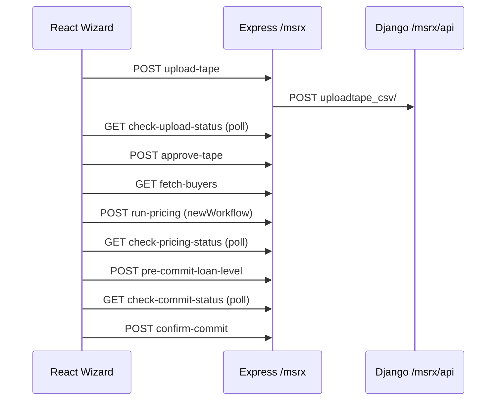

Deep-traced the stack and published an interactive call-graph canvas you can open beside chat: [runtime-reverse-engineering](C:\Users\AbhishekGajera\.cursor\projects\d-BLUE-WATER\canvases\runtime-reverse-engineering.canvas.tsx) (a live React artifact with selectable workflows, layer tables, and Mermaid sequences).

### Stack reality check
This app does **not** use a React hooks folder. The requested “Hook” layer maps to `connect(mapDispatch)` + the giant `apiHoc` HOC. Authenticated “pages” are Redux `state.view` keys from DB-driven `side_panel_items`, not URL routes.

```
Browser → React (class) → mapDispatch/apiHoc → Redux → axios /msrx/*
  → Express (CSRF + refreshToken) → proxy BACKEND_URL + Token
  → Django APIView → service → helpers → ORM → PostgreSQL
  → JSON → Redux → re-render
```

### Fully traced workflows (files + line numbers + Mermaid)
| Workflow | Entry | Deep path |
|----------|-------|-----------|
| **Login** | `login.js:176` | Express `auth.js:163` → Django `Login` `auth.py:23` → `auth_user` / `authtoken_token` / `msrx_msrx_user` |
| **Nav** | `sidePanel.js:45` | `SET_VIEW` → `mainPanel` → `viewMaps.js` (no network) |
| **Logout** | `headerPanel` | `POST /msrx/logout` → `rest-auth/logout/` |
| **MSR Wizard 1–6** | `showWizard` | upload → approve → buyers → price → pre-commit → confirm (full ORM + services) |
| **Freedom upload** | `apiHoc` + `uploadtape_freedom` | → `freedom/price-tape/` |
| **DD portfolio** | `POST duediligence-portfolios` | → `duediligence/portfolios/` |

### MSR New Workflow (end-to-end)



**Status machine:** `uploaded → approved → priced → pre-commit → confirmed` on `msrx_client_coissue_seller`.

### Scope note
There are **80+** in-app views and hundreds of buttons. Every critical auth + MSR commit path is traced layer-by-layer with line numbers in the canvas. Remaining screens follow the same pattern — the **Full Page Catalog** tab documents how to reverse any other control via `viewMaps.js` → `apiHoc`/`axios` → `msrxRoutes.js` → Django.

Open the canvas and pick a workflow from the dropdown to walk each call graph.