# 21 — Complete Database Relationship Map

> **READ-ONLY forensic audit** of BLUE-WATER / MSRX persistence across `msrx_v2.0` and `super_transfer_client` (optional cross-ref: `msrx-frontend`).
>
> Built from **actual code inspection** — Django models, ORM queries, raw SQL, DynamoDB `query`/`update_item`, SQS producers, S3 paths.
>
> Companion full model dump: [`21a_DJANGO_MODEL_INVENTORY_APPENDIX.md`](./21a_DJANGO_MODEL_INVENTORY_APPENDIX.md) (~264 models).

---

## Relationship label legend

| Label | Meaning |
|-------|---------|
| **[CONFIRMED FK]** | Django `ForeignKey` / `OneToOneField` / `ManyToManyField` |
| **[CONFIRMED ORM RELATION]** | Explicit ORM relation used in code |
| **[LOGICAL RELATION — NO FK]** | Integer/Char field joined only in application code |
| **[JSON-BASED RELATION]** | IDs inside `JSONField` (e.g. `commitment.buyer_id`) |
| **[ID-BASED RELATION]** | Business-key join (loan numbers, `selleracqidprefix`, etc.) |
| **[DYNAMODB RELATION]** | Cross-store link via DynamoDB attribute |
| **[INFERRED — VERIFY]** | Strong code signal, not a hard constraint |
| **[UNKNOWN]** | Not proven in these repos — ask in KT |

**Diagram legend:** solid = confirmed FK · dashed/labeled = logical/JSON/DynamoDB/external · external nodes = SQS/S3/DynamoDB

**Naming:** Django model `Client_Coissue_Tape` ↔ PostgreSQL `msrx_client_coissue_tape` (default `{app}_{model}`.lower()).

**`Meta.db_table` overrides:** `base.APIActivityLog` → `api_activity_log`; `duediligence.ProgramDocumentTypeAlternate` → `duediligence_program_document_type_alternates`.

---

# 1. Database technology overview

| Store | Repository | Configuration (no secrets) | Purpose | Environments | Main modules |
|-------|------------|----------------------------|---------|--------------|--------------|
| **PostgreSQL (primary)** | `msrx_v2.0` | Django `DATABASES['default']` → `django.db.backends.postgresql` | System of record | Dev/UAT/Demo/Live/Local | All Django apps |
| **PostgreSQL (read-only)** | `super_transfer_client` | `psycopg2` via Secrets Manager `msrx-urls` | Commitment gate + boarding lookup | Same DB names as MSRX | `base/workflows/query_msrx.py` |
| **DynamoDB processing** | ST + MSRX reprocess | Secret `dynamodb_table_{branch}`; names `supertransfer-{env}DB` | ST loan processing state | `supertransfer-devDB` / `uatDB` / `demoDB` / `liveDB` | `helper_functions.update_table`, handlers |
| **DynamoDB deployment** | `super_transfer_client` | Hardcoded `supertransfer-deploymentDB` | `process_flag` per env | Shared | `process_flag.py` |
| **S3 tapes** | `msrx_v2.0` | `S3_BUCKET_NAME` | Tape/grid uploads | `msrxtape`, `msrxuat`, `msrxdemo`, `msrxlive` | API upload/pricing |
| **S3 Super Transfer** | both | `SUPER_TRANSFER_S3_BUCKET_NAME` | Loan PDFs + ST outputs | `supertransfer-{env}` | commit → ST → DD |
| **S3 metadata** | ST | Hardcoded `supertransfer-metadata` | OCR/Textract cache | Shared | ST workers |
| **SQS** | both | `loansToprocess-{env}`, missing-file, Bedrock, notifications | Async processing | Per env | `post_loan_to_sqs`, ST `main.py` |
| **Redis** | — | **Not used** as app persistence | — | — | — |
| **LocMem cache** | `msrx_v2.0` | `CACHES` LocMem TIMEOUT=5 | Ephemeral process cache | All | `shared.py` |
| **SQLite :memory:** | `msrx_v2.0` | tapecrack helper only | Non-durable | Runtime | `tapecrack/supporting/tapecrack.py` |
| **Local files** | ST | `local_loan_files/` | Worker scratch | Runtime | ST handlers |
| **Secrets Manager** | ST | Config only | Creds / table / queue / bucket names | All ST | `env_variables.py` |

### PostgreSQL DB names

| Settings | DB `NAME` | Tape S3 | ST S3 |
|----------|-----------|---------|-------|
| `dev.py` | `msrx_internal_dev` | `msrxtape` | `supertransfer-dev` |
| `uat.py` | `msrx_uat_new` | `msrxuat` | `supertransfer-uat` |
| `demo.py` | `msrx_demo_new` | `msrxdemo` | `supertransfer-demo` |
| `live.py` | `msrx_live_new` | `msrxlive` | `supertransfer-live` |
| `local.py` | local/dev-like | `msrxtape` | `supertransfer-dev` |

---

# 2. Complete model / table inventory (master)

> Field-level dump of all ~264 models: **[21a appendix](./21a_DJANGO_MODEL_INVENTORY_APPENDIX.md)**.  
> No `proxy=True`, no `managed=False`. Default PK: `id`. Empty apps: `middleware`, `bw_middleware`.

| MODEL | DB TABLE | APP | PK | FOREIGN KEYS | IMPORTANT FIELDS | STATUS | JSON | PURPOSE |
|-------|----------|-----|-----|--------------|------------------|--------|------|---------|
| `MSRX_User` | `msrx_msrx_user` | msrx | id | O2O `user`→`auth_user` CASCADE; haf/branch/price_class/correspondent/srp_provider/platform/qc_company; M2M via `Linked_Buyers` | `client_name`, `user_role`, flags, `selleracqidprefix` UNIQUE | `active` | `counterparty`, `user_details`, `valuation_assumptions`, `side_panel_items` | Business user (seller/buyer/investor/aggregator) |
| `MSRX_User_additional` | `msrx_msrx_user_additional` | msrx | id | `django_user`→User; `msrx_user`→MSRX_User CASCADE | linked logins | — | — | Extra auth users → one MSRX user |
| `Client_Aggregator_Seller` | `msrx_client_aggregator_seller` | msrx | id | O2O `user`→MSRX_User; FK `aggregator`→MSRX_User CASCADE | `seller_code`, LOS, engines | — | — | Aggregator Seller (AGS) |
| `Client_Aggregator_Seller_Login` | `msrx_client_aggregator_seller_login` | msrx | id | `seller`→AGS; O2O `user`→auth.User CASCADE | `access_view/pricing/commit/exception` | — | — | AGS portal logins |
| `AggregatorStore` | `msrx_aggregatorstore` | msrx | id | aggregator FK; M2M sellers | docs | — | `file` | Aggregator docs |
| `Linked_Buyers` | `msrx_linked_buyers` | msrx | id | root/linked/aggregator → MSRX_User CASCADE | — | — | — | Buyer/aggregator M2M through |
| `Client_Coissue_Seller` | `msrx_client_coissue_seller` | msrx | id | `client`/`correspondent` CASCADE; `psa_deal` PROTECT; `whole_loan_tape`→freedom.Tape PROTECT; `pricer` SET_NULL | tape_name, loancount, upb | **status** | **status_details** | **Tape HEADER (coissue)** |
| `Client_Coissue_Tape` | `msrx_client_coissue_tape` | msrx | id | `tapeinfo` CASCADE; `acquisition_id`→selleracqidprefix PROTECT; `commit_cycle` PROTECT; `psa_deal` PROTECT; `transfer` CASCADE | `tape_loan_id`, balances, `aggregator_loan_id` | via JSON | **price**, **commitment** | **Loan-level coissue** |
| `Client_Coissue_Seller_Resell` | `msrx_client_coissue_seller_resell` | msrx | id | `orig_tape_id`→Seller CASCADE | — | status | status_details | Resell tape header |
| `Client_Coissue_Tape_Resell` | `msrx_client_coissue_tape_resell` | msrx | id | tapeinfo→Resell Seller | aggregator_loan_id | — | price, commitment | Resell loans |
| `Client_Coissue_Seller_Deleted` | `msrx_client_coissue_seller_deleted` | msrx | id | client CASCADE; **`orig_tape_id` IntegerField NO FK** | archive | status | status_details | Deleted tape archive |
| `Client_Coissue_Tape_Deleted` | `msrx_client_coissue_tape_deleted` | msrx | id | tapeinfo→Deleted; acquisition_id **CharField** | archive | — | price, commitment | Deleted loans |
| `Client_Coissue_Tape_Updated` | `msrx_client_coissue_tape_updated` | msrx | id | original_id→Tape CASCADE; PA_Summary SET_NULL | post-commit | — | price, commitment, resell_* | Updated loan snapshot |
| `Client_Coissue_Buyer` | `msrx_client_coissue_buyer` | msrx | id | client→MSRX_User CASCADE | grid_name, inuse, coissue | status | **grid_info**, counterparty, adjustors | **Buyer GRID** (misnamed) |
| `Client_Coissue_Buyer_Criteria` | `msrx_client_coissue_buyer_criteria` | msrx | id | buyer, seller → MSRX_User | inuse | — | criteria | Eligibility |
| `Client_Coissue_Buyer_Middleware` | `msrx_client_coissue_buyer_middleware` | msrx | id | client; task→Background_Task PROTECT | model filenames | inuse | adjustors, counterparty, audit_ready_model | Pricing model pointers |
| `Client_Coissue_Buyer_Par` | `msrx_client_coissue_buyer_par` | msrx | id | client→MSRX_User | product/term | inuse | par_rate_formula, log | Par formulas |
| `Buyer_Par_History` | `msrx_buyer_par_history` | msrx | id | client→MSRX_User | par_* | — | par_rate_formula | Par history |
| `Client_Commit_Cycle` | `msrx_client_commit_cycle` | msrx | id | buyer, seller CASCADE | caps / counts | — | — | Commit volume cycle |
| `LoanNumbers` | `msrx_loannumbers` | msrx | id | seller, buyer → MSRX_User | buyer/seller loan numbers, burned | — | — | Aggregator loan # pool |
| `Boarding_Staging` | `msrx_boarding_staging` | msrx | id | buyer/seller/updated_by; msrx_coissue_loan; whole_loan; qc_loan CASCADE | ~1496 cols | **status**, boarded* | excess_fields | Boarding staging |
| `Boarded_Tapes` | `msrx_boarded_tapes` | msrx | id | buyer→MSRX_User | loan_ids ArrayField | — | — | Boarding batch meta |
| `Client_Seasoned_Seller` | `msrx_client_seasoned_seller` | msrx | id | client; self FKs; psa_deal; summaries | loancount, upb | status | status_details | Seasoned tape header |
| `Client_Seasoned_Tape` | `msrx_client_seasoned_tape` | msrx | id | tapeinfo CASCADE; commit_cycle; transfer | tape_loan_id | — | price, commitment, shock_scenarios | Seasoned loans |
| `Tape` | `freedom_tape` | freedom | id | client; root self; correspondent; haf; branch; winner; latest_pricer SET_NULL | status, allocation_status | status | status_details, pricing_tape_s3, commit_tape_s3 | Freedom tape header |
| `Loan` | `freedom_loan` | freedom | id | client; tape; aot SET_NULL; selected_wl_resell_price; allocated_pool PROTECT; meta_product SET_NULL (via caas abstracts) | tape_loan_id, balances… | origination/lock/pipeline | msr_price, extension_policy | Freedom whole loan |
| `WholeLoanPrice` | `freedom_wholeloanprice` | freedom | id | loan CASCADE; buyer CASCADE; pricer SET_NULL; pricing_model; snapshot | selected | — | price, msr | WL price rows |
| `WholeLoanCommit` | `freedom_wholeloancommit` | freedom | id | loan; buyer; pricer; pricing_model; snapshot; M2M psa_deals | — | — | commit, msr_commit, purchase, msr_purchase | WL commitments |
| `Company` | `duediligence_company` | duediligence | id | ratings CASCADE | feature flags | — | — | DD company |
| `Portfolio` | `duediligence_portfolio` | duediligence | id | owner→MSRX_User CASCADE; company SET_NULL | active | — | — | Deal collection |
| `Deal` | `duediligence_deal` | duediligence | id | portfolio/seller/program/company SET_NULL | sftp paths, cleared | — | — | Seller deal |
| `Loan` (DD) | `duediligence_loan` | duediligence | id | deal/program SET_NULL; **msrx_coissue_loan**→Coissue_Tape SET_NULL; **whole_loan**→freedom.Loan SET_NULL | loan_number | **status** | closing_docs_s3_path | DD loan |
| `Document` | `duediligence_document` | duediligence | id | type CASCADE; loan CASCADE | final_version | — | — | Classified docs |
| `DocumentType` | `duediligence_documenttype` | duediligence | id | company; bw_doc_type self SET_NULL | name | — | — | Doc taxonomy |
| `supertransfer.Loan` | `supertransfer_loan` | supertransfer | id | seller/buyer → MSRX_User | — | — | — | ST Postgres loan tracker |
| `MissingFile` | `supertransfer_missingfile` | supertransfer | id | loan CASCADE | — | — | — | Missing docs |
| `BuyerSFTP` | `supertransfer_buyersftp` | supertransfer | id | msrx / msrx_group → MSRX_User | SFTP config | — | documents_expected, zipfile_name | Buyer delivery config |
| `QualityControl` (ST) | `supertransfer_qualitycontrol` | supertransfer | id | boarding_staging CASCADE | ~242 bool flags | — | — | ST QC flags on staging |
| `boarding_staging_table` | `rp_boarding_staging_table` | rp | id | seller→MSRX_User | ~545 cols | — | — | RP-specific boarding |
| `APIActivityLog` | `api_activity_log` | base | id | (see model) | request/response | — | — | API activity |
| `PA_Summary` | `commitrecon_pa_summary` | commitrecon | id | buyer/seller/commit_cycle | — | status choices | — | Purchase advice summary |
| `EMResource` | `transfer_emresource` | Transfer | id | — | transfer state | — | notification/status_details/manifest | Electronic mortgage transfer |

**Why similar names are not duplicates:** Coissue ≠ Seasoned ≠ Freedom WL ≠ DD loan ≠ ST loan; Resell/Deleted/Updated are lifecycle copies, not alternate live stores.

---

# 3. Master domain ERD

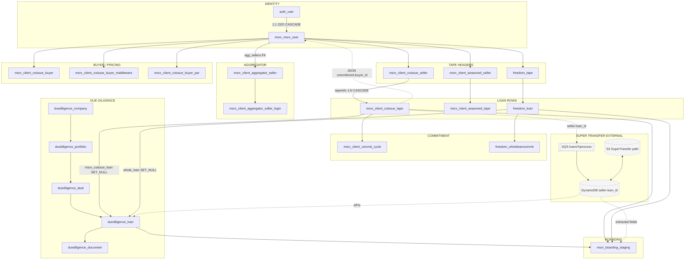

| From → To | Mechanism | Label |
|-----------|-----------|-------|
| IDENTITY → AGGREGATOR | `Client_Aggregator_Seller.aggregator` / `.user` | [CONFIRMED FK] |
| IDENTITY → TAPE | `Client_Coissue_Seller.client` | [CONFIRMED FK] |
| TAPE → LOAN | `Client_Coissue_Tape.tapeinfo` | [CONFIRMED FK] |
| LOAN → BUYER commit | `commitment['buyer_id']` | [JSON-BASED RELATION] |
| LOAN → DD | `duediligence_loan.msrx_coissue_loan_id` | [CONFIRMED FK] |
| LOAN → ST | SQS + DynamoDB `seller-loan_id` | [DYNAMODB RELATION] |
| ST → BOARDING | ST APIs → `msrx_boarding_staging` | write path |
| LOAN → BOARDING | `Boarding_Staging.msrx_coissue_loan` | [CONFIRMED FK] |

---

# 4. True foreign-key graph (BASE ERD)

```mermaid
erDiagram
  auth_user ||--o| msrx_msrx_user : "user_id 1:1 CASCADE"
  msrx_msrx_user ||--o| msrx_client_aggregator_seller : "user_id 1:1 CASCADE"
  msrx_msrx_user ||--o{ msrx_client_aggregator_seller : "aggregator_id 1:N CASCADE"
  msrx_client_aggregator_seller ||--o{ msrx_client_aggregator_seller_login : "seller_id 1:N CASCADE"
  auth_user ||--o| msrx_client_aggregator_seller_login : "user_id 1:1 CASCADE"

  msrx_msrx_user ||--o{ msrx_client_coissue_seller : "client_id 1:N CASCADE"
  msrx_client_coissue_seller ||--o{ msrx_client_coissue_tape : "tapeinfo_id 1:N CASCADE"
  msrx_msrx_user ||--o{ msrx_client_coissue_tape : "acquisition_id to_field selleracqidprefix PROTECT"

  msrx_client_coissue_seller ||--o{ msrx_client_coissue_seller_resell : "orig_tape_id 1:N CASCADE"
  msrx_client_coissue_seller_resell ||--o{ msrx_client_coissue_tape_resell : "tapeinfo_id 1:N CASCADE"

  msrx_msrx_user ||--o{ msrx_client_coissue_buyer : "client_id 1:N CASCADE"
  msrx_msrx_user ||--o{ msrx_client_coissue_buyer_criteria : "buyer_id / seller_id"
  msrx_msrx_user ||--o{ msrx_client_coissue_buyer_middleware : "client_id"
  msrx_msrx_user ||--o{ msrx_client_coissue_buyer_par : "client_id"
  msrx_msrx_user ||--o{ msrx_client_commit_cycle : "buyer_id / seller_id CASCADE"
  msrx_client_commit_cycle ||--o{ msrx_client_coissue_tape : "commit_cycle_id PROTECT"

  msrx_msrx_user ||--o{ freedom_tape : "client_id CASCADE"
  freedom_tape ||--o{ freedom_loan : "tape_id CASCADE"
  freedom_loan ||--o{ freedom_wholeloanprice : "loan_id CASCADE"
  freedom_loan ||--o{ freedom_wholeloancommit : "loan_id CASCADE"
  msrx_msrx_user ||--o{ freedom_wholeloancommit : "buyer_id CASCADE"

  msrx_msrx_user ||--o{ duediligence_portfolio : "owner_id CASCADE"
  duediligence_company ||--o{ duediligence_portfolio : "company_id SET_NULL"
  duediligence_portfolio ||--o{ duediligence_deal : "portfolio_id SET_NULL"
  msrx_msrx_user ||--o{ duediligence_deal : "seller_id SET_NULL"
  duediligence_deal ||--o{ duediligence_loan : "deal_id SET_NULL"
  msrx_client_coissue_tape ||--o{ duediligence_loan : "msrx_coissue_loan_id SET_NULL"
  freedom_loan ||--o{ duediligence_loan : "whole_loan_id SET_NULL"
  duediligence_loan ||--o{ duediligence_document : "loan_id CASCADE"

  msrx_client_coissue_tape ||--o{ msrx_boarding_staging : "msrx_coissue_loan_id CASCADE"
  freedom_loan ||--o{ msrx_boarding_staging : "whole_loan_id CASCADE"
  duediligence_loan ||--o{ msrx_boarding_staging : "qc_loan_id CASCADE"
  msrx_msrx_user ||--o{ msrx_boarding_staging : "buyer_id / seller_id CASCADE"
```

### Edge catalog (source.column → target.column)

| Source | Target | Card | on_delete | Label |
|--------|--------|------|-----------|-------|
| `msrx_msrx_user.user_id` | `auth_user.id` | 1:1 | CASCADE | [CONFIRMED FK] |
| `msrx_client_aggregator_seller.user_id` | `msrx_msrx_user.id` | 1:1 | CASCADE | [CONFIRMED FK] |
| `msrx_client_aggregator_seller.aggregator_id` | `msrx_msrx_user.id` | N:1 | CASCADE | [CONFIRMED FK] |
| `msrx_client_aggregator_seller_login.seller_id` | `msrx_client_aggregator_seller.id` | N:1 | CASCADE | [CONFIRMED FK] |
| `msrx_client_aggregator_seller_login.user_id` | `auth_user.id` | 1:1 | CASCADE | [CONFIRMED FK] |
| `msrx_client_coissue_seller.client_id` | `msrx_msrx_user.id` | N:1 | CASCADE | [CONFIRMED FK] |
| `msrx_client_coissue_tape.tapeinfo_id` | `msrx_client_coissue_seller.id` | N:1 | CASCADE | [CONFIRMED FK] |
| `msrx_client_coissue_tape.acquisition_id` | `msrx_msrx_user.selleracqidprefix` | N:1 | PROTECT | [CONFIRMED FK] (to_field) |
| `msrx_client_coissue_tape.commit_cycle_id` | `msrx_client_commit_cycle.id` | N:1 | PROTECT | [CONFIRMED FK] |
| `duediligence_loan.msrx_coissue_loan_id` | `msrx_client_coissue_tape.id` | N:1 | SET_NULL | [CONFIRMED FK] |
| `duediligence_loan.whole_loan_id` | `freedom_loan.id` | N:1 | SET_NULL | [CONFIRMED FK] |
| `msrx_boarding_staging.msrx_coissue_loan_id` | `msrx_client_coissue_tape.id` | N:1 | CASCADE | [CONFIRMED FK] |
| `msrx_boarding_staging.qc_loan_id` | `duediligence_loan.id` | N:1 | CASCADE | [CONFIRMED FK] |
| `freedom_loan.tape_id` | `freedom_tape.id` | N:1 | CASCADE | [CONFIRMED FK] |
| `freedom_wholeloancommit.loan_id` | `freedom_loan.id` | N:1 | CASCADE | [CONFIRMED FK] |
| `Client_Coissue_Seller.pricer_id` | `auth_user.id` | N:1 | SET_NULL | [CONFIRMED FK] |
| `Client_Coissue_Seller.psa_deal_id` | `msrx_psadeals.id` | N:1 | PROTECT | [CONFIRMED FK] |

---

# 5. Logical relationships without database FKs

| # | Source | Target | Evidence | Label |
|---|--------|--------|----------|-------|
| 1 | `Client_Coissue_Tape.commitment['buyer_id']` | `msrx_msrx_user.id` | Filters `commitment__buyer_id=`; commit groups by buyer_id; DD create uses it | [JSON-BASED RELATION] |
| 2 | `*.resell_commitment['buyer_id']` | `msrx_msrx_user.id` | Raw SQL CAST in `commitrecon/summary_functions.py` | [JSON-BASED RELATION] |
| 3 | `status_details['priced_buyer_list']` / `best_ex[*].buyer_id` | `msrx_msrx_user.id` | Aggregator/buyer tape views | [JSON-BASED RELATION] |
| 4 | `MSRX_User.counterparty['counterparty']` | list of `msrx_msrx_user.id` | Aggregator enablement `api/views/aggregator.py` | [JSON-BASED RELATION] |
| 5 | `Client_Coissue_Buyer.counterparty['seller']` | seller IDs | Grid apply-to sellers | [JSON-BASED RELATION] |
| 6 | `Client_Coissue_Buyer_Middleware.adjustors/counterparty['seller']` | seller IDs | Model comments + pricing | [JSON-BASED RELATION] |
| 7 | `Client_Coissue_Seller_Deleted.orig_tape_id` (IntegerField) | `msrx_client_coissue_seller.id` | Archive of deleted tape; resell uses real FK | [LOGICAL RELATION — NO FK] |
| 8 | `Client_Coissue_Tape_Deleted.acquisition_id` (CharField) | `msrx_msrx_user.selleracqidprefix` | Live tables use FK; deleted keeps CharField | [LOGICAL RELATION — NO FK] |
| 9 | Seasoned/WL `acquisition_id` CharField variants | `selleracqidprefix` | Pricing resolves via `MSRX_User.filter(selleracqidprefix=...)` | [ID-BASED RELATION] |
| 10 | `Client_Coissue_Tape.aggregator_loan_id` | `msrx_loannumbers.buyer_loan_number` | Assigned in `msr_commit.py` on confirm | [ID-BASED RELATION] |
| 11 | `Client_Coissue_Tape.tape_loan_id` | DD `loan_number`, LoanNumbers.seller_loan_number, agency purchase | Set on commit / DD create | [ID-BASED RELATION] |
| 12 | `Boarded_Tapes.loan_ids` ArrayField | boarding loan ids/numbers | `supertransfer/views/files.py` | [ID-BASED RELATION] |
| 13 | DynamoDB `seller-loan_id` | `{seller_id}-{buyer_id}_{loan_number}` | `support_committing.post_loan_to_sqs` | [DYNAMODB RELATION] |
| 14 | DynamoDB `loan_id` / `deal_id` / `porfolio_id` | `duediligence_loan` / deal / portfolio | ST `update_table` writes; initial create **UNKNOWN** | [DYNAMODB RELATION] / [UNKNOWN] creator |
| 15 | `analytics.*.investor_id` CharField | external InvestorID | Ingest only; no ORM join found | [INFERRED — VERIFY] |

**These must never be drawn as solid FK edges.**

---


# 6. User / role / company ERD

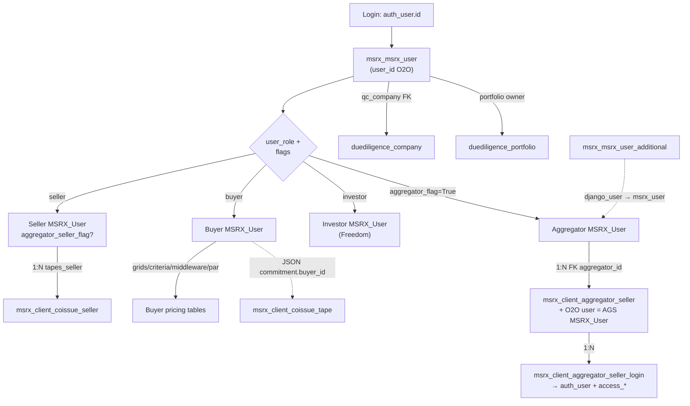

### Given a login user ID — who am I?

| Step | Query idea | What you learn |
|------|------------|----------------|
| 1 | `auth_user` by id/username | Django credentials |
| 2 | `msrx_msrx_user` where `user_id = auth.id` | Primary business profile |
| 3 | If missing: `msrx_msrx_user_additional` where `django_user_id = auth.id` | Linked aggregator login |
| 4 | If missing: `msrx_client_aggregator_seller_login` where `user_id = auth.id` | AGS portal user → seller → aggregator |
| 5 | Read `user_role`, `aggregator_flag`, `aggregator_seller_flag`, `correspondent_buyer_flag` | Role |
| 6 | If AGS: `client_aggregator_seller` where `user_id = msrx.id` → `aggregator_id` | Parent aggregator |
| 7 | `qc_company_id` → DD company access | QC company |

**Admin/staff:** Django `is_staff` / permissions on auth_user; not a separate MSRX role table.

---

# 7. Tape / loan ERD

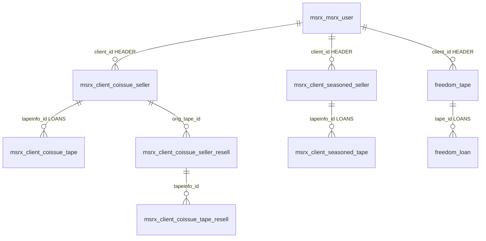

### Tape HEADER vs LOAN-LEVEL

| Kind | HEADER table | LOAN table | Key link |
|------|--------------|------------|----------|
| Coissue MSR | `msrx_client_coissue_seller` | `msrx_client_coissue_tape` | `tapeinfo_id` [CONFIRMED FK] |
| Seasoned | `msrx_client_seasoned_seller` | `msrx_client_seasoned_tape` | `tapeinfo_id` [CONFIRMED FK] |
| Freedom WL | `freedom_tape` | `freedom_loan` | `tape_id` [CONFIRMED FK] |
| Resell | `*_seller_resell` | `*_tape_resell` | tapeinfo FK |
| Deleted archive | `*_seller_deleted` | `*_tape_deleted` | tapeinfo FK; `orig_tape_id` logical on header |

**HEADER holds:** tape_name, uploadtime, loancount, upb, **status**, status_details, pricer.  
**LOAN holds:** tape_loan_id, attributes, UPB/balance, **price JSON**, **commitment JSON**, aggregator_loan_id, commit_cycle.

**Upload info / validation:** tape create in `api/api_handler.py` / `api/views/pricing.py` sets status `uploaded`; loancount/upb on header; loan rows `bulk_create`. Tapecrack uses in-memory SQLite — not a durable table.

**Pricing / commit:** written onto loan JSON; header status progresses uploaded → approved → priced → pre-commit → confirmed.

---

# 8. Pricing database ERD

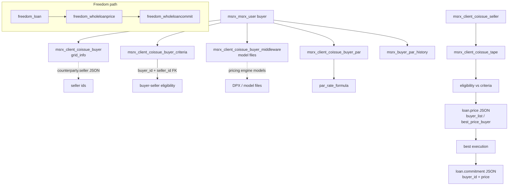

| Table | Who configures | Who reads | Key connect | Output |
|-------|----------------|-----------|-------------|--------|
| `msrx_client_coissue_buyer` | Buyer/admin via `api/views/grid.py` | Pricing engine | `client_id` → buyer | Grid matrix in `grid_info` |
| `msrx_client_coissue_buyer_criteria` | Buyer/admin | Pricing | buyer_id + seller_id FKs | Pass/fail eligibility |
| `msrx_client_coissue_buyer_middleware` | Buyer/admin | Pricing | `client_id`; seller lists in JSON | Model selection / adjustors |
| `msrx_client_coissue_buyer_par` | Buyer/admin | Pricing | client + product/term | Par coupon |
| `msrx_client_coissue_tape.price` | `support_pricing.py` (ORM + `fast_sql_update`) | UI, commit | loan PK | Per-buyer prices + best_ex |
| `freedom_wholeloanprice` | Freedom pricing | Pre-close / commit | loan_id + buyer_id FKs | Selected WL price |

**Does NOT store final commitment** — that is loan `commitment` JSON (coissue) or `freedom_wholeloancommit` (Freedom).

---

# 9. Commitment ERD

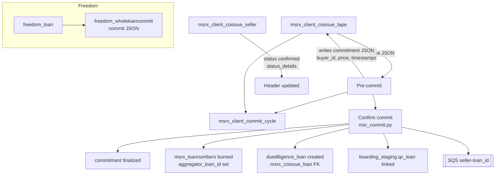

### Where commitment lives

| Location | Type | Label |
|----------|------|-------|
| `msrx_client_coissue_tape.commitment` | JSON on loan | [JSON-BASED RELATION] primary for MSR coissue |
| `msrx_client_coissue_seller.status` / `status_details` | Header progress | PRIMARY for tape-level status |
| `msrx_client_commit_cycle` | Caps / counts | Supporting |
| `msrx_loannumbers` | Aggregator # assignment | Inventory |
| `freedom_wholeloancommit` | Row + JSON | Freedom primary |
| `commitrecon_pa_summary` | Recon | History / recon |
| DynamoDB | Processing after confirm | Downstream ST |

### Status changes during commit flow (from code)

| Step | What changes |
|------|--------------|
| Pre-commit | Loan `commitment` filled; tape may → `pre-commit`; cycle counts |
| Confirm | Tape → `confirmed`; `status_details.commit_confirm_timestamp`; AGS loan numbers burned; DD loan `Committed`; optional SQS |
| Recommit / cancel | **Partial support in UI/API — verify exact reverse paths in KT** [UNKNOWN] for full reverse semantics |

Evidence: `api/views/commit.py`, `api/supporting/services/msr_commit.py`, `api/supporting/support_committing.py`.

---

# 10. Aggregator database ERD

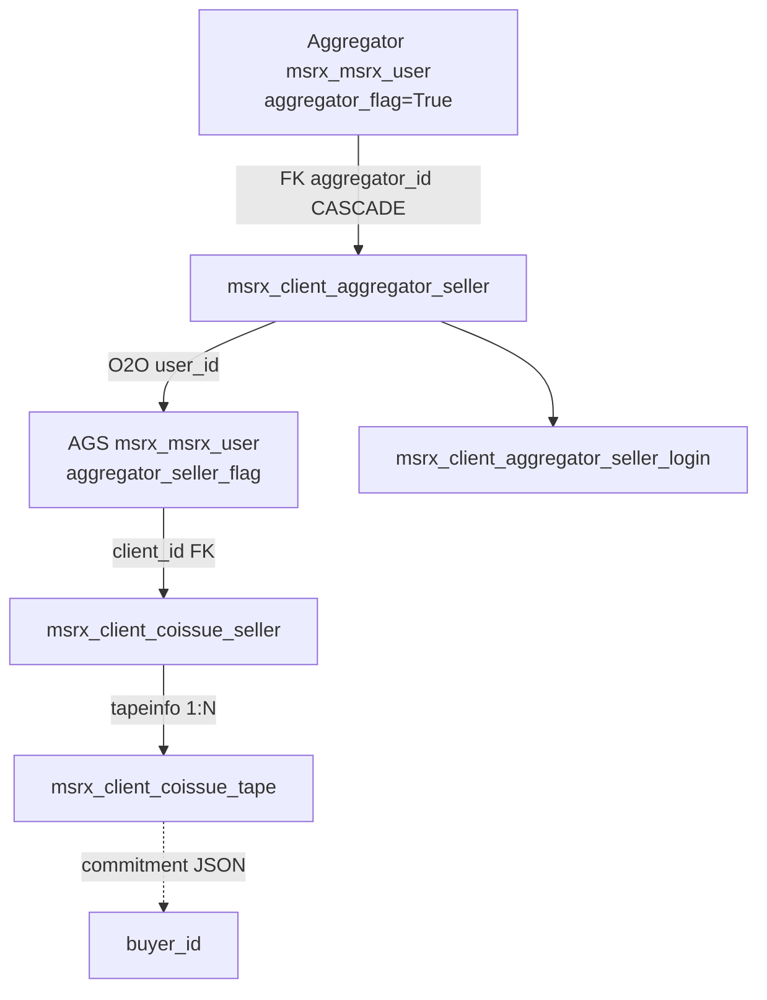

### `aggregator_get_tape_summary()` trace

**File:** `api/api_handler.py` → `aggregator_get_tape_summary(msrx_user)`

1. `Client_Aggregator_Seller.objects.filter(aggregator=msrx_user).values("user_id")` → seller_list  
   **[CONFIRMED FK]** `aggregator` / `user`
2. `Client_Coissue_Seller.objects.filter(client_id__in=seller_list)`  
   **[CONFIRMED FK]** `client`
3. Annotate/values include `view_loans__commitment` → coissue_flag from `commitment.coissue_channel`  
   **[JSON-BASED RELATION]**
4. Seasoned twin: `aggregator_get_seasoned_tape_summary` → `Client_Seasoned_Seller`

**ACL for tape detail:** `tapeinfo__client__in=seller_ids` on loan queryset.

---

# 11. Due Diligence database ERD

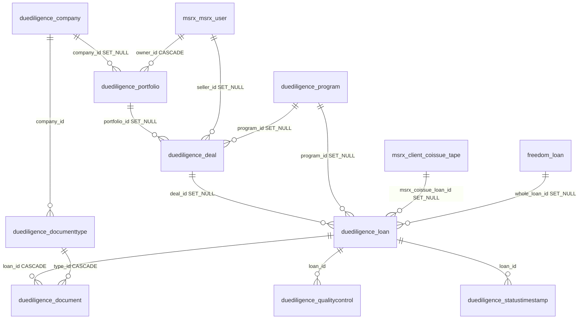

| Relationship | Type |
|--------------|------|
| Company → Portfolio → Deal → Loan → Document | [CONFIRMED FK] |
| Deal.seller → MSRX_User | [CONFIRMED FK] SET_NULL |
| DD Loan → Coissue Tape / Freedom Loan | [CONFIRMED FK] SET_NULL |
| `loan_number` ↔ `tape_loan_id` | [ID-BASED RELATION] |
| DynamoDB `loan_id` / `deal_id` / `porfolio_id` | [DYNAMODB RELATION] |
| Program ↔ required DocumentTypes | [CONFIRMED ORM RELATION] M2M/through (see programs models) |

**Flow:** Company → Deal (seller/portfolio/program) → Loan → Documents → Classification (type) → Extraction (Values) → QC rules → statuses.

---

# 12. Super Transfer data model

## Stores ST reads/writes

| Store | Read | Write |
|-------|------|-------|
| DynamoDB processing table | query by `seller-loan_id` | `update_item` only |
| DynamoDB deployment | query `env` | (ops) |
| PostgreSQL MSRX | commitment_check, boarding lookup | **No** — via HTTP APIs |
| S3 | download loan PDFs | upload extracted/segregated outputs |
| SQS | consume loan / missing-file | Bedrock + notifications |
| Local disk | scratch | temp artifacts |

## DynamoDB item diagram

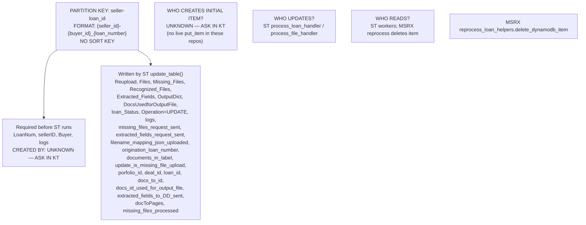

**Tables:** `supertransfer-devDB` / `uatDB` / `demoDB` / `liveDB`; deployment `supertransfer-deploymentDB` PK=`env`, attr `process_flag`.

---

# 13. MSRX ↔ Super Transfer ID crosswalk

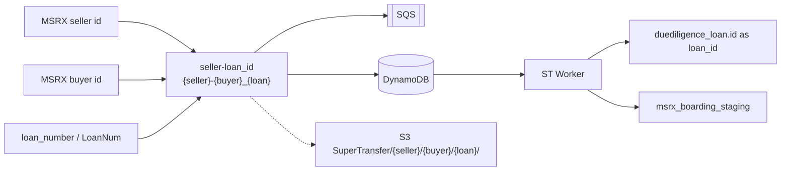

| CONCEPT | MSRX TABLE | MSRX FIELD | SUPER TRANSFER FIELD | DD FIELD | DYNAMODB FIELD | FORMAT | SOURCE OF TRUTH |
|---------|------------|------------|----------------------|----------|----------------|--------|-----------------|
| Seller | `msrx_msrx_user` | `id` | sellerID / path | Deal.seller_id | `sellerID` | int | MSRX user |
| Buyer | `msrx_msrx_user` | `id` | Buyer / path | Portfolio.owner often buyer | `Buyer` | int | MSRX user |
| Seller loan # | `msrx_client_coissue_tape` | `tape_loan_id` | LoanNum | `loan_number` | `LoanNum` | string (+ for space) | Coissue tape (pre-AGS assign) |
| Aggregator loan # | `msrx_client_coissue_tape` | `aggregator_loan_id` | may appear in boarding | — | — | string | `msrx_loannumbers` inventory |
| Composite key | — | constructed | SQS body | — | `seller-loan_id` PK | `{s}-{b}_{loan}` | Constructed at enqueue |
| Coissue loan PK | `msrx_client_coissue_tape` | `id` | — | `msrx_coissue_loan_id` | — | int | Coissue tape |
| DD loan PK | — | — | API / DynamoDB | `duediligence_loan.id` | `loan_id` | int | DD (after create) |
| Deal | `duediligence_deal` | `id` | API | `deal_id` | `deal_id` | int | DD |
| Portfolio | `duediligence_portfolio` | `id` | API | — | `porfolio_id` (typo) | int | DD |
| Freedom loan | `freedom_loan` | `id` | — | `whole_loan_id` | — | int | Freedom |

**Parse note:** ST `query_msrx.py` splits `seller-loan_id` as `split('-')[0]` seller, `split('_')[0].split('-')[1]` buyer, `split('_')[1]` loan. Comment in `base/types/misc.py` documenting alternate format is **wrong**.

**Who enriches SQS with `loan_id`?** MSRX `post_loan_to_sqs` only sends `{seller-loan_id}`. ST `main.py` may require `loan_id` in message — **UNKNOWN who adds it** → KT.

---

# 14. Document storage / three-store diagram

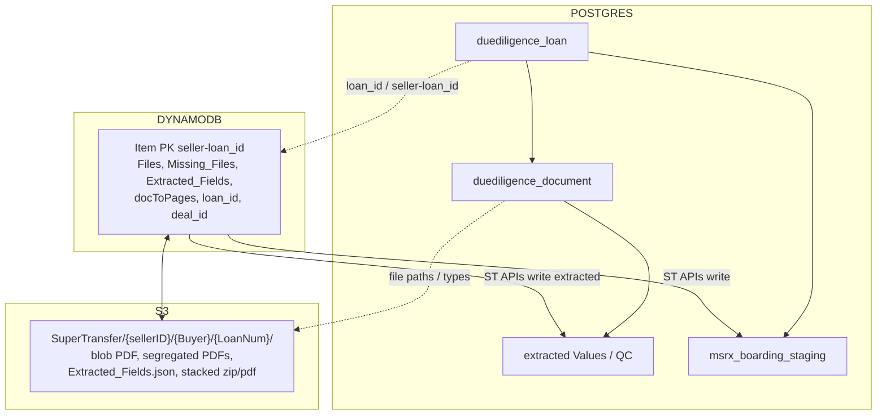

**Connector IDs:** `seller-loan_id` (ST↔Dynamo↔S3 path parts); `duediligence_loan.id` (`loan_id`); document type IDs in Postgres; S3 object keys under loan folder.

---

# 15. Boarding database ERD

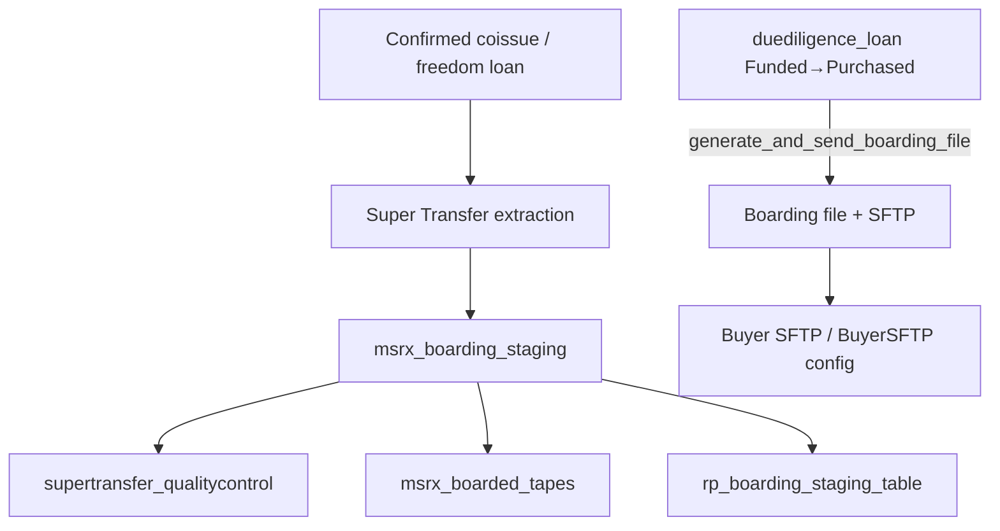

| Table | Who inserts | Who updates | Status / flags | Source | Output |
|-------|-------------|-------------|----------------|--------|--------|
| `msrx_boarding_staging` | ST views `files.py`, `exceptions.py`, `supertransfer/utils.py` bulk_create | Transfer mark boarded; exceptions; DD link qc_loan | `status` e.g. Processed; `boarded`, `boarding_file_delivered` | Extracted fields + MSRX loan | Boarding file generators |
| `msrx_boarded_tapes` | `supertransfer/views/files.py` | — | — | batch of loan_ids | batch meta |
| `rp_boarding_staging_table` | RP transfer generators | RP flow | client-specific | RP | RP boarding |
| DD boarding file configs | DD admin | DD | deal unique | deal config | SFTP delivery on Purchased |

---


# 16. Status / state model

| TABLE | FIELD | KNOWN VALUES (from code) | WHO SETS | WHO READS | NEXT (observed) | WORKFLOW |
|-------|-------|--------------------------|----------|-----------|-----------------|----------|
| `msrx_client_coissue_seller` | `status` | uploaded, approved, priced, pre-commit, confirmed; comment also transfer_complete; admin “unconfirmed” bucket | upload/pricing/commit APIs | Aggregator/seller/buyer UIs | uploaded→approved→priced→pre-commit→confirmed | Tape lifecycle |
| `msrx_client_coissue_seller_resell` | `status` | pre_commit, priced, resold | resell flows | Aggregator | → resold | Resell |
| `msrx_client_coissue_buyer` | `status` | uploaded, approved, modified | grid.py | Pricing | — | Grid lifecycle |
| `msrx_msrx_user` | `user_role` | buyer, seller, investor | admin/aggregator create | AuthZ | — | Identity |
| `msrx_boarding_staging` | `status` | Processed (SQL refs); flags boarded* | ST / Transfer | Boarding file SQL | → boarded | Boarding |
| `duediligence_loan` | `status` | Committed, Calculating, Processed, Cleared, Cleared to Close, Scheduled, Closed, Funded, Purchased, Boarded | DD save + ST APIs | DD UI; hooks on transition | Scheduled→Closed; Funded→Purchased (boarding) | DD |
| `freedom_tape` | `status` | uploaded; confirmed (analytics SQL) | Freedom upload/commit | Freedom UI | — | WL tape |
| `msrx_background_task` | `status` | pending, completed, failed (choices) | middleware build | Middleware | pending→completed/failed | Model build |
| DynamoDB item | `loan_Status` | set by ST (values vary by Operation) | ST update_table | ST / ops | — | ST processing |
| Tape `status_details.transfer_status` | JSON | not started / in progress / complete | transfer flows | UI | — | Transfer |

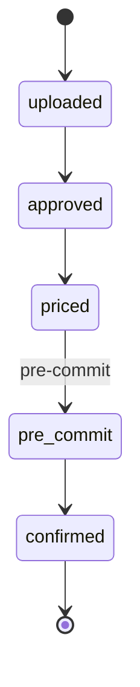

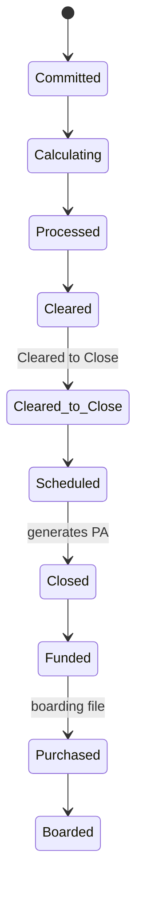

**Do not invent unobserved transitions.** Exact intermediate DD paths may vary by company — verify in KT.

---

# 17. JSONField schema reverse engineering

| TABLE.FIELD | JSON KEY | TYPE | WRITTEN BY | READ BY | PURPOSE |
|-------------|----------|------|------------|---------|---------|
| `msrx_client_coissue_tape.commitment` | `buyer_id` | int | pricing/commit | commit, aggregator, DD | Winning buyer |
| | `buyer_name`, `buyer_par`, `buyer_model`, `buyer_model_id` | mixed | pricing | UI | Buyer context |
| | `price`, `price_aa/sa/ss`, `multiple*`, `margin` | number | pricing | commit | Commit price |
| | `coissue_channel`, `agency`, `remit` | string | pricing | aggregator flag | Channel |
| | `commit_timestamp`, `upload_timestamp`, `pricing_timestamp` | datetime-ish | flows | audit | Timing |
| | `exclusion`, `exclusion_message`, `eligible`, `committable` | mixed | pricing | UI | Eligibility |
| `msrx_client_coissue_tape.price` | `buyer_list`, `best_price_buyer`, `selected_buyer` | mixed | support_pricing | UI/commit | Best ex |
| | `{buyer_id}` nested objects | object | pricing | UI | Per-buyer quote |
| `msrx_client_coissue_seller.status_details` | `priced_buyer_list`, `best_ex` | list | pricing/commit | aggregator summary | Commit plan |
| | `commit_confirm_timestamp`, `commit_progress`, `commit_failed_message`, `commit_source` | mixed | commit | UI | Commit progress |
| | `upload_progress`, `failed_message`, `transfer_status` | mixed | upload/transfer | UI | Ops |
| `msrx_msrx_user.user_details` | `loan_number_assignment`, `transfer_settings.investor_routing` | mixed | admin/agg | msr_commit | AGS numbering |
| | `margins`, `template`, `authorized_platform`, `commit_timer`, `wl_business_hour` | mixed | users API | pricing/commit | Config |
| `msrx_msrx_user.counterparty` | `counterparty` | list[id] | aggregator views | enablement | Allowed CPs |
| `msrx_client_coissue_buyer.grid_info` | grid matrix keys | nested | grid.py | pricing | Rate/SRP grid |
| `msrx_client_coissue_buyer.counterparty` | `seller` | list[id] | grid/agg | pricing apply-to | Sellers |
| `msrx_client_coissue_buyer_middleware.adjustors` | `seller` | list[id] | admin | pricing | Adjustors |
| `msrx_client_coissue_buyer_par.par_rate_formula` | `type`, `function`, `value` | mixed | par admin | pricing | Par calc |
| `freedom_wholeloancommit.commit` | commit payload | object | Freedom commit | UI/reports | WL commit |
| `duediligence_loan.closing_docs_s3_path` | path map | object | DD | delivery | S3 docs |
| DynamoDB `Extracted_Fields` | field map | object | ST | DD/boarding APIs | Extraction |

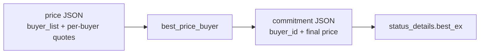

---

# 18. Table write-path map

| TABLE | CREATE PATH | UPDATE PATH | DELETE PATH | BG JOB? | API? | SCRIPT? | EXTERNAL? |
|-------|-------------|-------------|-------------|---------|------|---------|-----------|
| `msrx_msrx_user` | admin.py create_user+MSRX_User; aggregator.py AGS; freedom investor_mgmt | users.py, aggregator, commit (hours) | CASCADE from auth rare | no | yes | admin | no |
| `msrx_client_aggregator_seller` | aggregator.py | aggregator.py | CASCADE with user | no | yes | — | no |
| `msrx_client_coissue_seller` | api_handler upload; pricing.py | status transitions pricing/commit | move to *_deleted archive patterns | pricing tasks | yes | — | no |
| `msrx_client_coissue_tape` | bulk_create on upload | support_pricing fast_sql_update; commit | archive deleted | pricing | yes | raw SQL updates | no |
| `msrx_client_coissue_buyer*` | grid.py | grid activate/deactivate | — | model build task | yes | — | no |
| `msrx_client_commit_cycle` | commit.py, support_pricing | commit/pricing caps | — | no | yes | — | no |
| `msrx_loannumbers` | inventory load (admin/ops) | msr_commit burns | — | no | yes | possibly | no |
| `duediligence_loan` | support_committing get_or_create; aggregator Deal create | Loan.save status hooks; ST APIs | SET_NULL parents | emails on status | yes | reprocess helpers | ST |
| `msrx_boarding_staging` | supertransfer views bulk_create | Transfer boarded; exceptions; qc_loan link | CASCADE from loans | boarding file | yes | RP generators | ST |
| DynamoDB item | **UNKNOWN** | ST update_table | MSRX reprocess delete | ST worker | — | notebook commented put_item | **UNKNOWN creator** |
| `freedom_loan` / commits | Freedom tape upload/commit | pre_close, tape_management | CASCADE tape | Freedom jobs | yes | — | no |

---

# 19. Table read-path map

| TABLE | WHO READS | WHY | SURFACE |
|-------|-----------|-----|---------|
| `msrx_client_aggregator_seller` | aggregator_get_tape_summary | seller_list | Aggregator Price Management API/UI |
| `msrx_client_coissue_seller` | aggregator/seller/buyer APIs | tape list | Tape screens |
| `msrx_client_coissue_tape` | pricing, commit, ST commitment_check SQL, commitrecon | loan attrs + JSON | Pricing/Commit/Reports |
| `msrx_client_coissue_buyer` | support_pricing | grids | Pricing engine |
| `msrx_boarding_staging` | ST query_msrx; boarding_file SQL; Transfer | latest boarding row | Boarding export |
| `duediligence_loan` | DD serializers; ST DD APIs | QC/docs/status | DD UI |
| DynamoDB | ST handlers | processing state | Worker |
| `freedom_loan` | Freedom serializers (N+1 risk) | WL pipeline | Freedom UI |

---

# 20. Source-of-truth map

| Concept | Classification | Table / store | Notes |
|---------|----------------|---------------|-------|
| User login | PRIMARY | `auth_user` | Credentials |
| Business user | PRIMARY | `msrx_msrx_user` | Role/flags/details |
| Aggregator↔Seller map | PRIMARY | `msrx_client_aggregator_seller` | |
| Tape header status | PRIMARY | `msrx_client_coissue_seller` | |
| Loan attributes (MSR) | PRIMARY | `msrx_client_coissue_tape` | |
| Price quotes | PRIMARY (on loan) | `price` JSON | Also history elsewhere limited |
| Commitment (MSR) | PRIMARY | `commitment` JSON on loan | Not a separate commit table |
| Commitment (Freedom) | PRIMARY | `freedom_wholeloancommit` | |
| Buyer grid config | PRIMARY | `msrx_client_coissue_buyer` | |
| Aggregator loan numbers | PRIMARY inventory | `msrx_loannumbers` | burned on assign |
| DD loan / docs / QC | PRIMARY | `duediligence_*` | |
| ST processing state | PRIMARY for ST | DynamoDB | Initial create UNKNOWN |
| Loan PDFs / segregated | PRIMARY blobs | S3 | |
| Boarding field values | STAGING | `msrx_boarding_staging` | Built from extraction |
| Deleted tapes | ARCHIVE / HISTORY | `*_deleted` | |
| Updated post-commit | SNAPSHOT / HISTORY | `*_updated` | |
| Resell | ACTIVE copy | `*_resell` | Parallel lifecycle |
| Boarded_Tapes | EXPORT meta | `msrx_boarded_tapes` | |
| LocMem cache | CACHE | — | Not SoT |
| RP boarding table | CLIENT-SPECIFIC STAGING | `rp_boarding_staging_table` | |

---

# 21. Cascade / delete impact

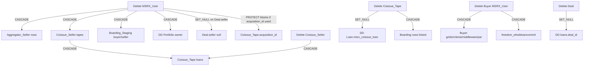

| Entity deleted | Impact |
|----------------|--------|
| `auth_user` | CASCADE → `msrx_msrx_user` if O2O; AGS logins CASCADE |
| `MSRX_User` | CASCADE many child FKs (tapes, grids, AGS, boarding…); PROTECT on acquisition_id / commit_cycle / psa may **block** |
| Tape header | CASCADE all loan rows |
| Coissue loan | SET_NULL on DD link; CASCADE boarding linked rows |
| Buyer | CASCADE pricing config & Freedom commits referencing buyer |
| Deal | SET_NULL on loans (loans remain) |

**SET_NULL / PROTECT / DO_NOTHING matter:** acquisition_id and commit_cycle are PROTECT — deleting referenced users/cycles can fail.

---

# 22. Index / constraint findings (report only)

**Explicit unique / indexes in models (sample):**

| Model | Constraint |
|-------|------------|
| `MSRX_User.selleracqidprefix` | unique=True |
| `Client_Coissue_Tape.tape_loan_id` | db_index=True |
| Buyer grid `inuse`, middleware `inuse`/`valid_until`, par product/term | db_index=True |
| DD Program/Field/DocumentType/QC | UniqueConstraints per company |
| `duediligence_loan` location | unique loan_number on Loan_location |
| Freedom PriceClass | unique_together (code, branch) |

**Heavily queried, potentially under-indexed (from code + prior audit — verify with EXPLAIN):**

- `freedom_wholeloanprice(loan_id)` filtered by selected
- `freedom_tape(root_id, status)`
- `msrx_boarding_staging(seller_loan_number, updated_at DESC)` DISTINCT ON patterns
- `duediligence_qualitycontrol(loan_id, triggered)`
- JSON containment queries on `commitment__buyer_id` (GIN jsonb may help — not confirmed present)

**Do not modify.** Validate on UAT with `EXPLAIN (ANALYZE, BUFFERS)`.

---

# 23. Raw SQL / ORM bypass

| Location | Accesses | Why it matters |
|----------|----------|----------------|
| `api/supporting/support_pricing.py` `fast_sql_update` | UPDATE `msrx_client_coissue_tape` / seasoned `price` jsonb | Bypasses ORM save signals |
| `api/supporting/criteria/criteria_update.py` | `.raw()` SUM on coissue tape | Aggregates |
| `commitrecon/*.py` | cursor SQL on updated/resell + JSON cast buyer_id | Reveals JSON buyer relation |
| `api/supporting/support_util.py` | CTE volume reports | Cross tape families |
| `duediligence/utils/boarding_file.py` | SQL on boarding staging | Boarding export |
| `super_transfer_client/.../query_msrx.py` | psycopg2 SELECT users/coissue/boarding | Cross-repo DB read |
| `Transfer/.../file_generators.py` | psycopg2 external/boarding | RP boarding |
| Bloomberg/Refinitiv scripts | psycopg2 market DBs | Market data — not core MSR graph |

---

# 24. Legacy / duplicate table classification

| Table / family | Classification |
|----------------|----------------|
| `msrx_client_coissue_*` live | **ACTIVE** |
| `msrx_client_seasoned_*` | **ACTIVE** (parallel product) |
| `freedom_*` | **ACTIVE** |
| `duediligence_*` | **ACTIVE** |
| `*_resell` | **LIKELY ACTIVE** (aggregator resell) |
| `*_deleted` | **HISTORY / ARCHIVE** (referenced) |
| `*_updated` | **ACTIVE SNAPSHOT** (recon) |
| `msrx_boarding_staging` | **ACTIVE STAGING** |
| `rp_boarding_staging_table` | **CLIENT-SPECIFIC ACTIVE** |
| `supertransfer_*` Postgres | **LIKELY ACTIVE** (parallel to DynamoDB) |
| `middleware` / `bw_middleware` models | **APPARENTLY UNUSED** (empty models.py) |
| Bloomberg Previous Versions | **LEGACY scripts** |
| In-memory sqlite tapecrack | **EPHEMERAL** |
| `whole_loan_tape` (msrx) | **UNKNOWN — ASK IN KT** vs freedom_tape |
| Secondlien / voxtur / terms / analytics | **LIKELY ACTIVE** niche modules |

---

# 25. Database workflow diagrams

### 1. LOGIN / USER

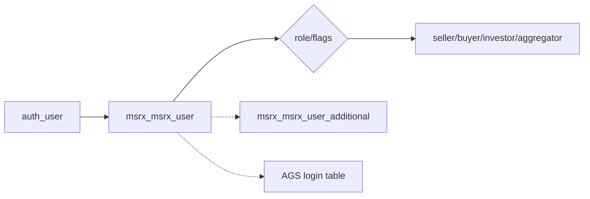

### 2. AGGREGATOR

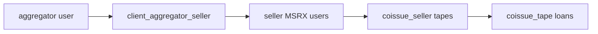

### 3. TAPE UPLOAD

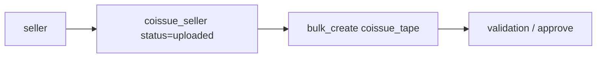

### 4. PRICING

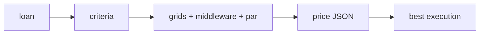

### 5. COMMIT

```mermaid
flowchart LR
  L[loan price] --> P[pre-commit commitment JSON]
  P --> C[confirm]
  C --> D[DD loan + loan numbers + SQS]
```

### 6. SUPER TRANSFER

```mermaid
flowchart LR
  C[confirmed loan] --> K[seller-loan_id]
  K --> Q[SQS]
  Q --> W[ST worker]
  W --> DDB[(DynamoDB)]
  W --> S3[(S3)]
  W --> DD[DD APIs]
```

### 7. DOCUMENT PROCESSING

```mermaid
flowchart LR
  L[loan] --> S3[blob PDF]
  S3 --> ST[classify / extract]
  ST --> DOC[duediligence_document]
  DOC --> QC[QC]
```

### 8. BOARDING

```mermaid
flowchart LR
  P[processed extraction] --> BS[boarding_staging]
  BS --> F[boarding file]
  F --> SFTP[buyer SFTP]
```

### 9. FULL LOAN LIFECYCLE

```mermaid
flowchart TD
  U[User] --> S[Seller]
  S --> T[Tape header]
  T --> L[Loan]
  L --> P[Pricing]
  P --> C[Commitment]
  C --> ST[Super Transfer]
  ST --> DD[Due Diligence]
  DD --> B[Boarding]
```

---

# 26. Unknown relationships / KT questions

1. **Who `put_item`s the initial DynamoDB loan record?** (ST only updates; MSRX only deletes; notebook put_item commented.)
2. **Who adds `loan_id` / `deal_id` / `porfolio_id` to SQS or DynamoDB before ST runs?**
3. Exact **recommit / cancel / reverse** DB mutations for coissue commitments.
4. Is `msrx_whole_loan_tape` still written, or fully replaced by `freedom_tape`?
5. Are empty `middleware` / `bw_middleware` apps truly dead?
6. Full allowed DD status transition matrix per company.
7. Whether jsonb GIN indexes exist in live DB (not visible from models alone).
8. External process (Lambda?) watching S3 that creates DynamoDB items.

---

# DATABASE LEARNING GUIDE FOR A NEW DEVELOPER

All SQL below is **READ ONLY** (`SELECT` / `WITH` / `EXPLAIN` only).

---

## LEVEL 1 — User → MSRX User → Role

**Tables:** `auth_user`, `msrx_msrx_user`, `msrx_msrx_user_additional`, `msrx_client_aggregator_seller_login`

**Key columns:** `auth_user.id`, `msrx_msrx_user.user_id`, `user_role`, `aggregator_flag`, `aggregator_seller_flag`, `client_name`

```sql
SELECT u.id AS auth_id, u.username, m.id AS msrx_id, m.client_name,
       m.user_role, m.aggregator_flag, m.aggregator_seller_flag, m.active
FROM auth_user u
LEFT JOIN msrx_msrx_user m ON m.user_id = u.id
WHERE u.id = /* your auth id */;
```

**Notice:** One auth user ↔ one primary MSRX_User (O2O). Flags matter more than `user_role` alone for aggregators.

---

## LEVEL 2 — Seller → Tape → Loan

**Tables:** `msrx_client_coissue_seller`, `msrx_client_coissue_tape`

**Key columns:** header `client_id`, `status`, `loancount`, `upb`; loan `tapeinfo_id`, `tape_loan_id`, `price`, `commitment`

```sql
SELECT s.id AS tape_id, s.tape_name, s.status, s.loancount, s.upb, s.client_id
FROM msrx_client_coissue_seller s
WHERE s.client_id = /* seller msrx id */
ORDER BY s.uploadtime DESC
LIMIT 20;

SELECT t.id, t.tape_loan_id, t.loan_balance,
       t.commitment->>'buyer_id' AS buyer_id,
       t.commitment->>'price' AS commit_price
FROM msrx_client_coissue_tape t
WHERE t.tapeinfo_id = /* tape header id */
LIMIT 50;
```

**Notice:** Header = tape; child rows = loans. Buyer is inside JSON, not a FK column.

---

## LEVEL 3 — Aggregator → Seller

**Tables:** `msrx_client_aggregator_seller`, `msrx_msrx_user`

```sql
SELECT cas.id, cas.seller_code, cas.user_id AS seller_msrx_id,
       cas.aggregator_id, s.client_name AS seller_name, a.client_name AS aggregator_name
FROM msrx_client_aggregator_seller cas
JOIN msrx_msrx_user s ON s.id = cas.user_id
JOIN msrx_msrx_user a ON a.id = cas.aggregator_id
WHERE cas.aggregator_id = /* aggregator msrx id */;
```

**Notice:** Same join path as `aggregator_get_tape_summary()` seller_list.

---

## LEVEL 4 — Buyer → Pricing

**Tables:** `msrx_client_coissue_buyer`, `_criteria`, `_middleware`, `_par`

```sql
SELECT id, grid_name, inuse, coissue, status,
       counterparty->'seller' AS seller_ids
FROM msrx_client_coissue_buyer
WHERE client_id = /* buyer msrx id */
ORDER BY uploadtime DESC
LIMIT 20;
```

**Notice:** `Client_Coissue_Buyer` is a **grid**, not a buyer entity. Buyer entity is `msrx_msrx_user`.

---

## LEVEL 5 — Loan → Commitment

```sql
SELECT id, tape_loan_id, aggregator_loan_id,
       commitment, price->'best_price_buyer' AS best_buyer
FROM msrx_client_coissue_tape
WHERE commitment ? 'buyer_id'
  AND (commitment->>'buyer_id')::int = /* buyer id */
LIMIT 50;

SELECT id, status, status_details
FROM msrx_client_coissue_seller
WHERE status IN ('priced','pre-commit','confirmed')
ORDER BY updated_at DESC
LIMIT 20;
```

**Notice:** Commitment SoT for MSR coissue is JSON on the loan row.

---

## LEVEL 6 — Confirmed Loan → Super Transfer

**Cross-system key:** `{seller_id}-{buyer_id}_{tape_loan_id}`

```sql
SELECT t.id, s.client_id AS seller_id,
       (t.commitment->>'buyer_id')::int AS buyer_id,
       t.tape_loan_id,
       (s.client_id::text || '-' || (t.commitment->>'buyer_id') || '_' || t.tape_loan_id) AS seller_loan_id
FROM msrx_client_coissue_tape t
JOIN msrx_client_coissue_seller s ON s.id = t.tapeinfo_id
WHERE s.status = 'confirmed'
LIMIT 20;
```

**Notice:** This string is DynamoDB PK + SQS body. Inspect DynamoDB / S3 outside Postgres.

---

## LEVEL 7 — Super Transfer → DD → Documents

**Tables:** `duediligence_loan`, `duediligence_deal`, `duediligence_document`

```sql
SELECT l.id, l.loan_number, l.status, l.deal_id, l.msrx_coissue_loan_id, l.whole_loan_id
FROM duediligence_loan l
WHERE l.msrx_coissue_loan_id = /* coissue tape loan id */
   OR l.loan_number = /* tape_loan_id */;

SELECT d.id, d.type_id, d.loan_id, d.final_version, d.file_name
FROM duediligence_document d
WHERE d.loan_id = /* dd loan id */;
```

**Notice:** DD loan links back via FK `msrx_coissue_loan_id` and business key `loan_number`.

---

## LEVEL 8 — Processed Loan → Boarding

**Tables:** `msrx_boarding_staging`, `msrx_boarded_tapes`

```sql
SELECT id, seller_id, buyer_id, seller_loan_number, status, boarded,
       boarding_file_delivered, msrx_coissue_loan_id, qc_loan_id, updated_at
FROM msrx_boarding_staging
WHERE seller_loan_number = /* loan number */
ORDER BY updated_at DESC
LIMIT 10;
```

**Notice:** Staging is wide (~1500 columns). Link columns `msrx_coissue_loan_id` / `qc_loan_id` / `whole_loan_id` are the bridges.

---

## Optional EXPLAIN pattern

```sql
EXPLAIN (ANALYZE, BUFFERS)
SELECT * FROM msrx_client_coissue_tape
WHERE tapeinfo_id = 12345;
```

---

# Quality checklist

| Check | Result |
|-------|--------|
| Inspected model packages across apps | Yes (~264; appendix 21a) |
| FK vs logical vs JSON labeled | Yes |
| Actual PostgreSQL table names | Yes |
| DynamoDB usage inspected | Yes (query/update only; create UNKNOWN) |
| MSRX ↔ Super Transfer connected | Yes (SQS/S3/APIs/Postgres read) |
| `seller-loan_id` traced | Yes `{seller}-{buyer}_{loan}` |
| Write paths for critical tables | Yes |
| Read paths for critical tables | Yes |
| JSONField structures | Yes (commitment/price/status_details/…) |
| Source-of-truth vs staging/history | Yes |
| Smaller domain diagrams (not one giant ERD) | Yes |
| Unknowns listed for KT | Yes |

---

*End of `21_COMPLETE_DATABASE_RELATIONSHIP_MAP.md`*
