# 22 — Complete End-to-End Execution Flow & Worker Architecture Audit

**Audience:** Backend developers learning MSRX → Super Transfer  
**Date:** 2026-07-24  
**Scope (read-only):** `msrx-frontend`, `msrx_v2.0`, `super_transfer_client`  
**Method:** Code-traced execution paths. No invented architecture.

**Evidence labels used throughout:**

| Label | Meaning |
|-------|---------|
| `[CONFIRMED FROM CODE]` | Exact file/function/behavior found in repo |
| `[CONFIRMED FROM CONFIG]` | Proven by config/deploy scripts (appspec, cron, settings, env patterns) |
| `[LOGICAL INFERENCE]` | Reasonable conclusion from adjacent code; not directly proven |
| `[EXTERNAL COMPONENT]` | Exists outside these three repos (or only referenced by comment) |
| `[UNKNOWN — KT CONFIRMATION REQUIRED]` | Cannot be proven from available code |

**Central representative flow:** Tape → Pricing → Pre-commit → **Confirm Commit** → SQS → Super Transfer worker.

---

## 1. Executive architecture

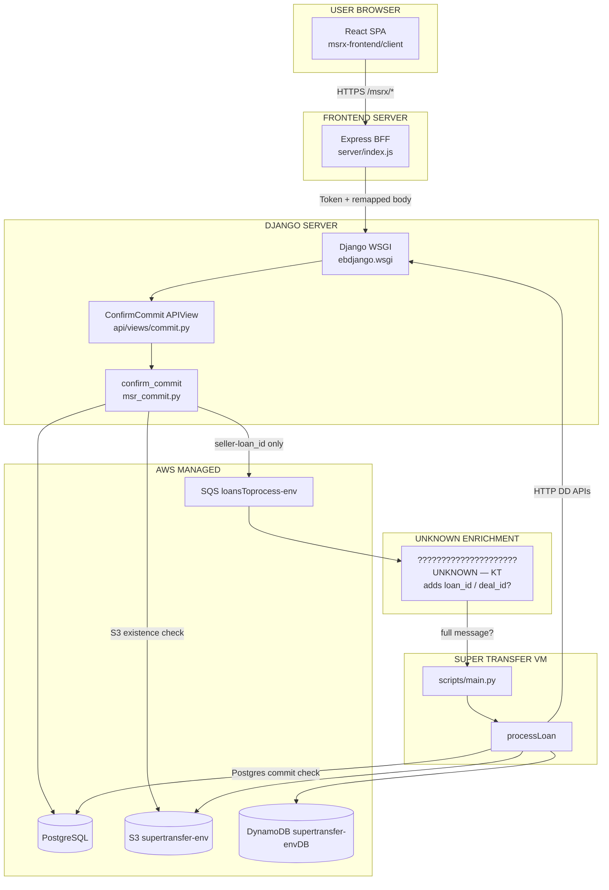

**What this system is (plain language):**

1. A trader confirms a committed tape in the React UI.  
2. Express BFF authenticates and remaps the request to Django.  
3. Django flips tape status to `confirmed`, writes DB records, and **may** enqueue Super Transfer work.  
4. An EC2 worker polls SQS, classifies/extracts loan documents, and posts results back to Due Diligence / boarding staging.  
5. Boarding file delivery to buyer SFTP is a **separate** Django scheduler path — not inside the worker’s sync response.

**Critical architectural fact:** Django’s SQS producer and the Super Transfer consumer do **not** share the same message schema in these three repos. See §10–§11.

---

## 2. Repository startup

### 2.1 msrx-frontend

```
npm start
  ↓
NODE_ENV=production node server/index.js
  ↓
express() + middleware
  ↓
static client/dist
  ↓
app.use("/msrx", [csrfProtection, msrxRouter])
  ↓
listen(PORT)
```

| Step | Evidence | Label |
|------|----------|-------|
| Scripts | `package.json`: `start` → `server/index.js`; `serve` → webpack.dev; `build` → webpack.prod | `[CONFIRMED FROM CODE]` |
| Express entry | `server/index.js` creates `app`, mounts `/msrx` | `[CONFIRMED FROM CODE]` |
| React entry | `webpack.common.js` entry → `client/src/app.js` | `[CONFIRMED FROM CODE]` |
| React mount | `app.js` → `ReactDOM.render` → `#root` | `[CONFIRMED FROM CODE]` |
| Dev proxy | `webpack.dev.js` proxies `/msrx` → `localhost:3000` (Express), **not** Django | `[CONFIRMED FROM CODE]` |

**Middleware order** (`server/index.js`) — `[CONFIRMED FROM CODE]`:

1. `dotenv.config()`
2. `helmet` / CSP
3. `express.static(DIST_DIR)`
4. `bodyParser` (urlencoded / json 40mb / raw)
5. `cookieParser(WEB_TOKEN_SECRET)`
6. `/msrx` → `csrfProtection` then `msrxRouter`
7. HTML routes set CSRF cookie
8. `listen(PORT)`

**Router first middleware:** `utils.refreshToken` in `server/msrxRoutes.js` — slides signed `auth` cookie, sets `axios.defaults.headers.common["username"]`.

### 2.2 msrx_v2.0

```
WSGI/EB process
  ↓
DJANGO_SETTINGS_MODULE=ebdjango.settings
  ↓
MSRX_ENV → demo/live/local/uat/dev settings
  ↓
ebdjango.urls → api.urls → ConfirmCommit
  ↓
APIView → service → ORM / AWS
```

| Step | Evidence | Label |
|------|----------|-------|
| manage.py | sets `ebdjango.settings` | `[CONFIRMED FROM CODE]` |
| Settings router | `ebdjango/settings/__init__.py` via `MSRX_ENV` | `[CONFIRMED FROM CODE]` |
| WSGI | `ebdjango/wsgi.py` + `leader_election_process` thread | `[CONFIRMED FROM CODE]` |
| ASGI | Not found | `[UNKNOWN — KT CONFIRMATION REQUIRED]` / absent |
| Root URLs | `ebdjango/urls.py` includes `msrx/api/` → `api.urls` | `[CONFIRMED FROM CODE]` |
| Confirm route | `api/urls/index.py` → `path("confirm_commit/", ConfirmCommit.as_view())` | `[CONFIRMED FROM CODE]` |
| Auth | TokenAuthentication + IsAuthenticated (shared settings) | `[CONFIRMED FROM CODE]` |

### 2.3 super_transfer_client

```
CodeDeploy AfterInstall
  ↓
scripts/start_cron.sh installs crontab
  ↓
* * * * * flock … python3.12 scripts/main.py
  ↓
import helper_functions → ensure_model_context()
  ↓
main() while process_flag():
  ↓
receive_message (missing-file queue first, then loan queue)
```

| Step | Evidence | Label |
|------|----------|-------|
| CodeDeploy | `appspec.yml` → destination `/home/ec2-user/super_transfer_client/` | `[CONFIRMED FROM CONFIG]` |
| Cron start | `start_cron.sh` every minute + `flock -w 1` | `[CONFIRMED FROM CONFIG]` |
| Entry | `scripts/main.py` calls `main()` at module bottom (no `if __name__`) | `[CONFIRMED FROM CODE]` |
| Process gate | `process_flag()` reads DynamoDB `supertransfer-deploymentDB` | `[CONFIRMED FROM CODE]` |
| systemd | Not found | Absent in repo |
| supervisor | Not found | Absent in repo |

**Production host name / AMI / ASG:** `[UNKNOWN — KT CONFIRMATION REQUIRED]` — only CodeDeploy path + cron proven.

---

## 3. React flow (Tape → Confirm)

**Important:** The MSR Coissue wizard uses **direct axios**, not `apiHoc`. `[CONFIRMED FROM CODE]`

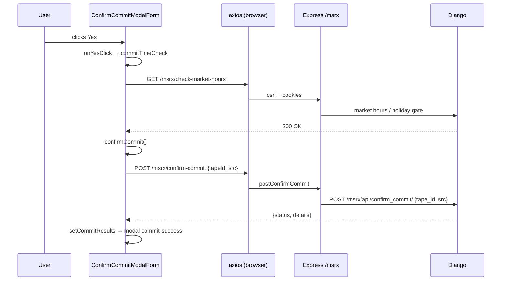

### Step-by-step (confirm only)

| # | FILE | FUNCTION | INPUT | OUTPUT / NEXT |
|---|------|----------|-------|---------------|
| 1 | `client/.../confirmCommitModalForm.js` | `onYesClick` | click | closes modal → `commitTimeCheck` |
| 2 | same | `commitTimeCheck` | — | `GET /msrx/check-market-hours` |
| 3 | same | `confirmCommit` | `{ tapeId, src: "msrx_workflow" }` | `POST /msrx/confirm-commit` |
| 4 | Redux `actions.js` via mapDispatch | `setCommitResults` | axios response | success modal |

**Upstream path that gets the tape into confirmable state** (abbreviated, all `[CONFIRMED FROM CODE]`):

| Stage | Component | Request |
|-------|-----------|---------|
| Upload | `dropZone.js` `postFile` | `POST /msrx/upload-tape` |
| Approve | `workflowWizard.js` `approve` | `POST /msrx/approve-tape?tapeId=` |
| Price | `step4-price.js` `runPricing` | `POST /msrx/run-pricing?...` |
| Pre-commit | `step6-confirm.js` `commitPools` | `POST /msrx/pre-commit-loan-level` `{pools, newWorkflow}` |
| Fetch confirm | `step6-confirm.js` `getConfirm` | `GET /msrx/fetch-confirm` |
| Open modal | `workflowWizard.js` `checkDuplicates` | `GET /msrx/check-duplicates-commit` → modal `confirm-commit` |

**Store wiring:** CSRF header set in `client/src/store/store.js` from meta `token`; auth token is **not** on client — lives in httpOnly signed cookie. `[CONFIRMED FROM CODE]`

---

## 4. Express BFF flow

```
Browser POST /msrx/confirm-commit
  ↓
csrfProtection (prod: header vs signed cookie)
  ↓
msrxRouter → refreshToken
  ↓
msrCoissue.postConfirmCommit
  ↓
axios → BACKEND_URL/msrx/api/confirm_commit/
     Authorization: Token {auth.key}
     body: qs.stringify({ tape_id, src })
  ↓
res.status(200).send(response.data)
```

### Why Express exists

| Responsibility | Does Express do it? | Evidence |
|----------------|---------------------|----------|
| Serve React static build | Yes | `express.static(DIST_DIR)` |
| CSRF gate | Yes (prod) | `csrfProtection` |
| Hold auth token in httpOnly cookie | Yes | login sets `auth`; routes read `signedCookies.auth.key` |
| Refresh/slide session | Yes | `refreshToken` maxAge 2h |
| Remap client JSON → Django form body | Yes | `tapeId`→`tape_id`, pools→`commit_details`, etc. |
| Transparent reverse proxy | **No** | Hand-rolled axios, not `http-proxy-middleware` |
| Access database | **No** | No ORM/SQL in `server/` for this path |
| Change request body | **Yes** | Remapping is intentional |

`postConfirmCommit` (`server/routes/msrCoissue.js`):

```404:418:msrx-frontend/server/routes/msrCoissue.js
const postConfirmCommit = (req, res) => {
  const options = {
    method: "post",
    url: `${BACKEND_URL}/msrx/api/confirm_commit/`,
    headers: { Authorization: `Token ${req.signedCookies.auth.key}` },
    data: qs.stringify({ tape_id: req.body.tapeId, src: req.body.src})
  };
  // ...
};
```

**Error handling:** route catches axios error → `res.status(error.status).send(error.data?.details)`. Server axios interceptor can synthesize 503. `[CONFIRMED FROM CODE]`

---

## 5. Django request flow (confirm)

```
POST /msrx/api/confirm_commit/
  ↓
TokenAuthentication middleware stack
  ↓
ConfirmCommit.post (api/views/commit.py)
  ↓
request.POST: tape_id, src
  ↓
confirm_commit(auth_user, tape_id, commit_src)
  ↓
ORM + AWS side effects
  ↓
Response { status, details }
```

**No DRF serializer** on this view — raw `request.POST`. `[CONFIRMED FROM CODE]`

```277:283:msrx_v2.0/api/views/commit.py
  def post(self, request, format=None):
    try:
      tape_id = request.POST.get("tape_id")
      commit_src = request.POST.get("src")
      status, details = confirm_commit(request.user, tape_id, commit_src)
      return Response({"status": status, "details": details})
```

---

## 6. Commit confirmation deep trace

### 6.1 Function chain

| Order | FILE | FUNCTION | IMPORTANT ARGS | SIDE EFFECTS |
|------:|------|----------|----------------|--------------|
| 1 | `api/views/commit.py` | `ConfirmCommit.post` | `tape_id`, `src` | HTTP response |
| 2 | `api/supporting/services/msr_commit.py` | `confirm_commit` | `auth_user`, `tape_id`, `commit_src` | Full commit pipeline |
| 3 | same | (inline) | tape must be `pre-commit` | Else returns failure |
| 4 | ORM | `Client_Coissue_Seller.save` | status→`confirmed`, timestamp | DB write |
| 5 | `support_pricing.py` | `asset_commit_postprocess` | tape | Postprocess / split |
| 6 | loop loans | `get_s3_buyer` | seller, loan_number, loan | Resolve buyer for S3/SQS |
| 7 | `support_committing.py` | `post_loan_to_sqs` | seller_id, buyer_id, loan_number | S3 check + SQS |
| 8 | ORM | `bulk_update` delivery_month | loans | DB write |
| 9 | `api_handler` | `assign_deals_to_loans` | loans_by_buyer | PSA deal linkage |
| 10 | optional | LoanNumbers burn / AgencyPurchase | aggregator paths | DB write |
| 11 | `support_committing.py` | `create_commit_dd_records_and_values` | tape | DD Loan/Document/Value |
| 12 | email + thread | `email_commit`, `auto_resell_async` | tape | Email + background resell |

### 6.2 ID provenance

| ID | Source | Label |
|----|--------|-------|
| `seller_id` | `str(msrx_user.id)` of authenticated user | `[CONFIRMED FROM CODE]` `msr_commit.py:84,131` |
| `loan_number` | `str(loan.tape_loan_id)` on `Client_Coissue_Tape` | `[CONFIRMED FROM CODE]` |
| `buyer_id` (SQS) | `get_s3_buyer(...)`: aggregator_id OR `loan.commitment__buyer_id` OR S3 key scan | `[CONFIRMED FROM CODE]` |
| `buyer_id` (deal map) | `loan.commitment["buyer_id"]` | `[CONFIRMED FROM CODE]` |

### 6.3 Ordering note (race risk)

```
for loan in loans:
    post_loan_to_sqs(...)          # SQS FIRST
...
create_commit_dd_records_and_values(...)  # DD loan_id CREATED AFTER
```

`[CONFIRMED FROM CODE]` — SQS is sent **before** DD records are created. If enrichment needs DD `loan_id`, this is a race. `[LOGICAL INFERENCE]` that this matters for the enrichment gap in §11.

### 6.4 SQS failure does not roll back confirm

If `post_loan_to_sqs` returns `False`, confirm still continues; only `activity_log` records failure. `[CONFIRMED FROM CODE]`

---

## 7. seller-loan_id lifecycle

### Format (verified)

```
{seller_id}-{buyer_id}_{loan_number}
```

Example: `117-42_2208066387`

`[CONFIRMED FROM CODE]` — constructed in `post_loan_to_sqs`:

```181:181:msrx_v2.0/api/supporting/support_committing.py
        MessageBody=json.dumps({"seller-loan_id": f"{seller_id}-{buyer_id}_{loan_number}"}),
```

Worker parsers split on `-` then `_` (`query_msrx.py:23-24,78-80`). `[CONFIRMED FROM CODE]`

> TypedDict comment in `misc.py` saying `<seller_id>_<buyer_id>-<loan_number>` is **wrong** relative to runtime parsers. `[CONFIRMED FROM CODE]` contradiction in comments only.

### ID diagram

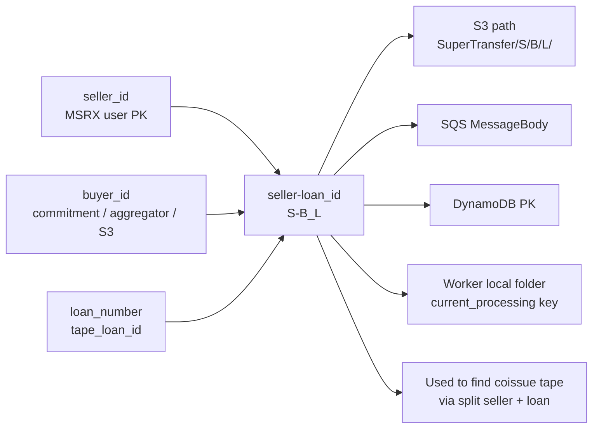

| System | What seller-loan_id means | Label |
|--------|---------------------------|-------|
| S3 | Folder identity: seller/buyer/loan under `SuperTransfer/` | `[CONFIRMED FROM CODE]` |
| SQS (Django producer) | Sole message field | `[CONFIRMED FROM CODE]` |
| DynamoDB | Primary key for loan processing state | `[CONFIRMED FROM CODE]` |
| Super Transfer | Message identity + local dir name | `[CONFIRMED FROM CODE]` |
| Due Diligence `loan_id` | **Different** — integer PK of `duediligence_loan` | `[CONFIRMED FROM CODE]` TypedDict + notebook |

---

## 8. S3 precondition before SQS

```
confirm_commit
  ↓
post_loan_to_sqs(seller_id, buyer_id, loan_number)
  ↓
bucket = supertransfer-{MSRX_ENV.lower()}
path   = SuperTransfer/{seller_id}/{buyer_id}/{loan_number}/
  ↓
folder_exists_and_not_empty(bucket, path)
  ↓ list_objects MaxKeys=1
  ├─ Contents present → send_message → return True
  └─ empty / missing → return False (NO SQS)
```

| Item | Value | Label |
|------|-------|-------|
| Bucket | `supertransfer-{env}` hardcoded in `post_loan_to_sqs` | `[CONFIRMED FROM CODE]` |
| Path | `SuperTransfer/{seller}/{buyer}/{loan}/` | `[CONFIRMED FROM CODE]` |
| Check | `list_objects` Prefix + MaxKeys=1; true if `"Contents"` | `[CONFIRMED FROM CODE]` |
| If missing | SQS not sent; confirm continues | `[CONFIRMED FROM CODE]` |
| Who uploaded docs | Not in confirm path | `[UNKNOWN — KT CONFIRMATION REQUIRED]` |

---

## 9. SQS producer (Django)

| Item | Exact value | Label |
|------|-------------|-------|
| FILE | `msrx_v2.0/api/supporting/support_committing.py` | `[CONFIRMED FROM CODE]` |
| FUNCTION | `post_loan_to_sqs` | `[CONFIRMED FROM CODE]` |
| QUEUE | `loansToprocess-{MSRX_ENV.lower()}` | `[CONFIRMED FROM CODE]` |
| URL | `https://sqs.us-east-1.amazonaws.com/{AWS_ACCOUNT_ID}/loansToprocess-{env}` | `[CONFIRMED FROM CODE]` |
| Client | `boto3.client("sqs", keys…, region_name="us-east-1")` | `[CONFIRMED FROM CODE]` |
| MessageAttributes | **None** | `[CONFIRMED FROM CODE]` |
| Error handling | bare `except: return False` | `[CONFIRMED FROM CODE]` |

### Exact message schema (producer)

```json
{
  "seller-loan_id": "117-42_2208066387"
}
```

**Only that field.** Do not add fields Django does not send. `[CONFIRMED FROM CODE]`

---

## 10. Producer / consumer contract comparison

### DJANGO PRODUCER

| field | type | example | required by producer |
|-------|------|---------|----------------------|
| `seller-loan_id` | string | `"117-42_2208066387"` | Yes (only field) |

### SUPER TRANSFER CONSUMER (TypedDict + runtime gate)

| field | required at gate? | purpose | Label |
|-------|-------------------|---------|-------|
| `seller-loan_id` | Yes (always read) | Identity, DDB key, path parsing | `[CONFIRMED FROM CODE]` |
| `loan_id` | **Yes to call processLoan** | DD loan PK (`duediligence_loan.id`) | `[CONFIRMED FROM CODE]` `main.py:100` |
| `deal_id` | Soft (DDB/message fallback) | DD deal context | `[CONFIRMED FROM CODE]` |
| `porfolio_id` | Soft (typo spelling used) | Portfolio context | `[CONFIRMED FROM CODE]` |
| `msrx_coissue_loan_id` | Injected by worker after commitment_check | Coissue tape loan id | `[CONFIRMED FROM CODE]` |
| `timeOfmessage` | TypedDict only | Timestamp | `[CONFIRMED FROM CODE]` notebook |

Manual full shape (`Manual_Loan_Process.ipynb`) — `[CONFIRMED FROM CODE]`:

```python
res = {
  "seller-loan_id": "1234-1234_123456",
  "porfolio_id": "123",
  "deal_id": "12",
  "loan_id": 0000,  # DD loan id, NOT seller loan number
  "msrx_coissue_loan_id": None,
  "timeOfmessage": "..."
}
```

---

## 11. Missing / enrichment component investigation

### What code proves

| Fact | Evidence | Label |
|------|----------|-------|
| Django sends only `seller-loan_id` | `support_committing.py:181` | `[CONFIRMED FROM CODE]` |
| Worker requires `'loan_id' in res` before `processLoan` | `main.py:100` | `[CONFIRMED FROM CODE]` |
| If `loan_id` missing, message is still **deleted** | `main.py:115` outside the `if 'loan_id'` block | `[CONFIRMED FROM CODE]` |
| Worker does **not** call `STLoanLookupView` | No HTTP to `/stloans/lookup` in worker | `[CONFIRMED FROM CODE]` |
| `STLoanLookupView` docstring says “used by Lambda” | `duediligence/views/loanviews.py:228-232` | `[CONFIRMED FROM CODE]` comment only |
| No Lambda implementation in these three repos | Glob/search for lambda packages = empty | `[CONFIRMED FROM CODE]` absence |
| No `loansToprocess` string in ST client | Grep | `[CONFIRMED FROM CODE]` absence |
| DynamoDB can also supply `loan_id` **inside** `processLoan` via `initialize_portfolio` | `helper_functions.py:212-233` | `[CONFIRMED FROM CODE]` — but unreachable if gate fails |

### Gap diagram (DO NOT silently connect)

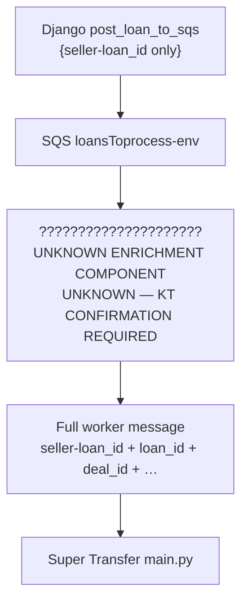

### Searched and not found in-repo

- Lambda source that enriches SQS  
- Second producer writing full message  
- EventBridge / SNS / DynamoDB Stream transformers  
- Worker-side call to `STLoanLookupView`  
- S3 event → enqueue full payload  

**KT question (must ask):**  
*After Django posts `{seller-loan_id}` to `loansToprocess-{env}`, what production component adds `loan_id` / `deal_id` / `porfolio_id` before the worker consumes the message?*

---

## 12. Worker startup

```
CodeDeploy ApplicationStart/AfterInstall
  ↓
cron: flock → python3.12 scripts/main.py
  ↓
import helper_functions
  ↓ ensure_model_context()
      Secrets / env
      AWS clients (S3, DynamoDB Table, SQS)
      pickle.load NB + TF-IDF + JSON maps
  ↓
main()
  ↓ regenerate_local_loan_directory
  ↓ while process_flag():
        receive_message(missing_file_queue)
        else receive_message(loan_queue)
```

| Behavior | Value | Label |
|----------|-------|-------|
| Long poll | `WaitTimeSeconds=20` | `[CONFIRMED FROM CODE]` |
| Batch | `MaxNumberOfMessages=1` | `[CONFIRMED FROM CODE]` |
| Visibility | 1200s initial; heartbeat every 600s extends to 3600s during processLoan | `[CONFIRMED FROM CODE]` |
| Concurrency | Sequential messages; `flock` single process | `[CONFIRMED FROM CODE]` + `[CONFIRMED FROM CONFIG]` |
| Priority | Missing-file queue before loan queue | `[CONFIRMED FROM CODE]` |

---

## 13. SQS polling & message handling

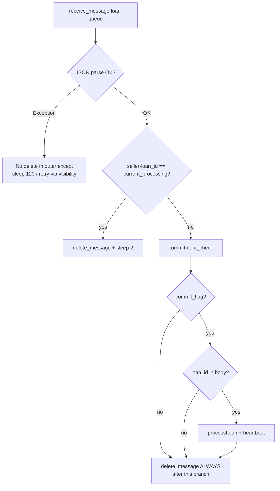

Every branch above is verified against `main.py:88-136`. `[CONFIRMED FROM CODE]`

---

## 14. commitment_check

| Item | Detail | Label |
|------|--------|-------|
| FILE | `base/workflows/query_msrx.py` | `[CONFIRMED FROM CODE]` |
| INPUT | SQS body with `seller-loan_id` | `[CONFIRMED FROM CODE]` |
| DB | Direct Postgres (`psycopg2`), not DynamoDB | `[CONFIRMED FROM CODE]` |
| Parse | `seller_id = split("-")[0]`; `loan_number = split("_")[1]` | `[CONFIRMED FROM CODE]` |
| Check 1 | `msrx_msrx_user.user_details→transfer_settings→super_transfer_commit_check` | `[CONFIRMED FROM CODE]` |
| Check 2 (if `"true"`) | Join `msrx_client_coissue_tape` + `msrx_client_coissue_seller` where status=`confirmed` | `[CONFIRMED FROM CODE]` |
| RETURN | `(flag: bool, coissue_loan_id: int\|None)` | `[CONFIRMED FROM CODE]` |

**Why (simple language):** Some sellers require Super Transfer to process a loan only after MSRX coissue commit is confirmed. The worker asks Postgres: “Is this seller’s tape loan confirmed?” If the seller does not require the check, processing proceeds.

**Failure behavior:** `flag=False` → **processLoan skipped** → **message still deleted**. `[CONFIRMED FROM CODE]` — recovery behavior ops-side: `[UNKNOWN — KT CONFIRMATION REQUIRED]`

---

## 15. processLoan deep trace

**FILE:** `scripts/process_loan_handler.py` · **FUNCTION:** `processLoan(res, lock)`

**Real order from code** (not an assumed pipeline):

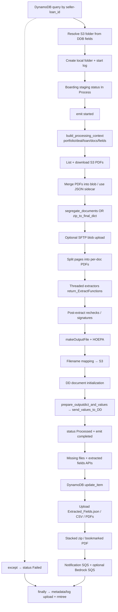

Exceptions inside `processLoan` are caught, status set to `"Failed"`, **not re-raised**; outer `main.py` still deletes the SQS message. `[CONFIRMED FROM CODE]`

---

## 16. Document acquisition

```
S3 bucket (env from Secrets / runtime)
  ↓
SuperTransfer/{sellerID}/{Buyer}/{LoanNum}
  ↓
list_of_uploaded_files → download_object_files
  ↓
local_loan_files/{seller-loan_id}/
  ↓
merge PDFs → blobs/  (or use existing classification JSON sidecar)
```

| Question | Answer | Label |
|----------|--------|-------|
| What is a blob PDF? | Merged (or single) source PDF of the loan’s uploaded documents before segregation | `[CONFIRMED FROM CODE]` / `[LOGICAL INFERENCE]` naming |
| Who uploaded it? | Not in confirm or worker path | `[UNKNOWN — KT CONFIRMATION REQUIRED]` |
| What identifier locates it? | DDB `sellerID` + `Buyer` + `LoanNum` → S3 prefix | `[CONFIRMED FROM CODE]` |
| If missing? | Empty download → segregation fails / exception → Failed status | `[CONFIRMED FROM CODE]` path |

---

## 17. OCR

### Runtime OCR (worker)

| Stage | Technology | Where | Label |
|-------|------------|-------|-------|
| Page text for classification | **AWS Textract** `detect_document_text` | `create_df` → `extract_kvs_text` | `[CONFIRMED FROM CODE]` |
| Field extraction | **Textract** analyze_document / forms / queries / analyze_id | `textract.py` + extractors | `[CONFIRMED FROM CODE]` |
| Secondary | **Tesseract** (`pytesseract`) | Credit report page numbers; some extractors | `[CONFIRMED FROM CODE]` |

```
PDF page image
  ↓ Textract detect_document_text
OCR text string
  ↓ stored in DataFrame column "Text" (in-memory)
  ↓ consumed by predict_label / extractors
```

### Training OCR

Training of Naive Bayes / TF-IDF is **not** performed by the worker. Pickles are loaded artifacts. Prior KT that Textract is used for training/data collection is **outside this runtime path** unless proven elsewhere. `[CONFIRMED FROM CODE]` for runtime; training pipeline location `[UNKNOWN — KT CONFIRMATION REQUIRED]`.

**Do not assume** “training OCR = runtime OCR.” They are separate.

---

## 18. Classification

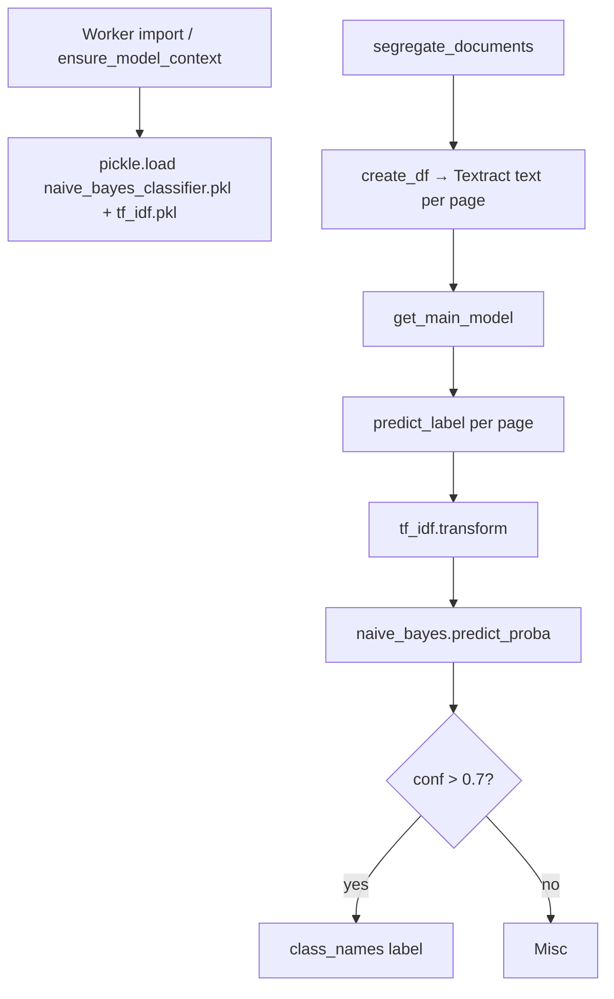

| Question | Answer | Label |
|----------|--------|-------|
| WHERE model loaded | `ensure_model_context` + `get_main_model` | `[CONFIRMED FROM CODE]` |
| WHEN | Import-time once; again when segregating; optional buyer model from S3 | `[CONFIRMED FROM CODE]` |
| predict() | `predict_label` → `predict_proba` | `[CONFIRMED FROM CODE]` |
| Output | Document type label + confidence; `<0.7` → `"Misc"` | `[CONFIRMED FROM CODE]` |
| Is this training? | **No** — inference only | `[CONFIRMED FROM CODE]` |

Supporting artifacts verified in load path: `naive_bayes_classifier.pkl`, `tf_idf.pkl`, `label_tokenizer.json`, `page_number_mappings.json`. `[CONFIRMED FROM CODE]`

Optional buyer-specific model: `customized_model/{branch}/{buyer}/` via `download_model_from_s3`. `[CONFIRMED FROM CODE]`

---

## 19. Segregation

```
classified pages (Prediction, Confidence)
  ↓
merge / versioning / first_pass combine rules
  ↓
group pages by document type
  ↓
split blob PDF into per-type PDFs
  ↓
filename generation + local write
  ↓
later: S3 upload of segregated PDFs
```

Entry: `segregate_documents` in `helper_functions.py`. Alternate path: if JSON/txt sidecar exists, `zip_to_final_dict` skips full re-classification. `[CONFIRMED FROM CODE]`

| Condition | Behavior | Label |
|-----------|----------|-------|
| Empty OCR DF | return `[], {}, {}` | `[CONFIRMED FROM CODE]` |
| Low confidence | label `"Misc"` | `[CONFIRMED FROM CODE]` |
| Duplicate doc types | versioning / combine logic in post-predict passes | `[CONFIRMED FROM CODE]` exists; full rule table not exhaustively listed here |
| Missing classification | Misc / incomplete extraction | `[LOGICAL INFERENCE]` from Misc path |

---

## 20. Extraction

```
segregated PDF labeled e.g. Note / Credit_Report
  ↓
return_ExtractFunctions()[label]
  ↓
extractor uses Textract/regex/parsers
  ↓
field dict
  ↓
recheck_fields / post-processing
  ↓
prepare_outputdict_and_values → send_values_to_DD
```

**Extractor map (code-supported labels)** — `[CONFIRMED FROM CODE]` `return_ExtractFunctions()`:

| Label | Function |
|-------|----------|
| Note | `note` |
| Closing_Disclosure | `extractCD` |
| Credit_Report | `CreditReport` |
| Security_Instrument | `extractDot` |
| Loan_Application-New_Format | `loanAppNew` |
| Loan_Application-Old_Format | `loanApp` |
| Appraisal_Uniform | `Appraisal` |
| … | Amortization, Escrow, Title, DU_Findings, LPA_Findings, W2, Paystub, etc. |

Fields such as loan type / borrower / property / credit / security instrument are extracted **only when** the corresponding document type is classified and the extractor runs. Do not claim universal field coverage.

---

## 21. Model loading vs training

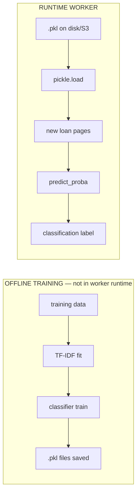

| Question | Answer | Label |
|----------|--------|-------|
| If 100 loans arrive today, how many times does the worker **train**? | **0** | `[CONFIRMED FROM CODE]` |
| How many times may model be **loaded**? | Once at import (`ensure_model_context`); again per segregation via `get_main_model`; optional buyer download; some extractor modules also load at import | `[CONFIRMED FROM CODE]` |
| `upload_model.py` | Uploads existing pickles to S3 on deploy — does not train | `[CONFIRMED FROM CONFIG]` / `[CONFIRMED FROM CODE]` |
| `TfidfVectorizer.fit_transform` in worker | Used for pairwise page similarity only — not classifier training | `[CONFIRMED FROM CODE]` |

---

## 22. DynamoDB

### Operations found in worker

| Op | Used? | When | Key | Why |
|----|-------|------|-----|-----|
| `Table(...)` | Yes | AWS init | — | Bind loan table |
| `query` | Yes | Start of processLoan/processFile; process_flag | `seller-loan_id` or `env` | Load loan metadata / deployment flag |
| `update_item` | Yes | After processing (`update_table`) | `seller-loan_id` | Persist output / status fields |
| `get_item` | No | — | — | — |
| `put_item` | **No** in runtime (only commented notebook) | — | — | — |
| `scan` / `delete_item` | No in worker loop | — | — | Django reprocess helper can delete |

### Flow

```
SQS message (seller-loan_id)
  ↓
table.query(seller-loan_id)  — MUST exist
  ↓
processing
  ↓
table.update_item(...)
```

### Who creates the initial DynamoDB record?

**Not present as a `put_item` in these three repos’ runtime paths.** Notebook shows commented `put_item`. Django reprocess deletes DDB items.  

→ `[UNKNOWN — KT CONFIRMATION REQUIRED]`  
*KT: What creates the initial `supertransfer-{env}DB` item for a loan (S3 event Lambda, upload API, manual, other)?*

---

## 23. PostgreSQL / Due Diligence

### Direct Postgres from worker

| Use | Tables | Label |
|-----|--------|-------|
| commitment_check | `msrx_msrx_user`, `msrx_client_coissue_tape`, `msrx_client_coissue_seller` | `[CONFIRMED FROM CODE]` |
| boarding staging merge | `msrx_boarding_staging` | `[CONFIRMED FROM CODE]` |

### Due Diligence via HTTP (not raw SQL)

Worker calls MSRX URLs under `/msrx/duediligence/...` and `/msrx/supertransfer/...` for loans, documents, values, boarding staging. `[CONFIRMED FROM CODE]` env_variables + helpers.

### Django on confirm creates DD rows

`create_commit_dd_records_and_values` creates/updates:

- `duediligence.Loan` (`get_or_create` by `loan_number`)
- Commitment Record `Document` / `Value` / `Field` links
- Links related boarding staging where applicable further in function

`[CONFIRMED FROM CODE]`

| Record | Created by | Updated by |
|--------|------------|------------|
| DD Loan on commit | Django confirm | Worker posts values/status via APIs |
| Boarding staging | Django ST APIs / worker POST/PATCH | Worker status In Process → Processed/Failed |
| Coissue tape/seller | Frontend/Django commit flow | confirm_commit |

Exact Django table names in DB: typically prefixed (`msrx_*`, `duediligence_*`) — worker SQL uses `msrx_*` names; ORM uses model names. `[CONFIRMED FROM CODE]`

---

## 24. S3 outputs

| INPUT | OUTPUT | S3 PATH | CREATED BY | CONSUMED BY |
|-------|--------|---------|------------|-------------|
| Blob / pages | Segregated PDFs | `SuperTransfer/{s}/{b}/{loan}/` | processLoan upload | Humans / SFTP / DD |
| Extracted fields | `Extracted_Fields.json` | same folder | processLoan | Ops / reprocess |
| Classification DF | `{blob}.csv` | same | processLoan | Debugging / re-run |
| Mapping | `super_transfer_filename_mapping.json` | same | processLoan | Rename / stack |
| Stacked package | `stacked_zip/` / `stacked_bookmarked_pdf/` | same | processLoan if flags | Buyer delivery |
| Logs / metadata | `.log` + metadata JSON | metadata bucket / loan folder | finally block | Ops |
| Optional | SFTP path copy | deal `sftp_path` | processLoan | Buyer |

`[CONFIRMED FROM CODE]` process_loan_handler upload section.

---

## 25. Boarding / downstream

### What code proves

```
processLoan
  ↓ update_loan_status_boarding_staging ("In Process" → later fields via prepare_output)
  ↓ send_values_to_DD
  ↓ boarding staging status updates via exceptions_check APIs
```

Separately, Django Super Transfer module:

```
Boarding_Staging rows
  ↓ deliver_boarding_file (scheduler / API)
  ↓ Excel boarding file
  ↓ buyer SFTP (BuyerSFTP config)
```

`[CONFIRMED FROM CODE]` `support_boarding_file_generation.py`

### What is NOT proven as automatic chain

```
ST processed
  ↓
??? automatic boarding readiness ???
  ↓
msr_exporting_staging   ← string NOT FOUND in msrx_v2.0
  ↓
manual validation
  ↓
SFTP
```

`msr_exporting` / `msr_exporting_staging`: **not found** in `msrx_v2.0`. `[CONFIRMED FROM CODE]` absence → `[UNKNOWN — KT CONFIRMATION REQUIRED]` if ops still use that name.

Manual validation steps before SFTP: `[UNKNOWN — KT CONFIRMATION REQUIRED]` / may be operational.

---

## 26. Frontend status after async processing

**Confirm is synchronous only through Django response.** React does **not** wait for Super Transfer. `[CONFIRMED FROM CODE]`

```
React receives confirm success
  ──────── ASYNC BOUNDARY ────────
SQS → (unknown enrichment) → worker → DD / boarding updates
  ↓ later
UI surfaces via separate screens/APIs:
  - Due Diligence loan tables (status strings e.g. Processed)
  - Super Transfer exceptions / transfer management BFF routes
  - Boarding progress / commit recon routes
```

MSR Coissue wizard after confirm opens `commit-success` modal — no ST poll in that modal. `[CONFIRMED FROM CODE]`

Later status discovery is via other product surfaces (`qualityControl.js`, `superTransfer.js` routes, DD UI) calling Django GET/PATCH APIs — not a push to the confirm modal. `[CONFIRMED FROM CODE]` routes exist; exact UX polling loops vary by screen.

---

## 27. Complete success diagram

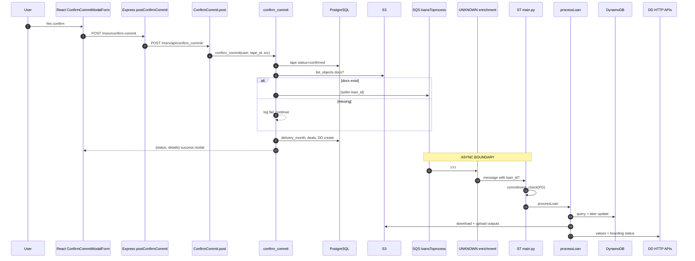

---

## 28. Complete failure / recovery diagram

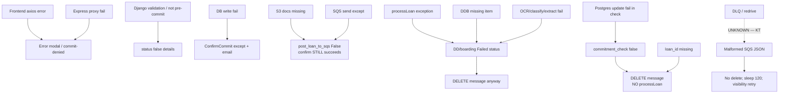

| CONDITION | PROCESS LOAN? | DELETE MSG? | RETRY? | DLQ? | DATA LOSS RISK? |
|-----------|---------------|-------------|--------|------|-----------------|
| Docs missing at confirm | N/A (never enqueued) | N/A | Manual requeue? | N/A | Medium — silent skip |
| SQS send fails | N/A | N/A | Unknown | Unknown | Medium |
| Bad JSON / outer exception | No | No | Yes (visibility) | Unknown | Low |
| commitment_check false | No | **Yes** | No | Unknown | **High — NEEDS KT** |
| loan_id missing | No | **Yes** | No | Unknown | **High — NEEDS KT** |
| processLoan fails | Attempted | **Yes** | No | Unknown | Medium (Failed status set) |
| Duplicate current_processing | No | Yes | No | Unknown | Medium |

DLQ configuration: **not in application code** → `[UNKNOWN — KT CONFIRMATION REQUIRED]`

---

## 29. Sync vs async boundary

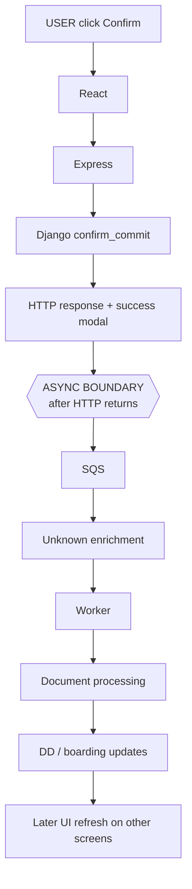

**Verified boundary:** After Django finishes `confirm_commit` and Express returns to React. SQS send happens **inside** the sync request, but worker processing is async. Email/resell thread also async after response path begins. `[CONFIRMED FROM CODE]`

Pre-commit and pricing also use `method: "async"` with status polling — those are earlier sync/async hybrids in the wizard, separate from ST. `[CONFIRMED FROM CODE]`

---

## 30. File/function execution map (cheat sheet)

| ORDER | REPOSITORY | FILE | FUNCTION | WHAT IT DOES | NEXT |
|------:|------------|------|----------|--------------|------|
| 1 | msrx-frontend | `confirmCommitModalForm.js` | `onYesClick` | User confirms | `commitTimeCheck` |
| 2 | msrx-frontend | same | `commitTimeCheck` | Market hours gate | `confirmCommit` |
| 3 | msrx-frontend | same | `confirmCommit` | POST confirm | Express |
| 4 | msrx-frontend | `server/index.js` | `csrfProtection` | CSRF | router |
| 5 | msrx-frontend | `server/utils.js` | `refreshToken` | Slide auth cookie | route |
| 6 | msrx-frontend | `server/routes/msrCoissue.js` | `postConfirmCommit` | Remap + Token | Django |
| 7 | msrx_v2.0 | `api/views/commit.py` | `ConfirmCommit.post` | Parse POST | `confirm_commit` |
| 8 | msrx_v2.0 | `api/supporting/services/msr_commit.py` | `confirm_commit` | Status + side effects | loop loans |
| 9 | msrx_v2.0 | `support_committing.py` | `get_s3_buyer` | Resolve buyer | `post_loan_to_sqs` |
| 10 | msrx_v2.0 | `support_committing.py` | `folder_exists_and_not_empty` | S3 precondition | send or skip |
| 11 | msrx_v2.0 | `support_committing.py` | `post_loan_to_sqs` | SQS producer | continue confirm |
| 12 | msrx_v2.0 | `support_committing.py` | `create_commit_dd_records_and_values` | DD rows | response |
| 13 | ??? | ??? | ??? | Enrich SQS with loan_id | `[UNKNOWN — KT]` |
| 14 | super_transfer_client | `scripts/main.py` | `main` | Poll queues | receive |
| 15 | super_transfer_client | `main.py` | `receive_message` | Long poll | parse |
| 16 | super_transfer_client | `query_msrx.py` | `commitment_check` | Postgres commit gate | loan_id gate |
| 17 | super_transfer_client | `process_loan_handler.py` | `processLoan` | Full pipeline | extractors |
| 18 | super_transfer_client | `helper_functions.py` | `segregate_documents` | Classify/split | extract |
| 19 | super_transfer_client | `helper_functions.py` | `predict_label` | NB prediction | labels |
| 20 | super_transfer_client | extractors via `return_ExtractFunctions` | various | Field extract | DD post |
| 21 | super_transfer_client | `helper_functions.py` | `send_values_to_DD` / boarding helpers | Persist results | done |
| 22 | super_transfer_client | `helper_functions.py` | `delete_queue_message` | Ack SQS | loop |

---

## 31. Runtime / deployment boundaries

```
USER BROWSER
    React (client/src) — webpack bundle

FRONTEND SERVER
    Express BFF (server/index.js)
    Node process via `npm start`
    Env: PORT, BACKEND_URL, WEB_TOKEN_SECRET

DJANGO SERVER
    WSGI ebdjango.wsgi
    Env: MSRX_ENV, AWS_*, DB
    Exact EB/EC2 names: UNKNOWN — KT

AWS MANAGED
    S3: supertransfer-{env}
    SQS: loansToprocess-{env}, missing-file queue, filesToBedrock-{env}
    DynamoDB: supertransfer-{env}DB, supertransfer-deploymentDB
    Textract: runtime classification + extraction
    Secrets Manager: ST worker credentials

SUPER TRANSFER VM
    CodeDeploy → /home/ec2-user/super_transfer_client/
    cron + flock → python3.12 scripts/main.py
    classifier pickles, segregation, extraction

DATABASE
    PostgreSQL (MSRX + DD schemas)

OPERATIONS
    Boarding SFTP schedulers in Django
    Manual notebooks (Manual_Loan_Process.ipynb)
    Reprocess helpers in Django DD utils
```

Do **not** claim exact Elastic Beanstalk environment names unless config proves them. Frontend/Django EB names: `[UNKNOWN — KT CONFIRMATION REQUIRED]` beyond settings module patterns.

---

## 32. Unknown architecture + KT questions

| COMPONENT | WHAT WE KNOW | CODE EVIDENCE | WHAT IS UNKNOWN | KT QUESTION |
|-----------|--------------|---------------|-----------------|-------------|
| SQS enrichment | Producer ≠ consumer schema | `support_committing.py:181` vs `main.py:100` | What adds `loan_id` | What enriches messages? Lambda? |
| Lambda | Docstring on STLoanLookupView | `loanviews.py:228-232` | Is it deployed? Trigger? | Show Lambda + event source |
| DynamoDB create | Worker queries/updates only | no runtime `put_item` | Initial record creator | Who puts first DDB item? |
| Worker deploy host | CodeDeploy + cron | `appspec.yml`, `start_cron.sh` | Instance identity, AMI | Where does ST run in LIVE? |
| DLQ | Not in app code | — | Exists? Redrive SOP? | DLQ + replay procedure? |
| Monitoring | Logs to `DO_NOT_DELETE_THIS.txt` | cron redirect | CloudWatch alarms? | How do you detect stuck loans? |
| Document uploader | Path expected at confirm | S3 prefix check | Who uploads blobs? | Upload UI/API/process? |
| Boarding readiness | Worker updates staging; Django delivers files | boarding helpers | Manual gates? | When is loan boardable? |
| `msr_exporting` | Not in repo | grep empty | Legacy name? | Still used? |
| Delete-on-skip | High data-loss risk paths | `main.py:115` | Intentional? | Confirm design intent |
| Confirm vs DD order | SQS before DD create | `msr_commit.py` loop then `:220` | Race with enrichment | Timing of loan_id availability? |
| ASGI | Not found | — | Used? | Any ASGI deploy? |

---

# EXPLAIN THIS SYSTEM TO A BACKEND DEVELOPER

### Hypothetical loan

- Loan number: `2208066387`  
- Seller: `117`  
- Buyer: `42`  
- Composite ID: **`117-42_2208066387`** `[CONFIRMED FROM CODE]` format

Walkthrough:

### 1. User action
**WHAT:** User clicks **Yes** on “Are you sure you want to commit?”  
**WHY:** Finalizes a pre-committed tape.  
**SERVICE:** Browser / React.  
**IN:** Click. **OUT:** Calls market-hours then confirm.  
**NEXT:** React axios.

### 2. React
**WHAT:** `ConfirmCommitModalForm.confirmCommit` POSTs `{ tapeId, src: "msrx_workflow" }` to `/msrx/confirm-commit`.  
**WHY:** UI never talks to Django directly.  
**SERVICE:** React SPA.  
**IN:** tapeId from Redux. **OUT:** HTTP to Express.  
**NEXT:** Express BFF.

### 3. Express
**WHAT:** CSRF + cookie slide; remaps to `tape_id`/`src`; adds `Authorization: Token …`; forwards to Django.  
**WHY:** Hide tokens, white-label static, reshape payloads.  
**SERVICE:** Node Express BFF.  
**IN:** JSON. **OUT:** form-urlencoded to Django.  
**NEXT:** Django APIView.  
**DB?** No.

### 4. Django
**WHAT:** `ConfirmCommit.post` → `confirm_commit`.  
**WHY:** Business authority for commit.  
**SERVICE:** Django API.  
**IN:** authenticated user + tape_id. **OUT:** `{status, details}`.  
**NEXT:** DB + optional SQS.

### 5. DB
**WHAT:** Tape `Client_Coissue_Seller.status` → `confirmed`; loans get `delivery_month`; deals assigned; later DD loan rows created.  
**WHY:** Persist trade commitment.  
**SERVICE:** PostgreSQL via Django ORM.  
**IN:** tape + loans. **OUT:** updated rows.  
**NEXT:** S3 check / SQS / email.

### 6. S3
**WHAT:** Check `supertransfer-{env}/SuperTransfer/117/42/2208066387/` has objects.  
**WHY:** Don’t enqueue ST if no documents.  
**SERVICE:** AWS S3.  
**IN:** prefix. **OUT:** true/false.  
**NEXT:** SQS if true.

### 7. SQS
**WHAT:** Message `{"seller-loan_id":"117-42_2208066387"}` to `loansToprocess-{env}`.  
**WHY:** Decouple document processing from HTTP.  
**SERVICE:** AWS SQS.  
**IN:** composite id. **OUT:** queued message.  
**NEXT:** **UNKNOWN enrichment** (if production adds `loan_id`) then worker.

### 8. Worker
**WHAT:** Cron-kept `main.py` long-polls; commitment_check; if `loan_id` present → `processLoan`.  
**WHY:** Heavy OCR/ML shouldn’t block traders.  
**SERVICE:** Super Transfer EC2 process.  
**IN:** SQS body (+ DDB metadata). **OUT:** segregated docs + extracted fields.  
**NEXT:** classification etc.

### 9. Classification
**WHAT:** Textract page text → TF-IDF → Naive Bayes → labels (Note, Credit_Report, …).  
**WHY:** Know which extractor to run.  
**SERVICE:** Worker + Textract + local pickles.  
**IN:** blob PDF pages. **OUT:** page→doc-type.  
**Training?** Zero at runtime.

### 10. Segregation
**WHAT:** Split blob into per-type PDFs.  
**WHY:** Downstream extractors and humans need document-level files.  
**SERVICE:** Worker.  
**IN:** labeled pages. **OUT:** Note.pdf, etc.  
**NEXT:** extraction threads.

### 11. Extraction
**WHAT:** Doc-type-specific functions pull fields (borrower, property, credit, security instrument when those docs exist).  
**WHY:** Populate Due Diligence / boarding.  
**SERVICE:** Worker + Textract/parsers.  
**IN:** segregated PDFs. **OUT:** field maps.  
**NEXT:** DD HTTP + DDB update.

### 12. Database / status
**WHAT:** Post values to DD; boarding staging → Processed/Failed; DynamoDB update.  
**WHY:** Make results visible in MSRX.  
**SERVICE:** Worker → Django APIs + DDB.  
**IN:** extracted fields. **OUT:** updated DD/boarding/DDB.  
**NEXT:** optional boarding file delivery.

### 13. Final downstream
**WHAT:** Separately, Django can generate Excel boarding files and SFTP to buyers from `Boarding_Staging`.  
**WHY:** Servicer boarding.  
**SERVICE:** Django Super Transfer boarding module / schedulers.  
**IN:** staging rows. **OUT:** SFTP file.  
**Manual steps / readiness gates:** `[UNKNOWN — KT CONFIRMATION REQUIRED]`.

**Meanwhile the trader already saw commit-success** — ST work is background.

---

## Final validation checklist

| Check | Status |
|-------|--------|
| Traced actual code, not assumptions | Yes |
| Inspected all three repositories | Yes |
| Exact frontend confirm files | Yes — `confirmCommitModalForm.js` |
| Exact Express middleware/proxy | Yes — hand-rolled BFF, not transparent proxy |
| Django API → service/helper | Yes — `ConfirmCommit` → `confirm_commit` → `post_loan_to_sqs` |
| confirm_commit traced | Yes |
| post_loan_to_sqs inspected | Yes |
| Producer vs consumer contracts compared | Yes — **mismatch** |
| Missing loan_id investigated | Yes — gap marked UNKNOWN |
| scripts/main.py deep traced | Yes |
| processLoan traced | Yes |
| Training vs loading distinguished | Yes — **0 training** at runtime |
| Classification / segregation / extraction | Yes |
| DynamoDB / Postgres / S3 | Yes |
| Sync/async boundary | Yes — after confirm HTTP response |
| Failure behavior | Yes — including delete-on-skip |
| Unknown production components marked | Yes |

---

*End of audit. Do not treat UNKNOWN nodes as implemented connectors. Ask KT for enrichment, DDB creation, document upload, DLQ, and boarding readiness before operating production incidents on this path.*
