# 23 — MSRX → Super Transfer Visual Diagrams

**Audience:** Backend developers / KT / onboarding  
**Date:** 2026-07-24  
**Source of truth:** [`22_COMPLETE_END_TO_END_WORKER_FLOW.md`](./22_COMPLETE_END_TO_END_WORKER_FLOW.md)  
**Method:** Visual learning only — **no invented architecture**

---

## About this document

| Artifact | Role |
|----------|------|
| **This Markdown (`.md`)** | Editable **Mermaid source** — edit diagrams here |
| **[`23_MSRX_SUPER_TRANSFER_VISUAL_DIAGRAMS.pdf`](./23_MSRX_SUPER_TRANSFER_VISUAL_DIAGRAMS.pdf)** | **PRIMARY deliverable** — **rendered** diagram images (open directly; no Mermaid viewer) |
| **`_diagram_assets/*.png`** | Individual rendered PNGs used inside the PDF |

~80% diagrams, ~20% short explanation. Every path below is taken from confirmed findings in the audit. Unknowns stay visibly unknown.

**PDF organization:** Part 1 System Overview → Part 2 Frontend→Backend → Part 3 Django→ST → Part 4 Worker → Part 5 Document Processing → Part 6 Data/AWS → Part 7 Example → Part 8 Failures → Part 9 KT Gaps.

---

## Legend — CONFIRMED vs UNKNOWN

| Visual / label | Meaning |
|----------------|---------|
| Solid boxes + normal arrows | **`[CONFIRMED FROM CODE]`** or **`[CONFIRMED FROM CONFIG]`** |
| Dashed / `???` / bold UNKNOWN box | **`[UNKNOWN — KT CONFIRMATION REQUIRED]`** — do not treat as implemented |
| `??? KT CONFIRMATION REQUIRED ???` | Gap that must be asked in KT — **not** labeled Lambda unless proven |

**Rule:** If a box says UNKNOWN, the audit did **not** find that component in `msrx-frontend`, `msrx_v2.0`, or `super_transfer_client`.

---

# PART 1 — SYSTEM OVERVIEW

## 1. COMPLETE END-TO-END MASTER FLOW

Confirm commit starts in the browser, passes Express → Django, may enqueue SQS, then (after an unknown enrichment step) the Super Transfer worker classifies and extracts documents and posts Due Diligence / boarding updates. Boarding Excel → buyer SFTP is a **separate** Django scheduler path, not inside the worker’s sync HTTP response. The UNKNOWN box between SQS and the worker is intentional — producer and consumer schemas do not match in these repos.

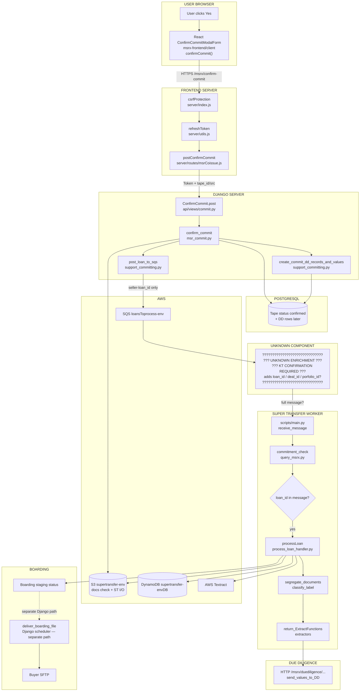

**KEY TAKEAWAY:** Django enqueues only `seller-loan_id`; the worker needs `loan_id` before `processLoan`. The component that bridges that gap is **unknown** — do not invent it.

---

# PART 2 — FRONTEND TO BACKEND

## 2. FRONTEND → DJANGO (Confirm Commit Sequence)

The MSR Coissue wizard uses **direct axios**, not `apiHoc`. Express is a hand-rolled BFF: CSRF, cookie session slide, body remap (`tapeId` → `tape_id`), and `Authorization: Token`. React never holds the auth token — it lives in an httpOnly signed cookie. Confirm success opens the commit-success modal; it does **not** wait for Super Transfer.

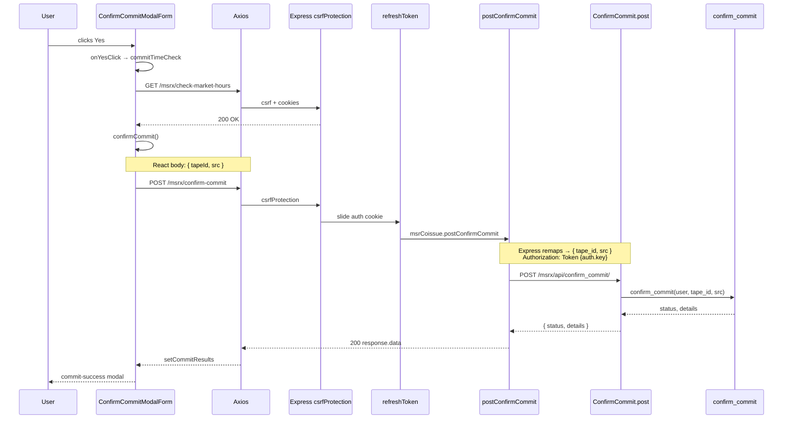

**KEY TAKEAWAY:** Express remaps and authenticates; Django owns commit business logic. UI success ≠ Super Transfer complete.

---

## 3. DJANGO `confirm_commit` INTERNAL FLOW

`ConfirmCommit.post` calls `confirm_commit`. After status → `confirmed` and loan loop work, **`post_loan_to_sqs` runs before `create_commit_dd_records_and_values`**. If S3 docs are missing, SQS is skipped but confirm still continues. SQS send failure does not roll back confirm — only activity log.

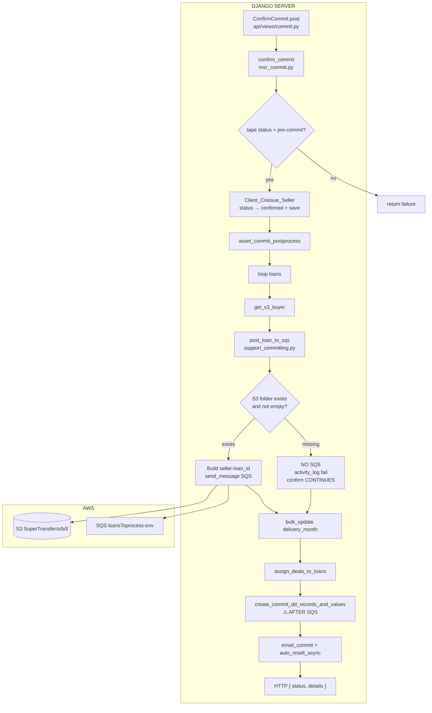

**KEY TAKEAWAY:** **SQS is sent before DD `loan_id` rows are created.** If enrichment needs that PK, this ordering is a race risk.

---

# PART 3 — DJANGO TO SUPER TRANSFER

## 4. `seller-loan_id` CREATION

Format is `{seller_id}-{buyer_id}_{loan_number}` — verified in `post_loan_to_sqs` and worker parsers (`split("-")` then `split("_")`). Same composite string keys S3 folders, SQS messages, DynamoDB, and local worker dirs. It is **not** the Due Diligence integer `loan_id`.

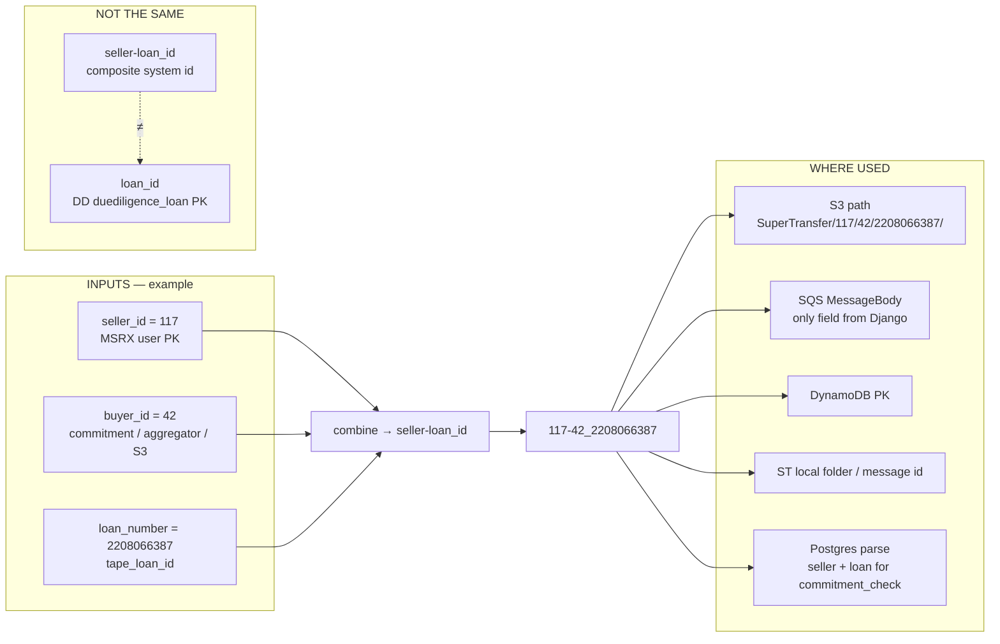

**KEY TAKEAWAY:** `117-42_2208066387` is the cross-system identity. DD `loan_id` is a different integer PK required by the worker gate.

---

## 5. PRODUCER / CONSUMER GAP

Django’s producer sends **only** `seller-loan_id`. The worker’s `main.py` requires `'loan_id' in res` before calling `processLoan`. No enrichment Lambda (or other bridge) exists in the three audited repos. `STLoanLookupView`’s docstring mentions Lambda — comment only; worker does not call that view.

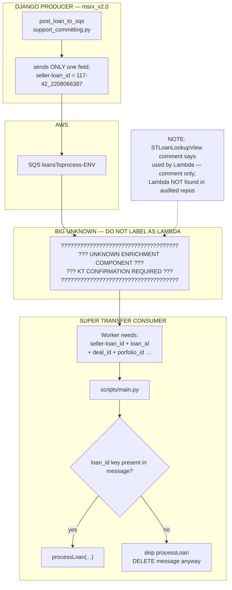

**KEY TAKEAWAY:** Schema mismatch is proven. What fills `loan_id` in production is a **KT question** — not a silent Lambda assumption.

---

# PART 4 — SUPER TRANSFER WORKER

## 6. WORKER STARTUP

CodeDeploy installs to `/home/ec2-user/super_transfer_client/`. `start_cron.sh` installs a per-minute crontab that runs `flock` then `python3.12 scripts/main.py`. `flock -w 1` ensures a single overlapping worker process on the machine. `ensure_model_context` loads secrets, AWS clients, and ML pickles once at import; `main()` loops while `process_flag()` is true.

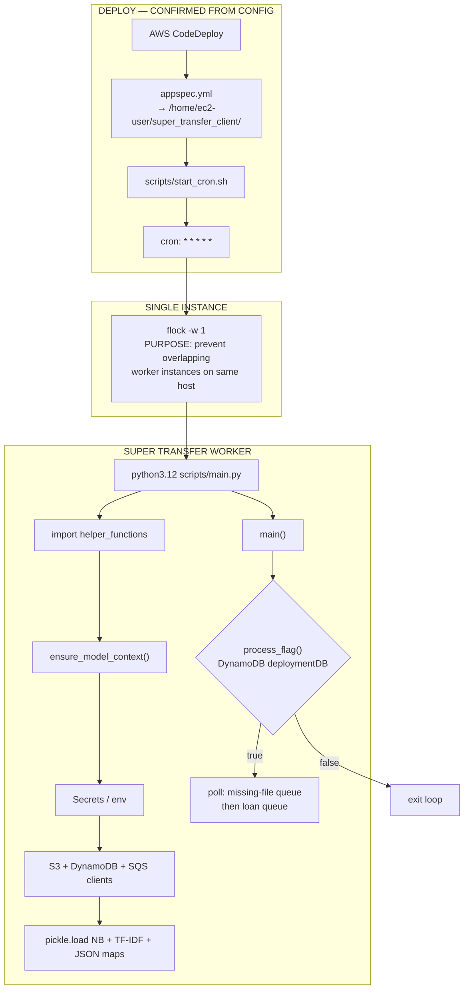

**KEY TAKEAWAY:** Worker is cron + flock, not systemd/supervisor (absent in repo). Models load at startup — not trained per loan.

---

## 7. SQS POLLING / DECISION TREE

`main.py` long-polls (`WaitTimeSeconds=20`, `MaxNumberOfMessages=1`). Malformed JSON does **not** delete (visibility retry). Duplicate `current_processing`, failed `commitment_check`, missing `loan_id`, and completed `processLoan` all **delete** the message. Delete-on-skip is **confirmed from code**; whether that is intentional product design needs **KT**.

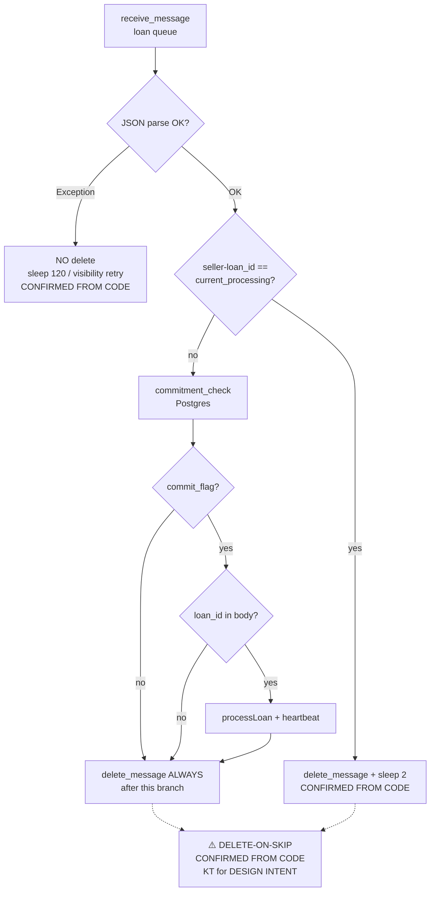

**KEY TAKEAWAY:** Missing `loan_id` or failed commit check → **no processLoan, message still deleted** — high data-loss risk until KT confirms intent / recovery.

---

## 8. `processLoan` INTERNAL PIPELINE

Real order from `process_loan_handler.processLoan`: DynamoDB → S3 download → blob → segregate → extract → DD → status → DDB update → S3 outputs → notifications. Exceptions set status `"Failed"` and are **not** re-raised; outer `main.py` still deletes SQS. `finally` uploads metadata/logs and removes the local folder.

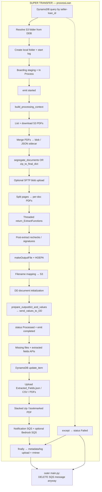

**KEY TAKEAWAY:** Failures mark Failed and still ack SQS — no automatic redrive proven in application code.

---

# PART 5 — DOCUMENT PROCESSING

## 9. CLASSIFICATION — OFFLINE TRAINING vs RUNTIME

Runtime OCR for classification uses **AWS Textract** `detect_document_text`, then TF-IDF + Naive Bayes pickles via `predict_label` / `predict_proba`. Confidence ≤ 0.7 → `"Misc"`. Training is **not** in the worker — pickles are loaded artifacts. **Zero model training per loan.**

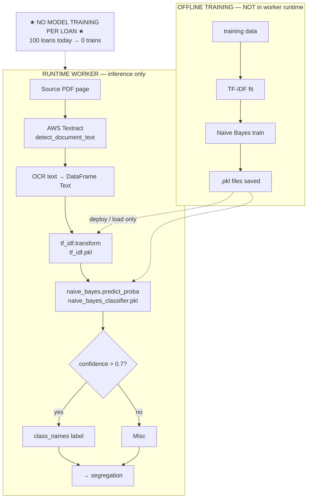

**KEY TAKEAWAY:** Worker loads and predicts. Training pipeline location is outside this runtime path (KT if needed).

---

## 10. SEGREGATION (ILLUSTRATIVE EXAMPLE)

`segregate_documents` groups classified pages and splits the blob into per-type PDFs for extraction and S3 upload. Alternate path: classification JSON/txt sidecar → `zip_to_final_dict` skips full re-classification. Page labels below are **illustrative only**.

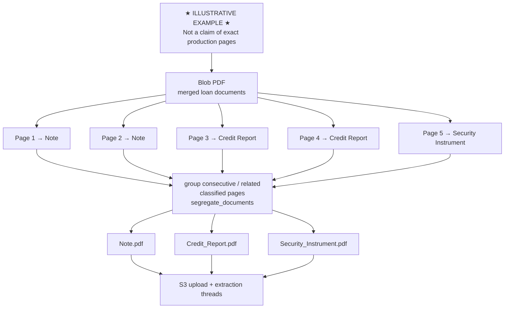

**KEY TAKEAWAY:** Segregation turns page labels into document-level PDFs that drive which extractors run.

---

## 11. EXTRACTION via `return_ExtractFunctions`

Each segregated label selects a confirmed extractor. Extractors use Textract / regex / parsers, then recheck/post-process, then `prepare_outputdict_and_values` → `send_values_to_DD`. Fields exist only when that document type was classified and its extractor ran.

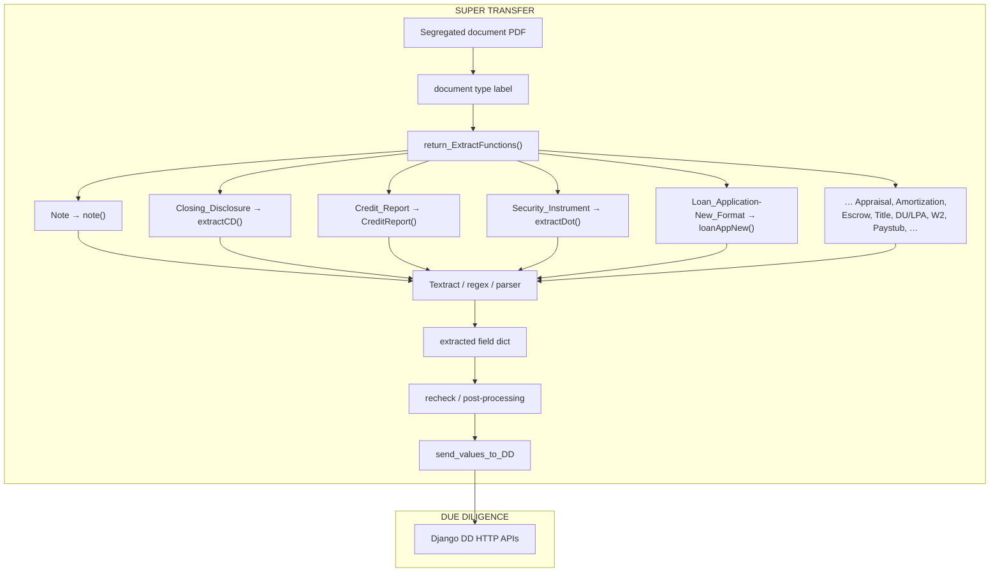

**KEY TAKEAWAY:** Extraction is label-driven and partial — no universal field set for every loan.

---

# PART 6 — DATA & AWS

## 12. DATA STORE INTERACTION (Worker-Centered)

The worker talks to Postgres directly for `commitment_check` (and boarding staging merge SQL), to DynamoDB for loan state, to S3 for documents/outputs, to SQS for jobs/notifications, and to Django HTTP for Due Diligence values. Initial DynamoDB `put_item` is **not** in these repos’ runtime paths → KT.

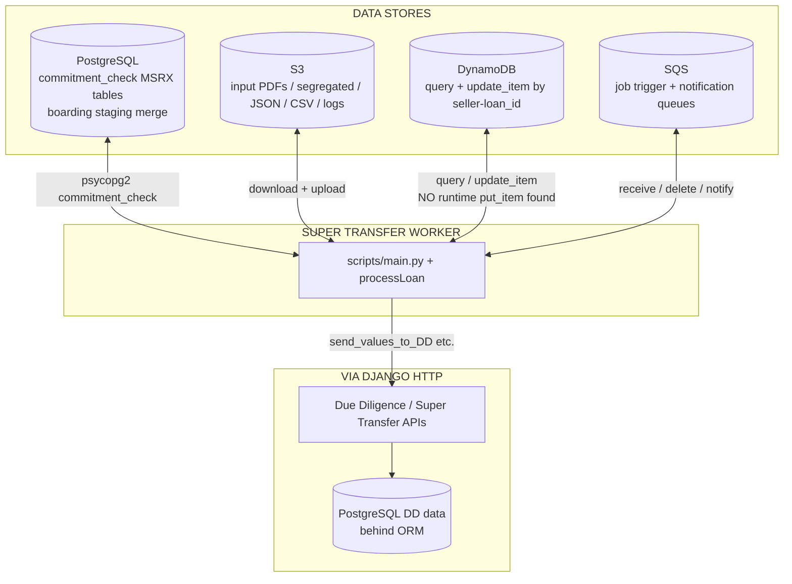

**KEY TAKEAWAY:** Worker is the hub for ST I/O; who **creates** the first DynamoDB item is still unknown.

---

# PART 7 — COMPLETE EXAMPLE

## 13. ONE-LOAN EXAMPLE — `117` / `42` / `2208066387`

Easiest walkthrough for a new developer: same composite id from confirm through S3/SQS into the worker. Enrichment between SQS and `processLoan` remains unknown. Trader already saw commit-success while ST runs asynchronously.

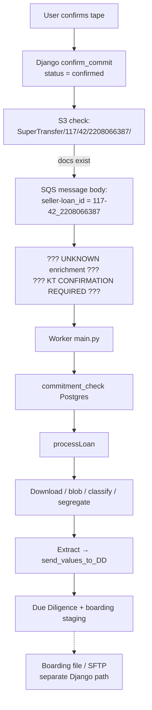

**KEY TAKEAWAY:** One composite id ties the loan across systems; async ST work continues after the trader’s success modal.

---

# PART 8 — FAILURE FLOW

## 14. FAILURE FLOW (Confirmed Behavior Only)

Only audit-confirmed outcomes. DLQ / redrive / ops recovery for delete-on-skip paths are **unknown**. Docs missing or SQS send fail → confirm can still succeed without enqueue.

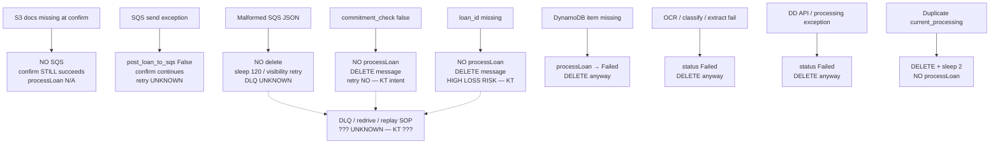

**KEY TAKEAWAY:** Worst silent losses: skip enqueue at confirm, or delete-on-skip when `loan_id` / commit check fails — ask KT before operating incidents.

---

## 15. HIGH-LEVEL SYSTEM MAP (KT / Onboarding)

One-screen map of major boundaries only — no function overload. Use this first for architecture, then drill into diagrams 1–14.

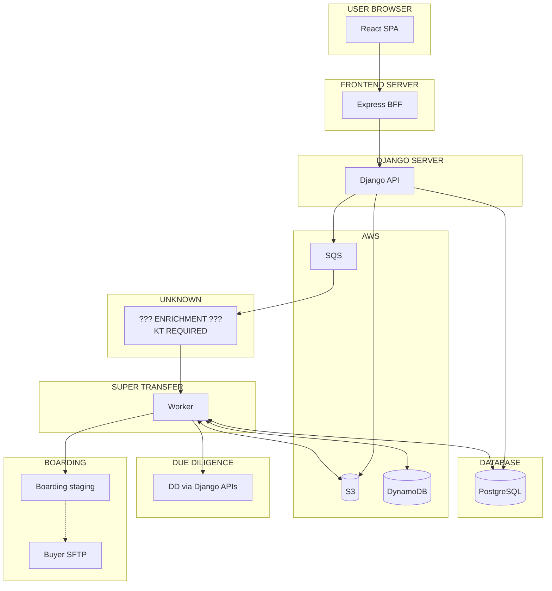

**KEY TAKEAWAY:** Sync path ends at Django HTTP response; async path is SQS → unknown enrichment → worker → DD/boarding → (separate) SFTP.

---

# PART 9 — KT GAPS

See Diagram 5 (producer/consumer gap), Diagram 14 (failures), and audit §32. Unresolved path remains:

```
Django → SQS → ??? UNKNOWN ENRICHMENT COMPONENT ??? → Super Transfer Worker
```

Do **not** label the gap as Lambda unless KT confirms a deployed component. `STLoanLookupView` only has a comment.

---

# HOW TO READ THESE DIAGRAMS

1. **Start with Diagram 15** for architecture — major system boundaries only.  
2. **Read Diagrams 2–3** for React → Express → Django confirm commit.  
3. **Read Diagrams 4–5** for `seller-loan_id` and the SQS producer/consumer gap.  
4. **Read Diagrams 6–8** for worker startup, SQS decisions, and `processLoan`.  
5. **Read Diagrams 9–11** for classification, segregation, and extraction.  
6. **Read Diagram 12** for databases / AWS interactions centered on the worker.  
7. **Read Diagram 13** for a complete one-loan example (`117-42_2208066387`).  
8. **Read Diagram 14** for confirmed failure behavior and KT gaps.  

Treat every `??? UNKNOWN ???` box as a **question to ask**, not as a finished connector. For prose detail and evidence tables, use [`22_COMPLETE_END_TO_END_WORKER_FLOW.md`](./22_COMPLETE_END_TO_END_WORKER_FLOW.md).

---

*End of visual diagram source. PDF with rendered diagrams is generated separately from this Markdown.*
