# 24 — Super Transfer Worker Internal Flow

**Audience:** Backend developers / KT — deep worker internals  
**Date:** 2026-07-24  
**Source of truth:** [`22_COMPLETE_END_TO_END_WORKER_FLOW.md`](./22_COMPLETE_END_TO_END_WORKER_FLOW.md) + `super_transfer_client` code  
**Companion (system-level):** [`23_MSRX_SUPER_TRANSFER_VISUAL_DIAGRAMS.md`](./23_MSRX_SUPER_TRANSFER_VISUAL_DIAGRAMS.md) / architecture PDF  
**Method:** Worker-only visual learning — **no invented architecture**

---

## About this document

This PDF explains the Super Transfer worker **from job receipt to cleanup**. It does **not** re-audit frontend/Django confirm-commit (see document 23).

| Label | Meaning |
|-------|---------|
| **`[CONFIRMED FROM CODE]`** | Exact file/function/behavior in `super_transfer_client` (or proven worker DB/API calls) |
| **`[CONFIRMED FROM CONFIG]`** | appspec / cron / deploy scripts |
| **`[UNKNOWN — KT CONFIRMATION REQUIRED]`** | Not proven in audited repos — do not invent |

---

## Legend — CONFIRMED vs UNKNOWN

| Visual / label | Meaning |
|----------------|---------|
| Solid boxes + normal arrows | **CONFIRMED FROM CODE** or **CONFIRMED FROM CONFIG** |
| Dashed / `???` / UNKNOWN box | **UNKNOWN — KT CONFIRMATION REQUIRED** |
| `.pkl` artifacts | **Loaded at startup** — inference only — **NO training per loan** |

---

## 1. WORKER DEPLOYMENT / STARTUP

CodeDeploy installs the repo to `/home/ec2-user/super_transfer_client/`. After install, `start_cron.sh` installs a crontab. Exact production AMI / ASG / hostname are not in repo.

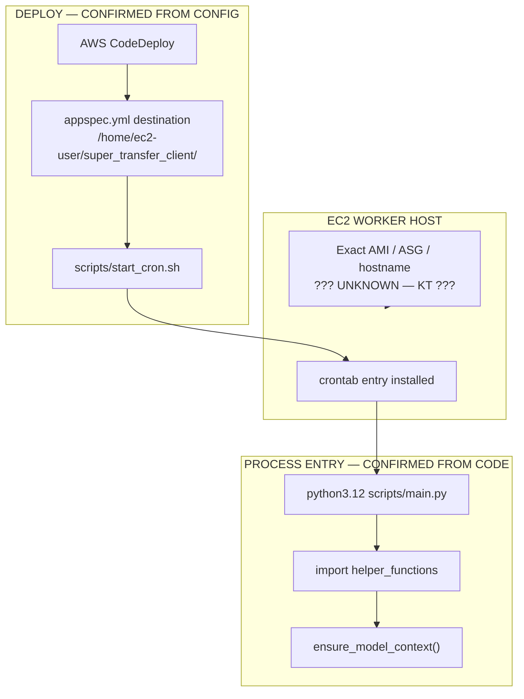

**KEY TAKEAWAY:** Worker is CodeDeploy + cron entrypoint — not systemd/supervisor in this repo. `[CONFIRMED FROM CONFIG]`

---

## 2. CRON + flock EXECUTION

Every minute cron tries to start the worker. `flock -w 1` ensures only one overlapping `main.py` runs on the host. Long-running work keeps the flock held.

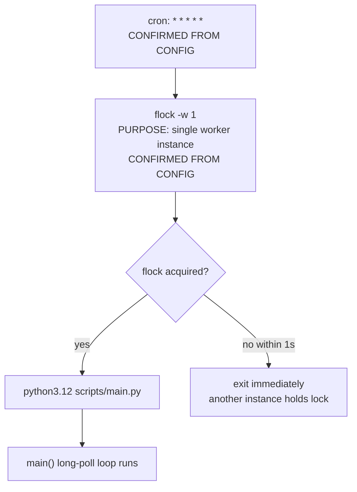

**KEY TAKEAWAY:** Concurrency model = one process per host via flock; messages processed sequentially inside that process. `[CONFIRMED FROM CODE]` + `[CONFIRMED FROM CONFIG]`

---

## 3. main.py PROCESSING LOOP

On import, models/secrets/AWS clients load once. `main()` regenerates local loan dirs, then loops while DynamoDB deployment `process_flag` is true. Missing-file queue is polled before the loan queue.

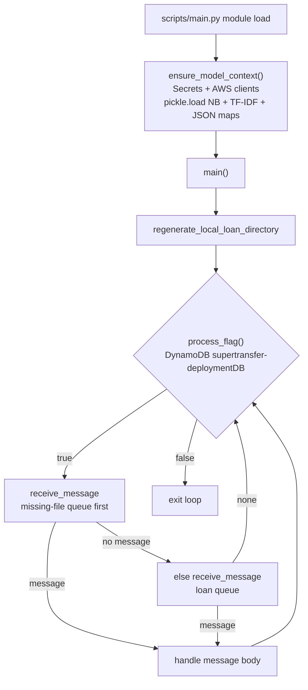

**KEY TAKEAWAY:** Models load at import — not per loan. Loop gated by deployment DynamoDB flag. `[CONFIRMED FROM CODE]`

---

## 4. SQS POLLING DECISION TREE

Long-poll: `WaitTimeSeconds=20`, `MaxNumberOfMessages=1`. Visibility starts at 1200s; heartbeat during `processLoan` extends to 3600s. Malformed JSON does **not** delete. Several skip paths **do** delete.

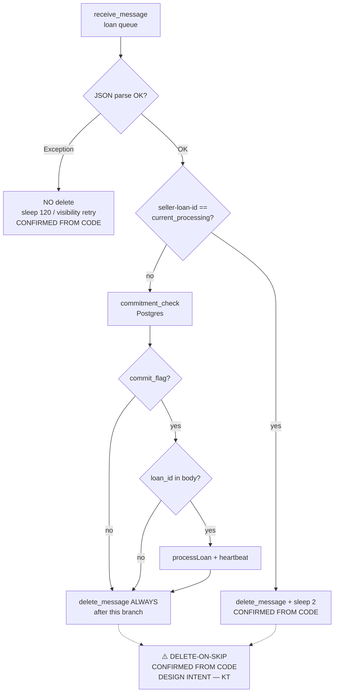

**KEY TAKEAWAY:** Missing `loan_id` or failed commit check → no `processLoan`, message still deleted. `[CONFIRMED FROM CODE]`

---

## 5. commitment_check

Direct Postgres via `psycopg2` in `base/workflows/query_msrx.py`. Parses `seller-loan_id` → seller + loan_number. Optional seller setting `super_transfer_commit_check` requires coissue tape status `confirmed`.

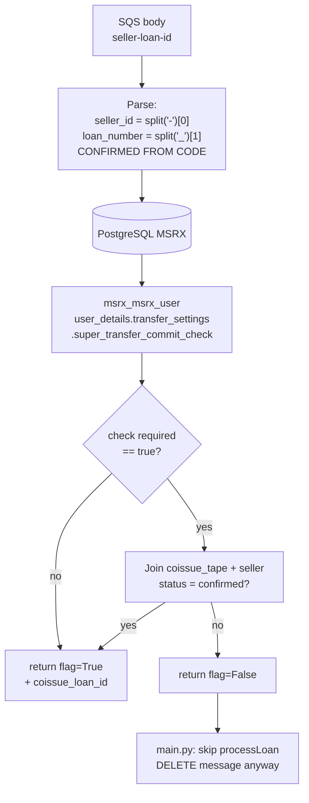

**KEY TAKEAWAY:** Commit gate is Postgres, not DynamoDB. False → skip + delete. Ops recovery: `[UNKNOWN — KT CONFIRMATION REQUIRED]`

---

## 6. loan_id GATE

Django producer sends only `seller-loan-id`. Worker requires `'loan_id' in res` before `processLoan`. Enrichment component is **not** in audited repos — do **not** label as Lambda.

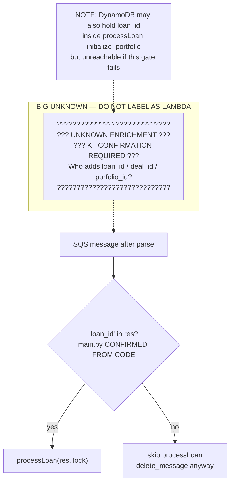

**KEY TAKEAWAY:** Schema mismatch is proven. What fills `loan_id` in production is a **KT question**. `[CONFIRMED FROM CODE]` gate + `[UNKNOWN]` enrichment

---

## 7. processLoan COMPLETE INTERNAL PIPELINE

Real order from `scripts/process_loan_handler.py` · `processLoan(res, lock)`. Exceptions set status `"Failed"` and are **not** re-raised; outer `main.py` still deletes SQS.

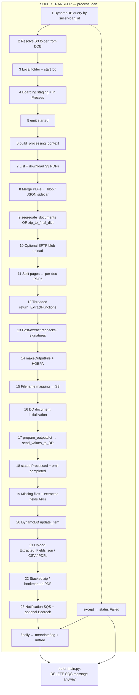

**KEY TAKEAWAY:** Full pipeline is sync inside one message handler; failures still ack SQS. `[CONFIRMED FROM CODE]`

---

## 8. S3 DOCUMENT PROCESSING

S3 prefix comes from DynamoDB fields `sellerID`, `Buyer`, `LoanNum` — not invented paths. Who uploaded the source PDFs originally is unknown.

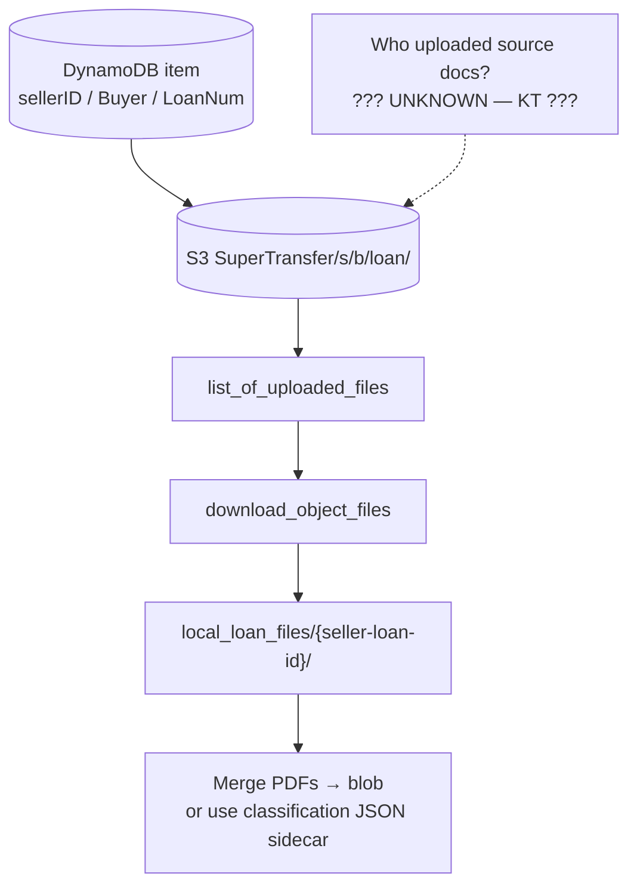

**KEY TAKEAWAY:** Worker is a consumer of S3 loan folders keyed by DDB metadata. Upload provenance: KT. `[CONFIRMED FROM CODE]`

---

## 9. CLASSIFICATION RUNTIME

Runtime classification: page → Textract OCR text → TF-IDF transform → Naive Bayes `predict_proba` → label or `"Misc"` if confidence ≤ 0.7. **No training in this path.**

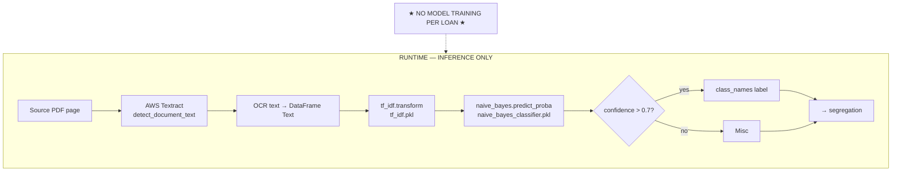

**KEY TAKEAWAY:** Classification is inference against loaded pickles. `[CONFIRMED FROM CODE]`

---

## 10. TF-IDF + Naive Bayes MODEL USAGE

Artifacts loaded in `ensure_model_context` / `get_main_model`: `naive_bayes_classifier.pkl`, `tf_idf.pkl`, plus JSON maps. Optional buyer-specific model from S3. Offline training location is outside worker runtime.

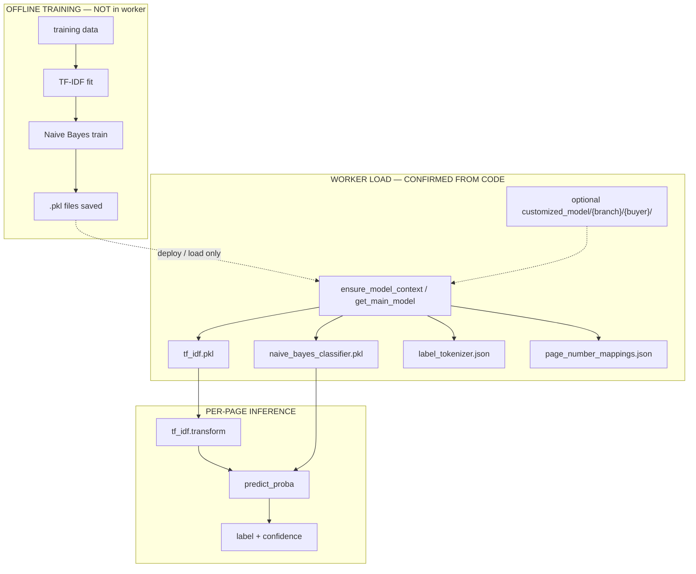

**KEY TAKEAWAY:** 100 loans today → **0 trains**. Load ≠ train. `[CONFIRMED FROM CODE]`

---

## 11. AWS TEXTRACT USAGE

Textract is used at **runtime** for classification OCR and for many field extractors. Tesseract appears in some extractors (e.g. credit report page numbers). Training-data OCR pipeline location is unknown.

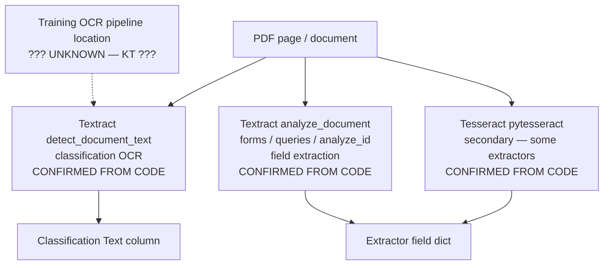

**KEY TAKEAWAY:** Textract = runtime OCR/extraction service, not the training loop. `[CONFIRMED FROM CODE]`

---

## 12. DOCUMENT SEGREGATION

`segregate_documents` groups classified pages and splits the blob into per-type PDFs. Alternate: JSON/txt sidecar → `zip_to_final_dict` skips full re-classification. Page labels below are illustrative.

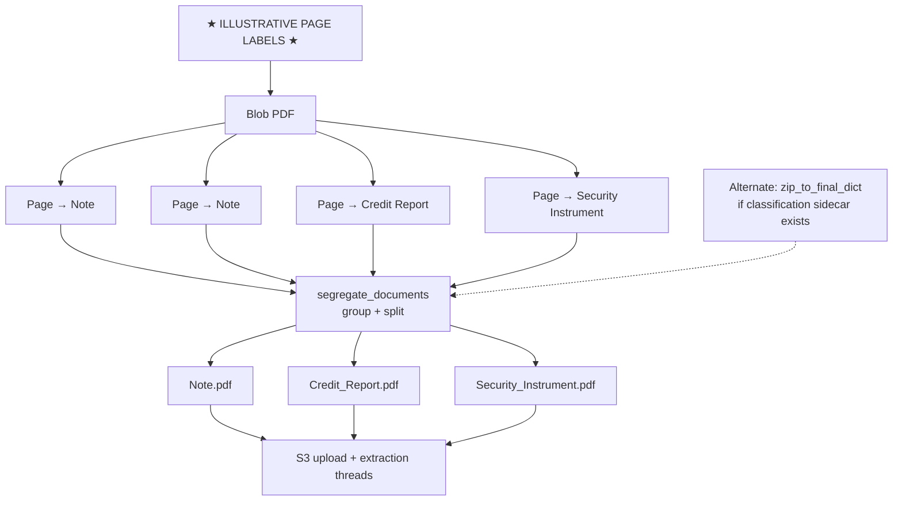

**KEY TAKEAWAY:** Segregation turns page labels into document PDFs that drive extractors. `[CONFIRMED FROM CODE]`

---

## 13. return_ExtractFunctions EXTRACTION ROUTING

Each segregated label selects a confirmed extractor. Fields exist only when that document type was classified and its extractor ran.

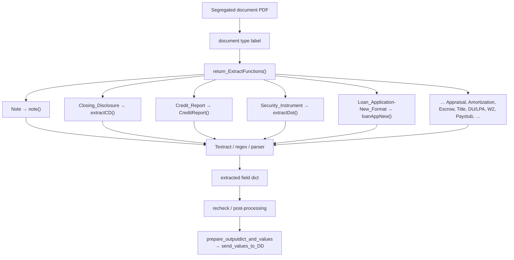

**KEY TAKEAWAY:** Extraction is label-driven and partial — not a universal field set. `[CONFIRMED FROM CODE]`

---

## 14. DUE DILIGENCE COMMUNICATION

Worker posts to Django HTTP Due Diligence / Super Transfer APIs (Api-Key). DD Postgres is behind Django ORM — worker does not write DD tables via raw SQL.

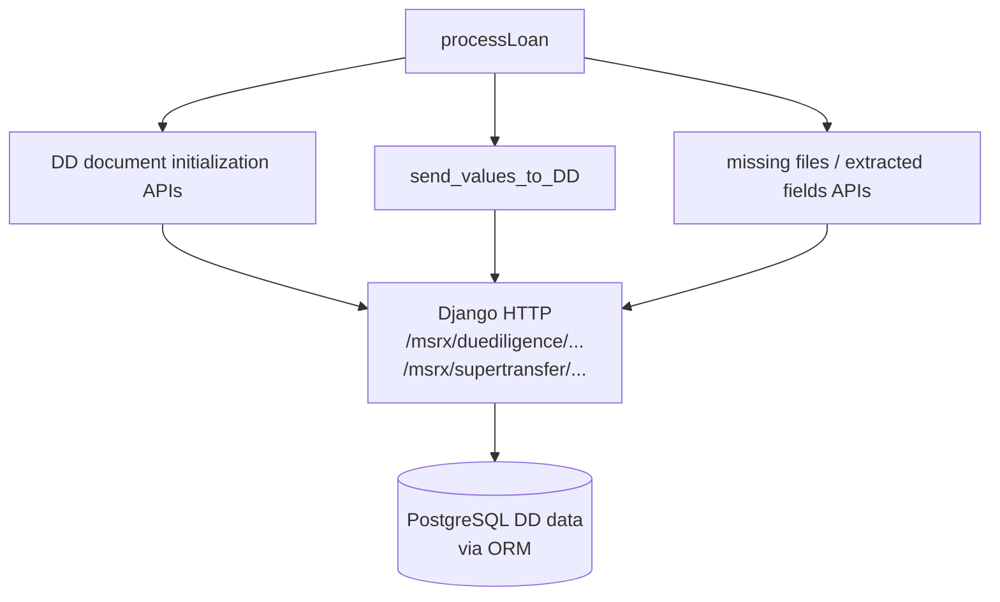

**KEY TAKEAWAY:** DD updates are HTTP API writes, not direct worker SQL into DD tables. `[CONFIRMED FROM CODE]`

---

## 15. DYNAMODB INTERACTION

Worker **queries** and **updates** by `seller-loan_id`. No runtime `put_item` found. Initial item creator is unknown. Deployment table uses PK `env` for `process_flag`.

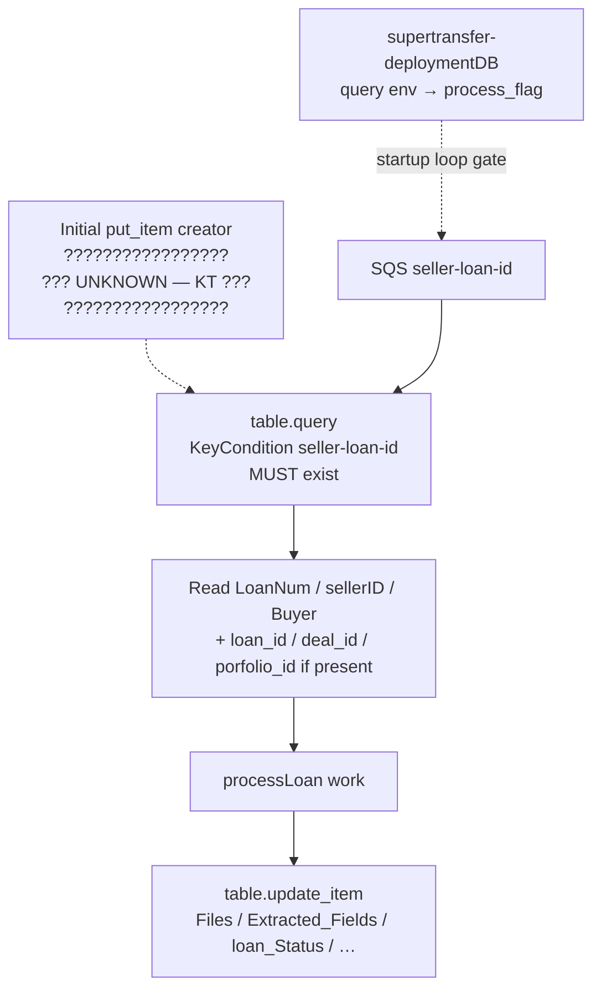

**KEY TAKEAWAY:** Worker assumes DDB item already exists; it does not create it. `[CONFIRMED FROM CODE]` + `[UNKNOWN]` creator

---

## 16. POSTGRESQL INTERACTION

Worker uses direct `psycopg2` for commitment check and boarding-staging merge lookups. DD business data goes through Django HTTP.

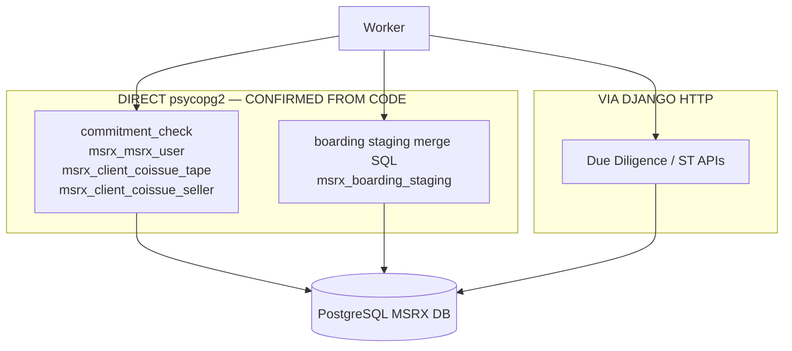

**KEY TAKEAWAY:** Only commit/boarding SQL is direct; DD entity writes are API-mediated. `[CONFIRMED FROM CODE]`

---

## 17. WORKER FAILURE PATHS

Only audit-confirmed outcomes. DLQ / redrive / ops replay for delete-on-skip are unknown.

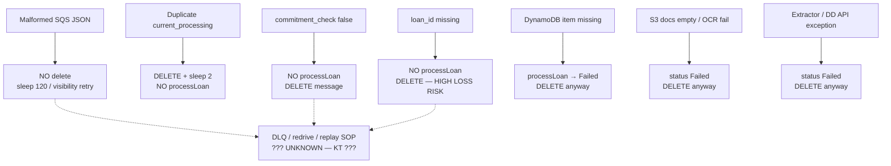

**KEY TAKEAWAY:** Worst silent losses: delete-on-skip when `loan_id` / commit check fails. `[CONFIRMED FROM CODE]`

---

## 18. SQS DELETION / RETRY BEHAVIOR

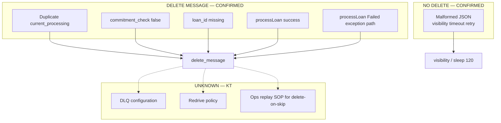

**KEY TAKEAWAY:** Visibility retry only for bad JSON. Most business skips permanently ack. `[CONFIRMED FROM CODE]`

---

## 19. WORKER CLEANUP / FINALIZATION

`processLoan` `finally` uploads metadata/logs and removes the local folder. Outer `main.py` deletes SQS after the handler returns (success or Failed).

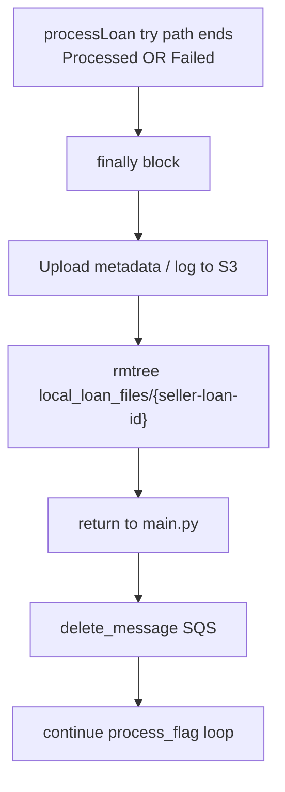

**KEY TAKEAWAY:** Local cleanup always runs; SQS delete is outside `processLoan` in `main.py`. `[CONFIRMED FROM CODE]`

---

## 20. ONE-LOAN WORKER EXAMPLE — `117-42_2208066387`

Example IDs: seller `117`, buyer `42`, loan `2208066387`. Enrichment between SQS receive and `loan_id` gate remains unknown.

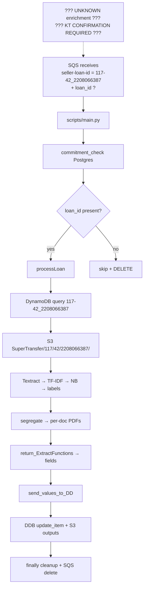

**KEY TAKEAWAY:** One composite id keys worker local/S3/DDB paths; `loan_id` is a separate DD PK required by the gate. `[CONFIRMED FROM CODE]`

---

# HOW TO READ THESE DIAGRAMS

1. **Start with Diagrams 1–3** — deploy, flock, main loop.  
2. **Read Diagrams 4–6** — SQS decisions, commitment_check, loan_id gate (+ UNKNOWN enrichment).  
3. **Read Diagram 7** — full `processLoan` order.  
4. **Read Diagrams 8–13** — S3, classification, pickles, Textract, segregation, extractors.  
5. **Read Diagrams 14–16** — DD HTTP, DynamoDB, Postgres.  
6. **Read Diagrams 17–19** — failures, delete/retry, cleanup.  
7. **Read Diagram 20** — one-loan walkthrough `117-42_2208066387`.  

Treat every `??? UNKNOWN ???` box as a **KT question**, not an implemented connector.

For system-level MSRX → SQS → Worker boundaries, use document **23** (architecture / visual diagrams PDF).

---

*End of worker-internal diagram source. PDF with rendered diagrams is generated separately — does not overwrite document 23.*
