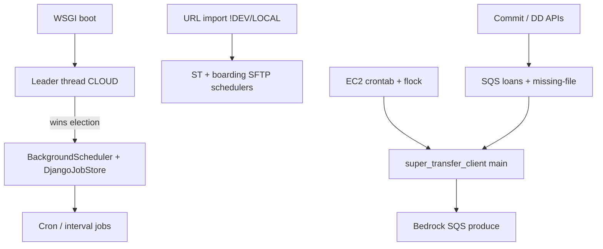
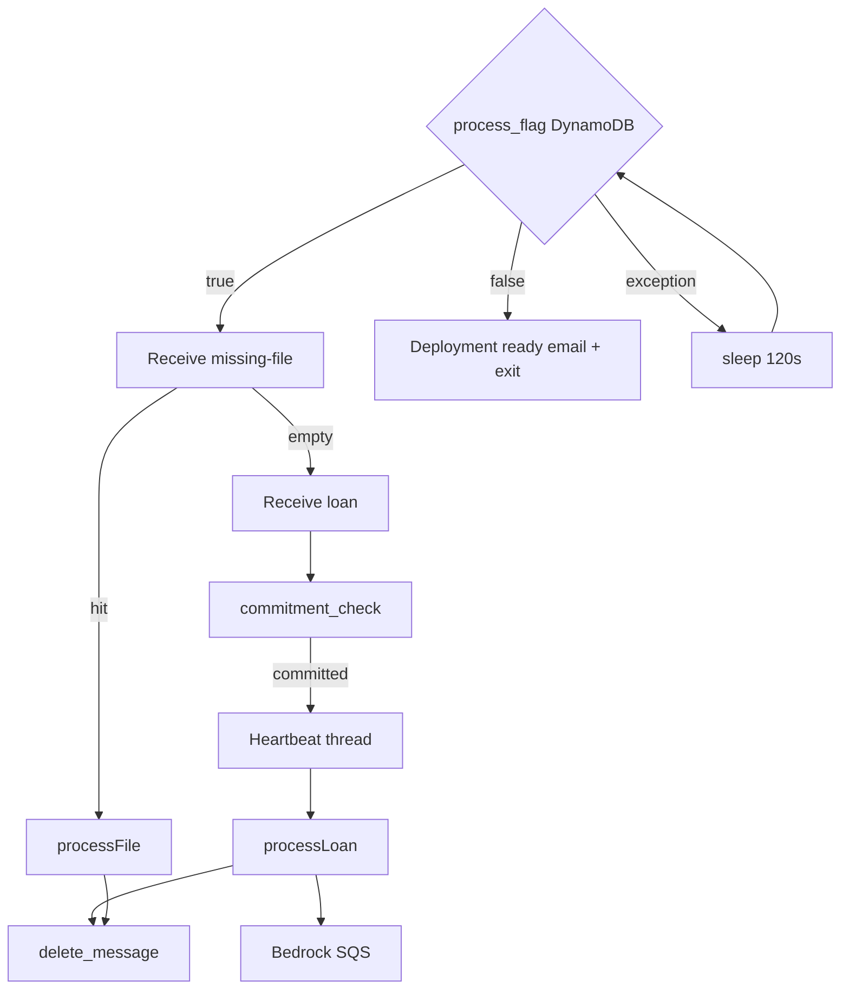
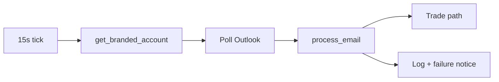

There is **no Celery**. Background work is **APScheduler (leader-elected)**, **separate ST/boarding schedulers**, **SQS polling in `super_transfer_client`**, and **request-scoped threads**.

Full inventory + interactive flow diagrams are in the canvas: [background-processes](background-processes.canvas.tsx).

---

### Entry points

| System | Start | Gate |
|--------|--------|------|
| Central APScheduler | `wsgi.py` → `leader_election_process` thread | `ENV_FLAG=CLOUD` + `LeaderElection` |
| ST document / boarding SFTP | `api/urls/urls.py` on import | `MSRX_ENV` ∉ `{DEV, LOCAL}` — **no leader** |
| ST SQS worker | EC2 crontab → `super_transfer_client/scripts/main.py` | DynamoDB `process_flag` |

---

### APScheduler jobs
Leader clears `DjangoJobStore`, registers ~35 jobs (US/Central, misfire grace 300s). Always-on: PAR every 5m, **5 mailbox polls every 15s**, duplicate-monitor check 10m, loan delivery 5m. Non-DEV adds secondlien, morning emails, FNMA, CAAS `WorkflowJob` crons. LIVE adds CRA/bal-spec/EOD/investor-connect/etc.

### Email jobs
Mailbox monitors via `enable_emailmonitor`; reports via `send_email_*` + `EmailSchedulerConfig`. Failures → `EmailTrading_Log` / `email_exception_failure_notice`.

### SQS
**Producers:** `post_loan_to_sqs`, `post_document_to_bedrock_sqs`.  
**Only in-repo consumer:** ST client (missing-file queue first, then loan). Bedrock queue is produce-only here.

### Super Transfer workers
SQS: `processLoan` / `processFile` → S3 + MSRX APIs (+ Bedrock enqueue). Django: per-row cron from `BuyerSFTP` / `BoardingFileRules` for SFTP delivery.

### Batch / retry / failure / logging / DB
- Batch: chunks of 4000, `ThreadPoolExecutor`, ORM bulk ops, Freedom `Pool`
- Retry: HTTP 3× backoff; SQS heartbeat 600s/3600; loop errors sleep 120s; APScheduler misfire grace
- Failure: `EVENT_JOB_MISSED` (watches `deactivate_emailmonitor_daily`), `activity_log`, leader shutdown
- Logging: django-apscheduler tables, `EmailTrading_Log`, `supertransfer.Logs`, `WorkflowLog`, `InternalNotificationStore`
- DB: `LeaderElection`, schedule configs, `WorkflowJob`, delivery status tables

---

### Execution flows

Also: many **fire-and-forget `threading.Thread`** workers on commit/pricing/DD/ST HTTP requests (not long-running services).

this is from canvas and in some files i have added that canvas cause its have more infor then the res only
Background processes — BLUE-WATER
No Celery/Redis. Work runs via leader-elected APScheduler in Django, separate Super Transfer / boarding schedulers, EC2 SQS pollers, and request-scoped threads. Cron timezone: US/Central.

~35
Scheduled job IDs
3
Process entry points
2
SQS queues consumed
0
Celery / RQ workers
Leadership vs ST schedulers
Central jobs start only on the CLOUD leader (LeaderElection + ~30s heartbeat, stale after 2 min). Super Transfer document/boarding BackgroundSchedulers start on every non-DEV/LOCAL Django process via URL import — no leader gate.
System map
Boot to schedulers to queues
WSGI boot
ebdjango/wsgi.py
URL import
!DEV && !LOCAL
Commit / DD APIs
SQS producers
Leader thread
ENV_FLAG=CLOUD
ST SFTP schedulers
BuyerSFTP + boarding
SQS queues
loans + missing-file
BackgroundScheduler
DjangoJobStore
ST client main()
EC2 crontab + flock
Cron / interval jobs
~35 job IDs
Bedrock SQS
produce only
Source: ebdjango/wsgi.py, api/utils/misc.py, api/urls/urls.py, super_transfer_client/scripts/main.py

1. Leader election + APScheduler
Thread started after Django WSGI init. Only CLOUD instances compete. Winner clears DjangoJobStore, registers jobs, then heartbeats every ~30s. On leadership loss: scheduler.shutdown(wait=True).

Leader election loop
while True
sleep 60s
select_for_update
LeaderElection
Become leader?
stale > 2 min
Start scheduler
misfire 300s
Register jobs
env-gated
EVENT_JOB_MISSED
email watch list
Heartbeat loop
~30s +/- jitter
Lost leadership
shutdown wait=True
api/utils/misc.py — attempt_to_become_leader / maintain_leadership

2. Scheduled job inventory
Job ID	Schedule (CT)	Env	Kind	Purpose
par_rate_update	every 5 min	CLOUD+	Interval	PAR rate history update
refresh_* mailbox	every 15s	CLOUD+	Email	Main / ShadowBid / FMX / SEQ poll
email_monitor_duplicate_check	every 10 min	CLOUD+	Email	Detect duplicate monitors
run_loan_delivery_configs	every 5 min	CLOUD+	Interval	SFTP purchased-loan zips
roundpoint_trial_balance	every 60 min	!DEV	Interval	Roundpoint FTP check
secondlien_ingest_client_files	06:30 CT	!DEV	Cron	Ingest seller SFTP files
secondlien_report_delivery	06:00 CT	!DEV	Cron	Deliver buyer SFTP reports
send_service_mac_report	07:30 Mon-Fri	!DEV	Email	ServiceMac daily report
fmx_aggegator_pipeline...	07:35 Mon-Fri	LIVE	Email	FMX aggregator pipeline
send_email_freedom	07:36 Mon-Fri	!DEV	Email	Freedom morning PAR email
send_email_greenway	07:40 Mon-Fri	!DEV	Email	Greenway morning PAR email
send_investor_connect_monitoring	07:00 Mon-Fri	LIVE	Email	Investor Connect health
check_loan_numbers*	08:00/08:10/08:15 & 18:xx	!DEV/LIVE	Email	Low loan-number alerts
record_fnma_pricing_history	09:00 CT	!DEV	Cron	FNMA meta-product history
exec_fnma_process	:00 hourly Mon-Fri	!DEV	Cron	FNMA MSR process
freedomx_eod_formatted_report	15:45 Mon-Fri	LIVE	Email	Freedom-X EOD report
ares_commit_report_send	17:00 CT	!DEV	Email	Ares commit report
deactivate_emailmonitor_daily	17:00 CT	DEMO/LIVE	Email	Deactivate monitors (miss watched)
email_investor_eod_pricingsummary	17:30 Mon-Fri	!DEV	Email	Investor EOD pricing summary
email_st_insurance_summary	17:30 Mon-Fri	LIVE	Email	ST insurance summary
send_email_rolling_control_chart	18:00 Mon-Fri	!DEV	Email	Conduit rolling control chart
email_platform_volume_summary	18:00 Mon-Fri	LIVE	Email	Platform volume summary
cra_scheduled_daily_job	20:00 daily	LIVE	Cron	CRA data fetch
cra / bal_spec reports	21:00 daily/Sat	LIVE	Email	CRA + Bal Spec reports
caas_workflow_job_{id}	DB cron fields	!DEV	CAAS	Active WorkflowJob rows
ST BuyerSFTP delivery	per BuyerSFTP cron	!DEV/LOCAL	ST sched	Document SFTP (no leader)
BoardingFileRules delivery	per rule cron	!DEV/LOCAL	ST sched	Boarding file SFTP (no leader)
empower_commit_report_send exists in cron_jobs.py but is not registered from leader_election_process.

3. Email jobs
Mailbox monitors (15s)
enable_emailmonitor: refresh_main_inbox, refresh_shadowbid_msr, refresh_fmx_msr, refresh_fmx_wl, refresh_seq_wl

EmailTrading/supporting/refresh.py · max_instances=1 · misfire_grace_time=None

Failures: emailtrading_log / EmailTrading_Log; exceptions: email_exception_failure_notice

Scheduled reports
Morning PAR (Freedom/Greenway), ServiceMac, rolling control, EOD investor/platform/CRA/bal-spec, Ares commit, ST insurance.

Recipients from EmailSchedulerConfig / InternalNotificationStore. Sender: send_email_notif.

Email monitor tick
15s trigger
get_branded_account
Poll inbox
limit ~200
process_email
Trade / commit path
Log + failure email
Every 15s on leader — Outlook poll then process_email / process_whole_loan

4. SQS workers
Producers (Django)
post_loan_to_sqs → loansToprocess-{env} (MSR commit)

post_document_to_bedrock_sqs → filesToBedrock-{env} (DD)

No Bedrock consumer in this monorepo.

Consumer (super_transfer_client)
Priority: missing-file queue, then loan queue

WaitTimeSeconds=20 · VisibilityTimeout=1200 · heartbeat every 600s extends to 3600

Gated by DynamoDB process_flag; on false → deployment email + exit

Super Transfer SQS poll loop
process_flag()
DynamoDB
Receive missing-file
priority
except: sleep 120s
Deployment email
flag false
processFile
OCR / reprocess
Receive loan msg
commitment_check
Heartbeat thread
processLoan
S3 → MSRX APIs
delete_message
Bedrock SQS send
super_transfer_client/scripts/main.py — kept alive by host crontab + flock

5. Super Transfer workers (Django side)
Separate APSchedulers (not leader-elected) deliver cleared documents / boarding files to buyer SFTP per BuyerSFTP and BoardingFileRules cron columns. Request threads run deliver_documents_bulk and exception posting without blocking the HTTP response.

6. Batch processing
Where	Mechanism
ST helper_functions	divide_chunks(4000), send_batch_values, ThreadPoolExecutor
support_super_transfer	deliver_documents_bulk; bulk_create/update MissingFile, Boarding_Staging
bulk_quality_check	QC batch over loans/docs
Freedom multi_workflow	multiprocessing.Pool for pricing workflows
DD / Freedom views	ORM bulk_create / bulk_update (not job runners)
7. Retry logic
ST HTTP
request_with_retry: 3 attempts, exponential backoff, 429/5xx

ST → MSRX batches
3 attempts with capped exponential _retry_backoff_seconds

SQS long jobs
Visibility heartbeat prevents reclaim; on loop error sleep 120s

APScheduler misfire
Default grace 300s; email deactivation uses 600s; mailbox jobs misfire_grace_time=None

8. Failure handling
Watched miss job today: deactivate_emailmonitor_daily only (custom_listener).

9. Logging
Store / sink	Used for
DjangoJob / DjangoJobExecution	django-apscheduler persistence + duplicate email-monitor check
EmailTrading_Log	Mailbox refresh success/failure
supertransfer.Logs	ST API / worker log posts
WorkflowLog	CAAS workflow run history
activity_log / APIActivityLog	Scheduler add failures, API activity
InternalNotificationStore	Per-job alert recipient lists (e.g. job_missed)
ST client stdout	print(...) in main/handlers; optional MSRX log POST
10. Database changes (job-related models)
Model	Role
LeaderElection	Single CLOUD leader for central APScheduler
InternalNotificationStore	Job alert email lists by job_name
EmailSchedulerConfig	Recipients / subject / body for scheduled emails
WorkflowJob + WorkflowLog	DB-driven CAAS cron + run history
BuyerSFTP schedule fields	Document delivery cron (month/day/dow/hour/minute)
BoardingFileRules	Boarding file delivery cron
LoanDeliveryConfig / Status	Interval loan zip delivery tracking
django_apscheduler tables	Job store + execution history
Also: request-scoped threads
Not long-running services — fire-and-forget threading.Thread from commit/pricing/strats/seasoned/DD/ST views so HTTP returns before work finishes (e.g. pricing_to_DB_asyn_worker, deliver_documents_bulk, threaded_rule_check).

Inventory from msrx_v2.0 + super_transfer_client · Jul 2026
