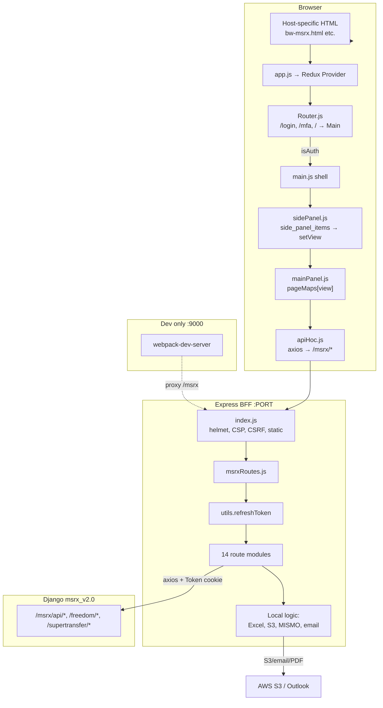

# MSRX Frontend — Deep Developer Takeover Audit

**Repository:** `d:\BLUE-WATER\msrx-frontend`  
**Package name:** `msrx-v3` (`package.json` L2)  
**Stack:** React 17 + Redux + Express 4 BFF, proxying Django (`msrx_v2.0`)  
**Audit mode:** Read-only — no source changes made.

---

## 1. Executive Summary

`msrx-frontend` is a **monolithic BFF + SPA** for the MSRX mortgage trading platform. It is **not** a pure React app: Express owns authentication cookies, CSRF, file processing (Excel/MISMO/S3/email), and ~90% of API traffic is proxied to Django via `BACKEND_URL`.

**Navigation is Redux-driven, not React Router-driven.** After login, the only route is `/`. Which screen renders is determined by:

```
Django login response → userDetails.side_panel_items → SidePanel sets state.view → pageMaps[view] in mainPanel.js
```

**Highest-risk findings for Monday-morning ownership:**

| Rank | Issue | Evidence |
|------|-------|----------|
| **P0** | Standard logout may **not clear** `auth` httpOnly cookie | `server/routes/auth.js` `postLogout` L192–211 — only `softLogout` path calls `clearCookie` |
| **P0** | CSRF header likely **never set** — `template.hbs` has no token meta; `store.js` L32 reads `metas[0].getAttribute("token")` from charset meta | Production CSRF enforcement at `index.js` L25 would block all `/msrx/*` if `NODE_ENV=production` |
| **P1** | Auth gate is **client-only** (`isAuth` in Redux/localStorage) | `Router.js` L14–24, `localStorage.js` |
| **P1** | Express **blocks** on server-side polling (pricing/upload/commit) | `msrCoissue.js` `getPricingStatus` L254–265, `getUploadStatus` L324–335, `getCommitStatus` L94–106 |
| **P1** | Node version mismatch: CodeBuild uses Node **22**, `.nvmrc` says **18.20.8** | `buildspec.yml` L9 vs `.nvmrc` |
| **P1** | Title Toolbox `downloadReport` proxies **arbitrary URL** (SSRF) | `server/routes/titleToolbox.js` L6–22 |

**What the repo answers well:** request routing, BFF proxy pattern, view→component mapping, major business workflows, build/deploy pipeline shape.

**What still needs KT:** production env var values, which screens are actively used per client, monitoring/rollback, and whether production CSRF/logout behavior differs from this code.

---

## 2. Architecture Diagram



### Startup trace

| Phase | Command | Result |
|-------|---------|--------|
| **Dev** | `npm run start-dev` | `nodemon server/index.js` → Express on `PORT` (default 3000) |
| **Dev** | `npm run serve` | Webpack dev server port **9000**, proxies `/msrx` → `localhost:3000` (`webpack.dev.js` L21–25) |
| **Dev browser** | `http://localhost:9000` | Loads `LOCAL_INDEX` or `bw-msrx.html` (`index.js` L37–38) |
| **Prod build** | `npm run build` | `NODE_ENV=production webpack --config webpack.prod.js` → `client/dist/bundle.*.js` + per-host HTML |
| **Prod run** | `npm start` | `node --max-old-space-size=8192 server/index.js` (`package.json` L12) |
| **Prod browser** | `GET /` | CSRF cookie set, host-mapped HTML rendered (`index.js` L98–101) |
| **First API** | Login `POST /msrx/login` | Express → `BACKEND_URL/msrx/api/login/` → sets signed `auth` cookie → Redux `userDetails` |

### How React and Express connect

- **Production:** Single Node process serves `client/dist` static assets **and** `/msrx/*` API (`index.js` L88–96).
- **Development:** Two processes — webpack (:9000) + Express (:3000), joined by proxy.
- **No SSR for React.** React bundle is client-side only; Express only renders HTML shell via EJS (`index.js` L44, L101).

### White-label / multi-tenant

| Piece | File | Behavior |
|-------|------|----------|
| Config source | `platform_configs.json` | 26 hostnames; schema: `hostname`, logos, `handle`, etc. |
| Build-time HTML | `webpack.common.js` L23–31 | One `HtmlWebpackPlugin` page per hostname |
| Runtime HTML pick | `index.js` `getHtmlFileName()` L34–41 | Strips `dev.|uat.|demo.|live.` prefix, maps `host.com` → `host.html` |
| Brand in Redux | `app.js` L26–33 | Reads meta tags injected in `template.hbs` L11–16 |
| Deploy fetch | `.platform/hooks/prebuild/01_white_label.sh` | S3 logos + `curl $BACKEND_URL/msrx/api/label-configs` |

---

## PHASE 1 — Repository Architecture

### Folder structure (maintainer view)

```
msrx-frontend/
├── client/src/          # React app (~421 files)
│   ├── app.js           # Entry
│   ├── Router.js        # Public routes only
│   ├── main.js          # Authenticated shell
│   ├── components/      # Feature UI + apiHoc.js (~4000 lines)
│   ├── componentsPublic/# login, forgot, reset, serverDown
│   ├── panels/          # viewMaps.js, sidePanel, headerPanel, mainPanel
│   ├── store/           # Redux (12 reducer files, ~100 slices)
│   └── helpers/
├── server/              # Express BFF
│   ├── index.js
│   ├── msrxRoutes.js    # ~645 lines, all route registration
│   ├── routes/          # 14 domain route files
│   └── [Excel/S3/MISMO modules]
├── client/dist/         # Webpack output (committed/built)
├── platform_configs.json
├── logos/
├── webpack.*.js
├── buildspec.yml        # AWS CodeBuild
├── .ebextensions/
└── .platform/           # EB hooks (white-label, puppeteer, nginx)
```

### Important files

| File | Role |
|------|------|
| `client/src/app.js` | ReactDOM render, brand bootstrap |
| `client/src/Router.js` | Auth gate (`isAuth`) |
| `client/src/panels/viewMaps.js` | **141 view keys → components** (`pageMaps` object) |
| `client/src/panels/sidePanel.js` | Sidebar from `userDetails.side_panel_items` |
| `client/src/panels/mainPanel.js` | Renders `pageMaps[view]` |
| `client/src/components/apiHoc.js` | Central API HOC (~200 methods) |
| `client/src/store/store.js` | Redux + axios interceptors + CSRF header |
| `server/index.js` | Security middleware, static, CSRF |
| `server/msrxRoutes.js` | All `/msrx/*` endpoints |
| `server/utils.js` | Token refresh + axios response normalization |

---

## PHASE 2 — React Application Deep Audit

### How MSRX decides which screen to display

```
Login success
  → login.js signIn() L202–205: setUserDetails(res.data)
  → userDetails includes side_panel_items (from Django)
  → sidePanel.js componentDidMount L13–21:
       find first enabled side_panel_items entry
       → dispatch setView(defaultView.id)
  → mainPanel.js render L23–25:
       pageMaps[this.props.view]
```

**Special case:** `showMarketDataModal` is **not** in `pageMaps` — opens modal instead (`sidePanel.js` L45–48).

**If `pageMaps[view]` is undefined:** React renders nothing for that view (silent blank screen risk).

### Router vs view system

| Layer | File | Scope |
|-------|------|-------|
| React Router | `Router.js` | `/login`, `/forgot`, `/reset-password/:token`, `/mfa`, `/error`, `/` (private) |
| Redux view | `displayReducer.view` | All in-app screens |

### Redux store

- **Creation:** `store/store.js` L15–18 with `redux-thunk`
- **Hydration:** `loadState()` from `msrxSerializedState` (`localStorage.js` L22–33)
- **Persistence:** Only `username`, `isAuth`, `userDetails` (throttled 1s, `store.js` L22–29)

### apiHoc pattern

`components/apiHoc.js` — functional HOC injecting axios methods as props. Used by `mainPanel.js` (wrapped at L53–55) and many feature components.

Module-specific HOCs:
- `components/wholeLoan/apiHoc.js`
- `components/superTransfer/apiHoc.js`
- `components/qualityControlModule/apiHoc.js`
- `components/blueRateModule/components/apiHoc.js`

`handleError` at `apiHoc.js` L1256–1259 → `setErrorObject` + `setErrorModal`.

### View mapping (141 active keys)

Full mapping lives in `panels/viewMaps.js` L91–273. Grouped below:

<details>
<summary><strong>VIEW KEY → COMPONENT → FILE → BUSINESS PURPOSE</strong> (click to expand)</summary>

| View Key | Component | File | Business Purpose |
|----------|-----------|------|------------------|
| `showWizard` | NewWorkflow | `workflowWizard/workflowSteps.js` | Standard seller tape upload→price→commit |
| `showPriceManagement` | PricingManagement | `pricingManagement.js` | Tape list, approve, reprice |
| `showTapeDetails` | TapeDetails | `tapeDetails.js` | Single tape detail |
| `showQuickCommit` | QuickCommit | `quickCommit/commitWizard.js` | Aggregator quick commit |
| `showWlQuick` / `showWlQuickCommit` / `showBwWlQuick` | WL price/commit zones | `quickCommit/*` | Whole-loan quick pricing/commit |
| `showAggSellerManagement` | AggSellerManagement | `aggregator/aggSellerManagement.js` | Aggregator creates/edits sellers |
| `showUserManagement` | AggSellerUserManagement | `aggregator/aggSellerUserManagement.js` | Aggregator seller login users |
| `showAggPipe` | AggPipe | `aggregator/aggPipeline.js` | Aggregator pipeline |
| `showAggRecon` / `showAggReconHome` | AggRecon | `aggRecon/aggRecon.js` | Aggregator reconciliation |
| `showPurchaseAdvices` | PurchaseAdvices | `aggRecon/purchaseAdvices.js` | PA management |
| `showBoardingProgress` | BoardingProgress | `activitySummary/boardingProgress.js` | MSR boarding status |
| `showFreedomTapeManager` | TapeManager | `freedom/tapeManagement/tapeManager.js` | Freedom whole-loan tapes |
| `showPricingManager` | PricingManager | `freedom/pricingManagement/pricingManager.js` | Freedom pricing trees |
| `showFreedomGrid` | FreedomGridTable | `freedom/gridManagement/gridTable.js` | Freedom grid editor |
| `showLoanPipeline` / `showLoanScenario` / `showWholeLoanCommitmentPipeline` | PreClose.* | `wholeLoan/index.js` | Whole-loan pre-close |
| `showSuperTransferDropZone` | SuperTransferDropZone | `superTransfer/superTransferDropZone.js` | Bulk doc upload |
| `showMissingDocuments` | SuperTransfer.Summary | `superTransfer/summary.js` | Missing docs QC |
| `showExceptionManagement` | QualityControl.* | `qualityControlModule/` | Exception remediation |
| `showDuediligenceLoans` (+ ~40 DD views) | dueDiligenceComponents.* | `dueDiligence/` | Full due diligence module |
| `showSeasonedTapeManagement` (+ seasoned views) | blueRateComponents.* | `blueRateModule/` | Seasoned MSR pricing |
| `showGlobalSearch` / `showOrder` / `showStatus` | Title Toolbox | `titleToolbox/` | Property/title search |
| `showPipeline` | CommitmentPipeline | `commitmentPipeline.js` | Buyer commitment pipeline |
| `showNewPricing` | GridUploadWorkFlow | `gridUploaderWizard/` | Buyer grid upload workflow |
| `showMsrDashboard` | AgsUserPipeline | `agsUser/pipeline.js` | Aggregator seller dashboard |
| `showUserProfile` | UserProfile | `userProfile.js` | Change password |

*Remaining keys (admin config, reports, margins, pools, etc.) are all defined in `viewMaps.js` L91–273 and follow the same pattern.*

</details>

**Modal-only (not in pageMaps):** `showMarketDataModal` → `market-data` modal form.

---

## PHASE 3 — Role-Based Frontend

### Where roles come from

**CONFIRMED** (Django `api/views/auth.py` L172–216): Login response includes:
- `user_role` (seller, buyer, aggregator, etc.)
- `aggregator_flag`, `aggregator_seller_flag`
- `aggregator_seller_login` (for aggregator seller sub-users)
- `side_panel_items` (from `MSRX_User.side_panel_items` or linked user)
- `permissions` (Django group permissions dict, L234–236)
- `is_staff`

**Frontend does NOT hardcode role→screen maps.** Screens are entirely driven by `side_panel_items` from Django (`sidePanel.js` L14–26).

### Aggregator Seller permissions (`access_view`, etc.)

| Layer | Location | Behavior |
|-------|----------|----------|
| **Model** | `msrx_v2.0/msrx/models/user.py` L214–217 | `Client_Aggregator_Seller_Login` fields |
| **Backend enforcement** | `msrx_v2.0/api/views/aggregator.py` L924–958 | Saved on create/update |
| **BFF relay** | `server/routes/conduit.js` L563–566, L942–945 | Forwards as strings to Django |
| **Frontend UI** | `aggregator/aggSellerUserManagement.js` L129 | Display label only: "admin" vs "view only" |
| **Redux defaults** | `aggregatorReducer.js` L214–245 | UI defaults when selecting users — **not security** |

### Role-specific frontend checks (UI only)

| Check | File | Purpose |
|-------|------|---------|
| `user_role === "buyer"` | `headerPanel.js` L22 | Soft logout for buyers |
| `user_role === "buyer"/"seller"` | `dueDiligence/loans/*.js` | Different status options |
| `aggregator_flag` | `pricingManagement.js` L28–29 | Switches `fetch-tape` vs `fetch-tape-agg` |
| `userDetails.aggregator_flag` | Various quick-commit flows | API route selection |

### Authorization weakness

**Hiding a sidebar item is NOT security.** A user could:
1. Manually `dispatch(setView("showWizard"))` via Redux DevTools
2. Call `/msrx/*` endpoints directly (cookie auth still required)
3. Set `isAuth: true` in `localStorage` (`msrxSerializedState`) and reload

**Real enforcement is Django Token auth** on every proxied request. UI permissions are presentation-only.

---

## PHASE 4 — API Layer

### Normal API call flow

```
Component
  → apiHoc method OR direct axios
  → axios defaults: X-CSRF-Token, username header (store.js L32–36)
  → cookie: auth (httpOnly, auto-sent)
  → POST/GET /msrx/<route>
  → index.js csrfProtection (prod only)
  → msrxRoutes.js utils.refreshToken (slide cookie 2hr)
  → route handler
  → axios to BACKEND_URL with Authorization: Token ${cookie.key}
  → response → Redux dispatch → re-render
```

### Priority API mapping

| Frontend call | Component(s) | Express route | Express file | Django endpoint | Method | Purpose |
|---------------|-------------|---------------|--------------|-----------------|--------|---------|
| `POST /msrx/login` | `login.js` L182 | `/login` | `auth.js` `postLogin` L163 | `/msrx/api/login/` | POST | Authenticate |
| `POST /msrx/logout` | `headerPanel.js` L23, `autoTimeout.js` L37 | `/logout` | `auth.js` `postLogout` L192 | `/msrx/api/rest-auth/logout/` | POST | Logout |
| Login response | `login.js` L204 | (in login response) | — | auth enrichs `side_panel_items` | — | User config |
| `POST /msrx/upload-tape` | `dropZone.js` L30 | `/upload-tape` | `msrCoissue.js` `postUploadTape` L509 | `/msrx/api/uploadtape_csv/` | POST multipart | Tape upload |
| `GET /msrx/check-upload-status` | `dropZone.js` L50 | `/check-upload-status` | `msrCoissue.js` `getUploadStatus` L316 | `/msrx/api/uploadtape_csv/` | GET (poll) | Upload progress |
| `POST /msrx/approve-tape` | `pricingManagement.js` L52 | `/approve-tape` | `msrCoissue.js` `postApproveTape` L370 | `/msrx/api/approve_tape/` | POST | Tape approval |
| `POST /msrx/run-pricing` | `step4-price.js` L28, `pricingManagement.js` L82 | `/run-pricing` | `msrCoissue.js` `postRunPricing` L486 | `/msrx/api/pricing/` | POST | Start pricing |
| `GET /msrx/check-pricing-status` | `step4-price.js` L75 | `/check-pricing-status` | `msrCoissue.js` `getPricingStatus` L246 | `/msrx/api/pricing/` | GET (poll) | Pricing progress |
| `GET /msrx/fetch-pricing` | `step4-price.js` L40 | `/fetch-pricing` | `msrCoissue.js` `getPricing` L215 | `/msrx/api/pricing/` | GET | Pricing results |
| `POST /msrx/pre-commit-loan-level` | workflow step5 | `/pre-commit-loan-level` | `msrCoissue.js` L421 | `/msrx/api/commit_loan_level/` | POST | Pre-commit |
| `POST /msrx/confirm-commit` | `confirmCommitModalForm.js` L38 | `/confirm-commit` | `msrCoissue.js` L404 | `/msrx/api/confirm_commit/` | POST | Confirm commit |
| `GET /msrx/check-commit-status` | commit flows | `/check-commit-status` | `msrCoissue.js` L83 | `/msrx/api/commit_loan_level/` | GET (poll) | Commit progress |
| `GET /msrx/get-agg-sellers` | `aggSellerManagement.js` L32 | `/get-agg-sellers` | `conduit.js` | `/msrx/api/aggregator/*` | GET | Seller list |
| `POST /msrx/new-agg-seller` | `aggSellerManagement.js` L55 | `/new-agg-seller` | `conduit.js` | aggregator create | POST | Create seller |
| `POST /msrx/create-grid/buyer` | buyer grids | `/create-grid/buyer` | `buyer.js` | buyer grid endpoints | POST | Buyer grid upload |
| `POST /msrx/upload-bulk-package` | `superTransferDropZone.js` L65 | `/upload-bulk-package` | `superTransfer.js` L46 | S3 + manifest parse | POST chunks | Super Transfer bulk |
| `GET /msrx/missing-loans` | SuperTransfer summary | route in `msrxRoutes.js` | `superTransfer.js` L14 | `/supertransfer/missing_docs` | GET | Missing docs |
| Freedom routes | `freedom/*` components | `/freedom/*` | `wholeLoan.js` | `/freedom/*`, `/msrx/freedom/*` | various | Whole loan/Freedom |

### Likely unused / dead API routes

| Route | Evidence | Status |
|-------|----------|--------|
| `GET /get-purchase-advice` | `msrxRoutes.js` L48 comment | **DEAD** |
| `PATCH /update-pa-status` | `msrxRoutes.js` L53 comment | **DEAD** |
| `POST /grid-crack` | `msrxRoutes.js` L57 comment | **DEAD** |
| `GET /get-committed-tape` | `msrxRoutes.js` L146 comment | **DEAD** |
| `POST /pre-commit-portfolio` | `msrxRoutes.js` L160 comment | **DEAD** |
| `POST /wipe-token` | `auth.js` L290 comment | **DEAD** (still called from `errorModal.js` L67) |
| `POST /msrx/auth/checkToken` | `resetPassword.js` L36 | **DEAD** — route does not exist; `verifyToken` commented out L25 |

### Duplicate implementations

| Area | Files | Notes |
|------|-------|-------|
| apiHoc | Main + 4 module HOCs | Domain-split, not fully duplicated |
| Pricing polling | `step4-price.js`, `pricingManagement.js`, `quickCommit/*`, `asOfPrice/*` | Same `/run-pricing` + `/check-pricing-status` pattern copied |
| Holiday lists | `marketDataModalForm.js` L75+, `marketHolidayModalForm.js` L32+ | Hardcoded 2020–2022 dates (**LEGACY**) while `sifmaHolidays.js` exists server-side |
| `downloadTermsAndConditions` | `login.js` L230–261 | **Duplicate method** definition (second overwrites first) |

---

## PHASE 5 — Express BFF Deep Audit

### Route registration

`index.js` L96: `app.use("/msrx", [csrfProtection, msrxRouter])`  
`msrxRoutes.js` L24: `router.use(utils.refreshToken)` on all routes.

### Django token storage and forwarding

| Step | Location |
|------|----------|
| Django returns `key` + optional `login_key` | `auth.js` `postLogin` L171–178 |
| Stored in signed httpOnly cookie `auth` | `{ key, login_key, username }` |
| Refreshed every request | `utils.js` `refreshToken` L32–42 (2hr sliding) |
| Forwarded to Django | `Authorization: Token ${req.signedCookies.auth.key}` |
| Aliased sessions | `Aliasedusertoken: login_key` on some routes (`auth.js` L16) |

### Flow traces

#### A. Login
```
login.js signIn() L182
  → POST /msrx/login
  → auth.postLogin L163–189
  → POST BACKEND_URL/msrx/api/login/ (hostname header)
  → Django returns key, enriches side_panel_items
  → Express sets auth cookie, encrypts reset token in response key field
  → Redux: setAuth(true), setUserDetails(data)
  → history.push("/")
  → sidePanel sets first enabled view
```

#### B. Authenticated GET
```
apiHoc.fetchTapes() L75
  → GET /msrx/api/tapesList (route in msrxRoutes)
  → refreshToken slides cookie
  → route handler → GET BACKEND_URL/... + Token header
  → response → setTapes in Redux
```

#### C. Authenticated POST
Same pattern; CSRF checked in production (`index.js` L25).

#### D. File upload (tape)
```
dropZone.postFile L28
  → POST /msrx/upload-tape (multipart userTape)
  → msrCoissue.postUploadTape L509
  → FormData → BACKEND_URL/msrx/api/uploadtape_csv/
  → returns tape_id
  → GET /msrx/check-upload-status (server polls Django every 3s until 100%)
```

#### E. Logout
```
headerPanel L23: POST /msrx/logout { softLogout: buyer|company_user }
  → auth.postLogout L192
  → if softLogout && !login_key: clearCookie("auth") ✓
  → else: Django logout but NO clearCookie ✗
  → Redux setAuth(false) only (cookie may persist)
```

---

## PHASE 6 — Authentication & Security Audit

| # | Severity | File | Function | What happens | Risk | How to verify |
|---|----------|------|----------|--------------|------|---------------|
| 1 | **P0** | `auth.js` L204–207 | `postLogout` | Full logout returns 200 without `clearCookie("auth")` | Session survives logout; user appears logged out in UI but cookie valid | Logout as seller; inspect browser cookies; call `/msrx/fetch-tape` |
| 2 | **P0** | `template.hbs`, `store.js` L32 | CSRF setup | No `token` meta in template; reads wrong meta | Production API calls may all fail CSRF, OR CSRF is ineffective | Inspect rendered HTML in prod; check `X-CSRF-Token` request header |
| 3 | **P1** | `index.js` L25 | `csrfProtection` | CSRF only when `NODE_ENV===production` | Dev/staging misconfig exposes CSRF bypass | Check EB env `NODE_ENV` |
| 4 | **P1** | `Router.js` L20 | `PrivateRoute` | `isAuth` from Redux only | UI bypass via localStorage/DevTools | Set `msrxSerializedState.isAuth=true` without cookie |
| 5 | **P1** | `localStorage.js` | `saveState` | Persists full `userDetails` | Stale roles/screens after backend permission change | Change user permissions in Django; reload without re-login |
| 6 | **P1** | `titleToolbox.js` L6–22 | `downloadReport` | Proxies `req.query.url` | SSRF to internal services | `GET /msrx/title-toolbox/download?url=http://169.254.169.254/` |
| 7 | **P2** | `auth.js` L173–175 | `postLogin` | Encrypts token in response body only | Mitigates token in response body; cookie still has raw key | Inspect login network response |
| 8 | **P2** | `cookieOptions` | all cookies | `secure: true` always | Local HTTP dev may not set cookies | Test login on `http://localhost` |
| 9 | **P2** | `mfa.js` | MFA flow | MFA route public; relies on cookie from partial login | UNKNOWN — ASK IN KT if MFA requires prior cookie | Login with MFA user; check cookie before MFA page |
| 10 | **P2** | `superTransfer.js` L104–106 | `uploadBulkPackage` catch | Empty catch, no response sent | Hung requests | Upload corrupt bulk package |
| 11 | **P3** | `.env` L6–7 | boilerplate | `ADMIN_NAME`/`ADMIN_PW` in repo template | Credential leak if real values committed | `git log .env` — file should be gitignored |
| 12 | **P3** | `login.js` L247–261 | duplicate method | Dead code | Confusion | Code review |

### Cookie settings summary

| Cookie | httpOnly | secure | signed | sameSite | maxAge |
|--------|----------|--------|--------|----------|--------|
| `auth` | yes (`auth.js` L176) | yes | yes (`WEB_TOKEN_SECRET`) | **not set** (browser default) | 2 hours |
| `x-csrf-token` | yes (`index.js` L20) | yes | yes | not set | 7 days |
| `ttb` (Title Toolbox) | yes | yes | yes | not set | 2 hours |

### Security headers

- `helmet()` enabled (`index.js` L54–58): XSS filter, frame options, nosniff
- CSP via `helmet-csp` (`index.js` L72–86)
- `x-powered-by` disabled L49

---

## PHASE 7 — Business Workflow Traces

### A. Login → Dashboard
| Step | Component | Function | API | Express | Django | Next state |
|------|-----------|----------|-----|---------|--------|------------|
| 1 | `login.js` | `signIn()` L176 | `POST /msrx/login` | `postLogin` | `/msrx/api/login/` | MFA/terms/password-reset branches |
| 2 | `login.js` | L202–205 | — | — | — | `isAuth=true`, `userDetails` in Redux |
| 3 | `sidePanel.js` | `componentDidMount` L13 | — | — | — | `setView(first enabled item.id)` |
| 4 | `mainPanel.js` | render L24 | — | — | — | `pageMaps[view]` dashboard screen |

### B. Tape Upload
| Step | Component | API | Express | Django |
|------|-----------|-----|---------|--------|
| 1 | `dropZone.newFile` L17 | — | — | — |
| 2 | `dropZone.postFile` L28 | `POST /msrx/upload-tape` | `postUploadTape` | `uploadtape_csv/` |
| 3 | `dropZone.getProgress` L49 | `GET /msrx/check-upload-status` | `getUploadStatus` (3s poll) | `uploadtape_csv/?tape_id=` |
| 4 | `dropZone.uploadSuccess` L64 | — | — | — → `setTapeId`, `setFileLoadSuccess` |

### C. Pricing
| Step | Component | API | Notes |
|------|-----------|-----|-------|
| 1 | `step4-price.runPricing` L26 | `POST /msrx/run-pricing` | Async pricing start |
| 2 | `step4-price.getPricingStatus` L74 | `GET /msrx/check-pricing-status` | **Server polls** until `pricing_progress===100` |
| 3 | `step4-price.getPricing` L39 | `GET /msrx/fetch-pricing` | Loans + summary |
| 4 | Redux | `setPricing` | Table render |

### D. Commit
| Step | Component | API | Notes |
|------|-----------|-----|-------|
| 1 | `step5-commit` | Renders bulk or loan-level child | Based on `commitType` |
| 2 | Pre-commit | `POST /msrx/pre-commit-loan-level` | Async commit start |
| 3 | `confirmCommitModalForm` L18 | `GET /msrx/check-market-hours` | SIFMA holiday check |
| 4 | `confirmCommitModalForm` L36 | `POST /msrx/confirm-commit` | Final commit |
| 5 | Modal | `commit-success` form | `setCommitResults` |

### E. Aggregator Seller Management
| Step | Component | API | Django |
|------|-----------|-----|--------|
| 1 | `aggSellerManagement` | `GET /msrx/get-agg-sellers` | aggregator sellers list |
| 2 | Create | `POST /msrx/new-agg-seller` | `aggregator.py` create — sets `side_panel_items` from `SidePanels` template |
| 3 | Update | `POST /msrx/update-agg-seller` | seller config |
| 4 | Users | `aggSellerUserManagement` | `new-agg-seller-user`, `access_view/pricing/commit/exception` |

### F. Super Transfer
| Step | Component | API | Processing |
|------|-----------|-----|------------|
| 1 | `superTransferDropZone` | Chunked `POST /msrx/upload-bulk-package` | Assembles ZIP, parses manifest (`superTransfer/utils.js`) |
| 2 | Server | `s3.uploadBulkPackage` | Uploads per-loan to `docReconBucket` |
| 3 | `SuperTransfer.Summary` | `GET missing-loans/docs` | Django `/supertransfer/missing_docs` |
| 4 | Single doc upload | `POST upload-loan-docs` | MIME check, PDF/ZIP/XML → S3 + MISMO parse |

### G. Freedom / Whole Loan (primary path)
| Step | View | Component | API area |
|------|------|-----------|----------|
| 1 | `showFreedomTapeManager` | `TapeManager` | `/freedom/tapes`, tape CRUD |
| 2 | `showPricingManager` | `PricingManager` | `/freedom/pricing-*`, optimization polling |
| 3 | `showWlQuick` | `WLPriceZone` | Freedom pricing workflow |
| 4 | `showLoanPipeline` | `PreClose.LoanPipeline` | `/msrx/freedom/pre-close/*` |
| 5 | Commit | `WLCommitZone` | `/freedom/commit-tape/` etc. |

---

## PHASE 8 — Express Non-Proxy Logic

| Feature | File | Function | Input | Output | External |
|---------|------|----------|-------|--------|----------|
| Excel strat reports | `viewerStrat/writeStrat.js` | via `msrCoissue.getViewerStrat` | Django strat data | `.xlsx` download | — |
| Boarding progress Excel | `boardingProgress/writeStrat.js` | `getBoardingProgressLoanLevel` | Django data | `.xlsx` | — |
| Agency cash tapes | `agencyCashPrice/writeStrat.js` | `wholeLoan.getAgencyCashTape` | Django data | `.xlsx` | — |
| Base SSI | `baseSSI/writeSSI.js` | `conduit.getSsiDownload` | Django data | `.xlsx` | — |
| Seasoned reports | `seasonedReports/*` | `msrSeasoned` routes | Django data | xlsx/pdf/zip | — |
| MISMO XML parse | `superTransfer/utils/readMismo.js` | `readMismo()` | XML file | JSON boarding fields | — |
| Super Transfer manifest | `superTransfer/utils.js` | `readSuperTransferManifest` | ZIP manifest | Per-loan file map | — |
| S3 uploads | `superTransfer/s3Bucket.js` | `uploadBulkPackage`, `uploadLoanDocs` | Files | S3 keys | `docReconBucket` |
| Bulk ZIP chunk assembly | `superTransfer.uploadBulkPackage` | L46–107 | base64 chunks | Manifest + S3 | — |
| QC remediation XLSX | `superTransfer/utils.js` | `readRemediationFile` | XLSX | PATCH to Django | — |
| Password reset email | `mailer.js` | `forgotPassword` | token | Outlook email | `OUTLOOK_NAME/PW` |
| Privacy policy PDF | `auth.postDownloadPrivacyPolicy` | L276 | markdown | PDF buffer | `md-to-pdf` |
| SIFMA holidays | `sifmaHolidays.js` | `isHolidayInEffect` | date | blocks commit API | — |
| Title Toolbox transform | `titleToolbox.js` | `globalSearch` | form body | reshaped request | Benutech API |
| Pre-close MISMO+S3 | `preClose.registerLoan` | — | XML upload | S3 + PATCH Django | S3 |

### Dead/unwired server modules (**LEGACY/DEAD**)

| Module | Status |
|--------|--------|
| `apiGoogleSheetsPA.js` | **DEAD** — no imports |
| `freedomWholeLoan/writeStrat.js` | **DEAD** — no route imports |
| `wholeLoan/bidtape.js`, `indicative.js` | **DEAD** |
| `villageWholeLoan/writeStrat.js` | **DEAD** |
| `freedomCommitment/commitment.js` | Imported in `wholeLoan.js` but **never called** |

---

## PHASE 9 — State Management

### Structure (`store/reducers/root.js`)

~100 slices across: auth, display, tape, price, aggregator, buyer, freedom, titleToolbox, dueDiligence, superTransfer, caas, blueRate, qualityControl.

### Key state domains

| Domain | Slices | Persisted? |
|--------|--------|------------|
| Auth | `username`, `isAuth`, `userDetails`, `env` | **Partial** (first 3) |
| Navigation | `view`, `wizardStep`, modals | No |
| Tape | `tapeId`, `tapes`, `fileMetaData`, etc. | No |
| Pricing/Commit | `pricing`, `selectedBuyers`, `commitResults`, etc. | No |

### `msrxSerializedState` (localStorage)

**Persisted** (`store.js` L24–28): `username`, `isAuth`, `userDetails`

**Stale detection** (`localStorage.js` L3–19): Invalidates if missing `side_panel_items`, `user_role`, `platform_config`, etc.

**Risks:**
- User sees **old sidebar** after Django permission change until re-login
- `isAuth: true` with expired cookie → API errors, confusing UX
- `userDetails` may contain business config (not raw passwords, but role/permissions metadata)

---

## PHASE 10 — Error Handling

### Failure-mode table

| Layer | Pattern | File | Risk |
|-------|---------|------|------|
| axios response | `setDataLoading(false)` + rethrow | `store.js` L63–67 | OK |
| apiHoc | `handleError` → modal | `apiHoc.js` L1256 | Swallows return value (`.catch` returns undefined) |
| Express proxy | `res.status(error.status).send()` — often empty body | Most route files | Generic client errors |
| Express axios interceptor | `status:false` → reject as 400 | `utils.js` L11–17 | Good normalization |
| Error modal 500 | `window.location.reload()` | `errorModal.js` L22–24 | May loop on persistent 500 |
| Error modal 401 | `setAuth(false)` only | `errorModal.js` L20–21 | Cookie not cleared |
| Upload polling | Server 400 on failure | `getUploadStatus` L330 | Client shows error string |
| Pricing polling | Server 503 on failure | `getPricingStatus` L260 | Client `handleError` |
| `uploadBulkPackage` catch | `console.error` only | `superTransfer.js` L104–106 | **Hung request** |
| `autoTimeout` logout fail | `console.log` only | `autoTimeout.js` L43–45 | User stays "logged in" in UI |

---

## PHASE 11 — Concurrency / Polling / Async

| Pattern | Location | Cleanup? | Risk |
|---------|----------|----------|------|
| Server-side 3s polling | `getPricingStatus`, `getUploadStatus`, `getCommitStatus` | N/A (blocks Express worker) | **Thread starvation** under load |
| `setInterval` 10s | `marketDataModalForm.js` L22 | `componentWillUnmount` L25 ✓ | OK |
| `setInterval` 10s | `marketClosedModalForm.js` L17 | `componentWillUnmount` L21 ✓ | OK |
| `setInterval` 10s | `marketHolidayModalForm.js` L17 | `componentWillUnmount` L21 ✓ | OK |
| Session timeout recursive `setTimeout` | `autoTimeout.js` L48–51 | `cleanup()` on unmount ✓ | OK |
| Optimization polling | `reallocation/status.js` L30 | **No cleanup** | Poll after navigate |
| `componentDidMount` pricing | `step4-price.js` L21–23 | **No guard** | Re-run pricing on remount |
| Duplicate commit | `confirmCommit` buttons | No disable during request | Double-click risk — **mitigated server-side UNKNOWN** |

---

## PHASE 12 — Build & Deployment

### Development commands
```bash
# Terminal 1
npm run start-dev    # nodemon server/index.js → PORT 3000

# Terminal 2  
npm run serve        # webpack-dev-server → :9000, proxies /msrx → :3000
```

### Production pipeline
```
CodeBuild (buildspec.yml)
  → printenv > .env
  → npm install
  → npm run build (webpack prod)
  → artifact: client/, server/, .platform/, .ebextensions/, platform_configs.json, logos/

Elastic Beanstalk deploy
  → prebuild: 01_white_label.sh (S3 logos + label-configs)
  → predeploy: Chromium for Puppeteer
  → npm start (8GB heap)
  → nginx: 450MB body, 300s timeout
```

### Deployment checklist

- [ ] `BACKEND_URL` points to correct Django env (dev/uat/live)
- [ ] `WEB_TOKEN_SECRET` stable across deploys (invalidates all cookies if changed)
- [ ] `NODE_ENV=production` in EB (enables CSRF)
- [ ] `API_KEY`, `accessKeyId`, `secretAccessKey` for white-label prebuild
- [ ] `OUTLOOK_NAME/PW` for password reset emails
- [ ] `docReconBucket` for Super Transfer S3
- [ ] `TTB_USERNAME/PW` for Title Toolbox
- [ ] `GOOGLE_API_KEY`, `MSRX_ENV` baked at build time
- [ ] `platform_configs.json` + `logos/` present after prebuild
- [ ] Node version aligned (22 vs 18 mismatch)
- [ ] Verify CSRF works post-deploy (see Phase 6 #2)
- [ ] Verify logout clears session (see Phase 6 #1)

---

## PHASE 13 — Configuration Dependency Map

| Variable | File(s) | Purpose | Required? | Secret? | Failure if missing |
|----------|---------|---------|-----------|---------|-------------------|
| `PORT` | `index.js` L118 | Express listen port | Yes (EB sets) | No | Server won't start |
| `NODE_ENV` | `index.js`, webpack | CSRF, CSP, build mode | Yes | No | CSRF off; dev CSP |
| `BACKEND_URL` | All `server/routes/*` | Django proxy target | **Yes** | No | All API 503/undefined |
| `WEB_TOKEN_SECRET` | `index.js` L95, `auth.js`, `mailer.js` | Signed cookies, JWT | **Yes** | **Yes** | Cookies invalid |
| `MSRX_ENV` | `webpack.common.js` → `app.js` | Env badge in UI | Yes | No | Shows undefined |
| `GOOGLE_API_KEY` | webpack → `googleMap.js` | Maps in Title Toolbox | If using TT | Yes | Maps fail |
| `ADMIN_NAME/PW` | `auth.js` L54 | Token lookup for forgot password | For password reset | **Yes** | Forgot password fails |
| `OUTLOOK_NAME/PW` | `mailer.js` L60 | Email sending | For email features | **Yes** | Silent email failure |
| `accessKeyId/secretAccessKey` | `s3Bucket.js`, prebuild | S3 uploads + white-label | For ST/S3 | **Yes** | Upload/prebuild fail |
| `docReconBucket` | `s3Bucket.js` L18 | Super Transfer bucket | For ST | No | S3 upload errors |
| `API_KEY` | `01_white_label.sh` L27 | Fetch label configs | Deploy | **Yes** | Empty platform_configs |
| `TTB_USERNAME/PW` | `titleToolbox.js` L120 | Benutech login | For TT | **Yes** | Title search fails |
| `LOCAL_INDEX` | `index.js` L38 | Dev HTML file pick | Dev only | No | Wrong white-label page |
| `NPM_TOKEN` | `.ebextensions/01_files.config` | GitHub packages | Deploy | **Yes** | npm install fail |
| `JEST_*` | `tests/*.test.js` | Integration tests | Test only | Yes | Tests skip/fail |

**Documented in `.env` but unused in code:** `FRONTEND_URL`, `SESSION_SECRET`, `TEST_SELLER_*`, `BWFT_LIST`, `DEV_LIST` — **LEGACY/README only**.

---

## PHASE 14 — Dead / Legacy / Duplicate Code

| Item | Classification | Evidence |
|------|----------------|----------|
| `apiGoogleSheetsPA.js` | **DEAD** | No imports in routes |
| `freedomCommitment/commitment.js` import | **DEAD** | Imported, never called |
| `wholeLoan/bidtape.js`, `indicative.js` | **DEAD** | No route wiring |
| `postWipeToken` route | **LEGACY** | Marked not in use; `errorModal` still calls it |
| `prebuild-script.js` `/admin/label-configs` | **LEGACY/BROKEN** | Django has `/label-configs` only |
| `resetPassword verifyToken` | **DEAD** | Commented out; `checkToken` route missing |
| Hardcoded holidays 2020–2022 in modals | **LEGACY** | `marketDataModalForm.js` L75+ |
| `downloadTermsAndConditions` duplicate | **DEAD** | `login.js` L230 + L247 |
| `get-purchase-advice`, `grid-crack`, etc. | **DEAD** | `msrxRoutes.js` comments |
| `client/dist/` committed bundle | **LIKELY ACTIVE** | Production may serve pre-built assets |
| `dueDiligence/loans.js` upload TODO | **INCOMPLETE** | L370 TODO comment |
| `console.log` in superTransfer | **DEBUG** | `superTransfer.js` L48, L60–63 |

---

## PHASE 15 — Production Failure Risks (Ranked)

### P0 — CRITICAL

1. **Logout leaves valid auth cookie** — `auth.js` `postLogout` L204–207  
2. **CSRF token not injected into HTML** — `template.hbs` vs `store.js` L32 — **verify in prod**  
3. **Express worker blocking polls** — long pricing/upload/commit requests hold connections (nginx 300s timeout may kill them)

### P1 — HIGH

4. **Stale `side_panel_items` from localStorage** — wrong screens after permission change  
5. **Node 22 vs 18 mismatch** — subtle runtime breakage  
6. **SSRF in titleToolbox downloadReport** — `titleToolbox.js` L9  
7. **White-label hostname mismatch** — wrong branding/HTML if `platform_configs.json` stale  
8. **Duplicate pricing/commit** — no universal client-side debounce  
9. **`BACKEND_URL` env mismatch** — frontend hits wrong Django environment

### P2 — MEDIUM

10. **secure cookies on local HTTP** — dev login issues  
11. **500 error → full page reload loop** — `errorModal.js` L23  
12. **MFA flow cookie state** — unclear partial-auth handling  
13. **Large upload memory check** — `superTransfer.js` L64 — rejects but race possible  
14. **prebuild API path inconsistency** — local `prebuild-script.js` vs EB hook

### P3 — LOW

15. **Hardcoded legacy holidays in client modals**  
16. **Committed `client/dist` bundle** — source/dist drift risk  
17. **Typo `wepack.config.js` in buildspec artifacts** — harmless but sloppy

---

## PHASE 16 — Code ↔ Backend Contract Check

Sibling `msrx_v2.0` available — key contracts **CONFIRMED**:

| Frontend/BFF | Django | Status |
|--------------|--------|--------|
| `POST /msrx/upload-tape` → `uploadtape_csv/` | `api/urls/index.py` L101 | **CONFIRMED** |
| `POST /msrx/run-pricing` → `pricing/` | L116 | **CONFIRMED** |
| `POST /msrx/confirm-commit` → `confirm_commit/` | L136 | **CONFIRMED** |
| `POST /msrx/pre-commit-loan-level` → `commit_loan_level/` | L130 | **CONFIRMED** |
| Login `side_panel_items` | `auth.py` L177, L216 | **CONFIRMED** |
| White-label `label-configs` | `api/urls/index.py` L243 | **CONFIRMED** |
| `prebuild-script.js` `admin/label-configs` | Not in urls | **BROKEN** — use `/msrx/api/label-configs` |
| `POST /msrx/auth/checkToken` | Not found | **MISSING** — dead client code |
| Super Transfer `missing_docs` | `supertransfer` app | **INFERRED** — path matches BFF |
| `uploadtape_csv/v2/` | Django has v2 endpoint | **INFERRED** — BFF still uses v1 only |

**Response contract assumptions:**
- Django wraps responses in `{ status: bool, details: ... }` — Express interceptor rejects `status: false` (`utils.js` L11)
- Pricing poll expects `details.pricing_progress === 100` (`msrCoissue.js` L258)
- Upload poll expects `details.upload_progress === 100` (`msrCoissue.js` L328)

---

## PHASE 17 — Developer Takeover Questions (KT only)

| Question | Why we need to ask | Code already tells us | Still unknown | Risk | Who |
|----------|-------------------|----------------------|---------------|------|-----|
| Is `NODE_ENV=production` on all EB environments? | CSRF only enforced in production | `index.js` L25 | Actual EB env config | CSRF bypass or total API block | DevOps |
| Does production HTML include CSRF token meta tag outside this repo? | `template.hbs` lacks token | `store.js` reads meta token | Deployed HTML source | All API calls fail or CSRF ineffective | Previous team/DevOps |
| Is logout cookie clearing handled by nginx/ALB? | `postLogout` doesn't clear cookie on full logout | Soft logout clears for buyers only | Infra-level session handling | Sessions survive logout | Previous team |
| Which `side_panel_items` templates are active per client/platform? | Screens are DB-driven | Django `SidePanels` model | Per-tenant config | Wrong screens for users | Product/BWFT |
| What is the frontend release process and rollback procedure? | No CI deploy workflow in repo | GitHub `test.yml` + `patch.yml` only | Deploy/rollback steps | Cannot recover Monday outage | DevOps |
| Are Node 18 or 22 canonical on EB? | Version conflict | `buildspec.yml` vs `.nvmrc` | Runtime on instances | Runtime crashes | DevOps |
| Which views are legacy vs actively used in production? | 141 views, some likely unused | viewMaps keys | Business usage | Wasted maintenance | Product |
| What monitoring/alerting exists for Express BFF? | No APM in repo | `pino` logger in `logger.js` | Log aggregation, alerts | Blind to outages | DevOps |
| Are there client-specific Freedom/Whole Loan flows not in generic code? | `activeBrand.handle` conditionals | empower-fcu config in `aggOptions.js` | Full client list | Broken client flows | Product |
| What are production values for `BACKEND_URL` per environment? | `.env` is boilerplate | Variable names | Actual URLs | Env mismatch | DevOps |
| Is `client/dist` built in CI or committed intentionally? | Dist exists in repo | `buildspec` runs build | Source of truth for prod assets | Stale bundle deploy | Previous team |
| Known production bugs being tracked? | Code has TODOs/FIXMEs | Scattered comments | Active bug list | Repeat incidents | Previous team |

---

## PHASE 18 — Final Takeover Report

### If something breaks Monday morning — where to look

| Symptom | First file | Trace |
|---------|-----------|-------|
| Can't login | `server/routes/auth.js` `postLogin` | Browser → `/msrx/login` → Django `/msrx/api/login/` → cookie |
| CSRF / session expired | `server/index.js` `csrfProtection` | Check `X-CSRF-Token` header vs cookie |
| Wrong screen / blank main panel | `sidePanel.js` + `viewMaps.js` | `userDetails.side_panel_items` → `state.view` → `pageMaps[view]` |
| Tape upload stuck | `dropZone.js` → `msrCoissue.getUploadStatus` | Server polling Django `uploadtape_csv/` |
| Pricing stuck | `step4-price.js` → `getPricingStatus` | Server 3s poll loop |
| Commit failed | `confirmCommitModalForm.js` | market hours → confirm-commit → Django |
| Super Transfer upload fail | `superTransferDropZone.js` → `superTransfer.uploadBulkPackage` | Chunks → manifest → S3 |
| White-label wrong logo | `platform_configs.json` + `01_white_label.sh` | Host → `getHtmlFileName` |
| API 503 all requests | `BACKEND_URL` env | Express can't reach Django |
| Logout but still authenticated | `auth.js` `postLogout` | Cookie not cleared |

### Knowledge still missing from repository

- Production environment variable values
- Active vs legacy screen inventory per client
- Monitoring, on-call, and rollback runbooks
- Whether CSRF/logout behave differently in deployed builds than this source suggests
- External integration SLAs (Benutech, S3, Outlook, Refinitiv/Freedom)

---

This audit is based on full repository inspection of `msrx-frontend` with selective contract verification against sibling `msrx_v2.0`. No source code was modified. For the highest-severity items (logout cookie, CSRF token injection, Express blocking polls), I recommend validating in a staging environment before your first production deploy as owners.