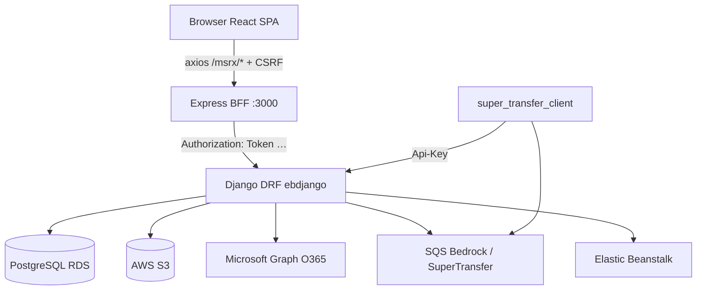
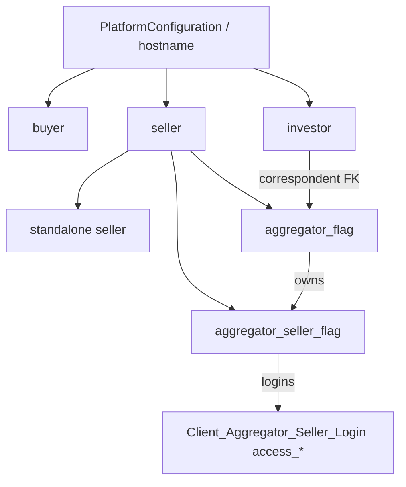
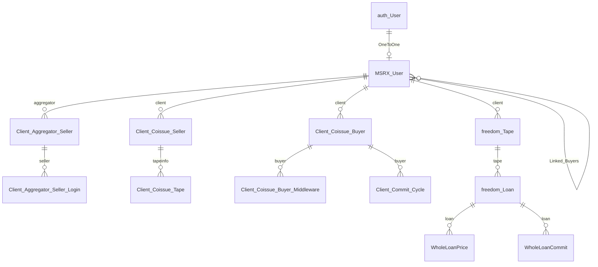

# MSRX Enterprise Reverse-Engineering Document

**Scope:** `d:\BLUE-WATER` — `msrx_v2.0` (Django), `msrx-frontend` (React/Express BFF), `super_transfer_client` (SQS worker)  
**Method:** Read-only code inspection. Every claim cites files/models/routes. Where code does not confirm something: **Unknown – not confirmed by the repository.**

---

## 1. Executive Summary

**MSRX** (MSR-X) is Blue Water Financial Technologies’ mortgage trading platform for **MSR (Mortgage Servicing Rights) coissue/seasoned sales**, **whole-loan (Freedom) trading**, post-commit **boarding / Super Transfer / QC / due diligence**, and related ops (recon, purchase advice, email trading, title).

| Layer | Tech (evidence) |
|-------|-----------------|
| Backend | Django 5.2 + DRF — `msrx_v2.0/requirements.txt`, `ebdjango/settings/shared.py` |
| Frontend | React 17 + Redux + Express BFF — `msrx-frontend/package.json`, `server/index.js` |
| DB | PostgreSQL on AWS RDS — `ebdjango/settings/{dev,uat,demo,live,local}.py` |
| Auth | DRF Token + optional HasAPIKey; Express signed cookie — `shared.py` REST_FRAMEWORK; `server/routes/auth.js` |
| Jobs | APScheduler (`django-apscheduler`), **not** Celery/Redis |
| Files | S3 via boto3; deploy Elastic Beanstalk |
| Email | Microsoft Graph / O365 — `EmailTrading` |

**Not present (searched, no matches):** Celery, Redis, Channels, CORS headers, Stripe/PayPal, Docker Compose/Dockerfile, JWT as DRF auth (PyJWT is in requirements but unused in app code).

---

## 2. Architecture



### Components

| Piece | Path | Role |
|-------|------|------|
| Django project | `msrx_v2.0/ebdjango/` | Settings, root URLs, WSGI |
| Core domain | `msrx_v2.0/msrx/` | Users, coissue/seasoned tapes, buyers, PSA |
| REST API | `msrx_v2.0/api/` | Login, pricing, commit, aggregator |
| Whole loan | `msrx_v2.0/freedom/` | Tape, PricingModel, WholeLoanCommit |
| BFF | `msrx-frontend/server/` | Cookie auth, proxy, file/XLSX helpers |
| SPA | `msrx-frontend/client/src/` | Redux views via `pageMaps` |
| Doc worker | `super_transfer_client/scripts/main.py` | SQS poll → process loans/docs |

### Environments

Evidence: `manage_{dev,uat,demo,live,local}.py` set `MSRX_ENV`; `ebdjango/settings/__init__.py` switches modules.

### URL roots

Evidence: `ebdjango/urls.py` — `/msrx/api/`, `/freedom/`, `/caas/`, `/supertransfer/`, `/duediligence/`, `/recon/`, `/analytics/`, `/email/`, `/secondlien/`, etc.

---

## 3. Business Overview

### What it does

Sellers (often under aggregators) upload **loan tapes**, get **priced** against buyer grids / DPX / Freedom ratesheets, **commit** loans to buyers/investors under volume caps, then move into **boarding, QC, purchase advice, and document delivery**.

### Who uses it

| Persona | Code signal |
|---------|-------------|
| Aggregator | `MSRX_User.aggregator_flag` |
| Aggregator seller + logins | `aggregator_seller_flag` + `Client_Aggregator_Seller_Login` |
| Standalone seller | `user_role=seller`, flags false |
| Buyer | `user_role=buyer` |
| Investor | `user_role=investor`, Freedom pools |
| BWFT staff/admin | `is_staff` / `is_superuser` / group `"BWFT"` |

### Industry / purpose

US **mortgage secondary market** — MSR transfer and whole-loan sale between originators/aggregators and buyers/investors. Company branding: Blue Water Financial Technologies (`super_transfer_client` README; hosts `*.bluewater-fintech-msrx.com` in settings).

### Glossary (simple English + evidence)

| Term | Simple meaning | Evidence |
|------|----------------|----------|
| **Tape** | Spreadsheet/batch of loans being sold | `Client_Coissue_Seller`, `freedom.Tape` |
| **Aggregator** | Company that manages many sellers | `aggregator_flag` |
| **Seller** | Originator uploading/pricing/committing | `user_role=seller` |
| **Buyer** | MSR purchaser with grids/DPX | `user_role=buyer`, `Client_Coissue_Buyer*` |
| **Investor** | Whole-loan takeout party | `user_role=investor` |
| **Counterparty** | Allowed trading partners (ID list) | `MSRX_User.counterparty` JSON — `Doc/json_config.md` |
| **Pricing** | Computing dollar/price per loan | `/msrx/api/pricing/`, `/freedom/price-tape/` |
| **Commitment** | Binding sale of loan(s) to a buyer | loan `commitment` JSON; `WholeLoanCommit` |
| **Workflow** | (1) UI wizard (2) Freedom pricing steps (3) CAAS post-commit jobs | wizard / `freedom.WorkFlow` / `caas.Workflow` |
| **Coissue** | Concurrent MSR sale channel | `execution`, `coissue=True` grids |
| **Seasoned** | Aged MSR path | `Client_Seasoned_*`, BlueRate UI |
| **UPB** | Unpaid principal balance | tape `upb`, cycle `upb_cap` |
| **DPX** | ML/adjustor pricing layer | `Client_Coissue_Buyer_Middleware` |
| **PSA** | Purchase & Sale Agreement | `PSADeals` / `PSATerms` |
| **SRP** | Service Release Premium | ratesheet / `srp_provider` |
| **HAF** | Hedge Advisory Fund | `freedom.HedgeAdvisoryFund` |
| **Pool** | Investor delivery bucket + UPB cap | `freedom.Pool` |
| **Margin** | Point spread aggregator↔seller | `freedom.Margin` |

### Mortgage lifecycle (as implemented)

```
Originate → Upload tape → Approve → Price → Pre-commit → Confirm commit
  → Boarding / Super Transfer / QC / Due Diligence → Purchase Advice / Settlement
```

Tape status comment: `uploaded/approved/priced/pre-committed/confirmed/transfer_complete` — `msrx/models/coissue.py:17-19`.

---

## 4. User Roles

### Hierarchy



### Role details

#### Aggregator (`aggregator_flag=True`, typically `user_role=seller`)

| Aspect | Evidence |
|--------|----------|
| Purpose | Manage sellers, pipeline, recon, document store |
| DB | `MSRX_User` + related `agg_sellers` |
| Permissions | `@aggregators_only` — `base/decorators/user_level_decorators.py` |
| Sidebar | Seeded: Home, Seller Info, User Mgmt, Price Mgmt, Wizard, Pipeline… — `local_dev_data.py` SIDE_PANEL_TEMPLATES |
| APIs | `/msrx/api/aggregator/seller/*`, `msr_pipeline`, etc. |
| Screens | `showAggregatorHome`, `showAggSellerManagement`, `showUserManagement`, … |
| Creation | Admin/registration + seed_enterprise; seller create via `AggregatorSellerCreate` |

#### Aggregator seller company + login

| Aspect | Evidence |
|--------|----------|
| Purpose | Seller under an aggregator; logins with view/price/commit/exception |
| DB | `Client_Aggregator_Seller`, `Client_Aggregator_Seller_Login.access_*` — `user.py:173-217` |
| Sidebar | Agg-seller template (includes Seasoned views in local_dev seed) |
| Limits | Login flags gate features; not Django Groups |

#### Standalone seller

Same MSR upload/price/commit path; no `aggregator_flag`; sidebar without aggregator admin menus.

#### Buyer

| Aspect | Evidence |
|--------|----------|
| Purpose | Publish grids/DPX; receive commitments |
| Sidebar | `showPipeline`, `showContact` (buyer template) |
| APIs | `buyer_committed_tapes`, grids, par rates |
| Config | `user_details.agency_remit_list` — `Doc/json_config.md` |

#### Investor

Freedom whole-loan pricing/pools; `correspondent` → aggregator; CAAS/Freedom workflows use role string `investor`.

#### Staff / BWFT / Admin

`@staff_only`, `@admin_only`, `@bwft_only` (group name `"BWFT"`); Django admin + `/msrx/api/admin/*`.

---

## 5. Database

### Core ER (simplified)



### Table classes

| Class | Examples |
|-------|----------|
| **Core / master** | `MSRX_User`, `PlatformConfiguration`, `SidePanels`, `SingleFamilyCode` |
| **Transactional** | `Client_Coissue_Seller/Tape`, `freedom.Tape/Loan`, commits, boarding |
| **Config** | Buyer grids, middleware/DPX, par, PricingModel, WorkFlow |
| **History / archive** | Coissue resell/deleted/updated mirrors; activity logs |
| **Audit** | `User_Activity_Log`, `base.APIActivityLog` (`db_table=api_activity_log`), EmailTrading logs |

### Important constraints / indexes (confirmed)

- `selleracqidprefix` **unique** — `MSRX_User`
- `tape_loan_id` **db_index** — `Client_Coissue_Tape`
- Commit cycle `start_date`/`end_date` **db_index** — `Client_Commit_Cycle`
- `PriceClass` **unique_together (code, branch)** — freedom models (per explore)
- Many UniqueConstraints in `duediligence` — Unknown full list without dumping every Meta; confirmed pattern exists

### Data flow (MSR)

`auth.User` → `MSRX_User` → upload creates `Client_Coissue_Seller` + loan rows → price writes `price` JSON → commit writes `commitment` JSON + status → cycles update `committed_*` → boarding/transfer tables / Super Transfer.

---

## 6. API Inventory

**Default auth:** Token + `IsAuthenticated` — `shared.py:150-154`.  
**Exceptions:** Login (public), many integration endpoints `HasAPIKey`.

### Critical trading APIs

| Route | Method | View file | Touches |
|-------|--------|-----------|---------|
| `/msrx/api/login/` | POST | `api/views/auth.py` | User, Token, MSRX_User, terms/MFA |
| `/msrx/api/uploadtape_csv/` (+ v2) | POST | `api/views/pricing.py` | Coissue seller/tape, S3 |
| `/msrx/api/approve_tape/` | POST | approve path | status → approved |
| `/msrx/api/pricing/` | GET/POST | `api/views/pricing.py` | buyers/grids/DPX → price JSON |
| `/msrx/api/commit_loan_level/` | GET/POST | `api/views/commit.py` | commitment JSON, cycles |
| `/msrx/api/confirm_commit/` | GET/POST | `api/views/commit.py` | confirmed |
| `/msrx/api/aggregator/seller/*` | GET/POST | `api/views/aggregator.py` + `@aggregators_only` | AGS graph |
| `/msrx/api/buyer_committed_tapes/` | GET | buyer views | confirmed loans |
| `/msrx/api/commit_cycle/` | CRUD-ish | `CommitCycle` | caps |
| `/freedom/price-tape/` | POST | `freedom/views/pricing.py` | Tape/Loan |
| `/freedom/commit-tape/` | POST | `freedom/views/tape_management.py` | WholeLoanCommit |
| `/caas/workflow/` | — | CAAS | post-commit automation |
| `/supertransfer/missing_loans/` | POST | API key (README) | ST client |

Full route maps: `api/urls/index.py`, `api/urls/admin.py`, `freedom/urls.py`, plus app `urls.py` under each prefix in `ebdjango/urls.py`.

**Frontend mapping:** Browser → Express `/msrx/...` (`server/msrxRoutes.js`) → `BACKEND_URL` Django path.

---

## 7. UI Inventory

**URL routes are few** (`Router.js`): `/login`, `/forgot`, `/reset-password/:token`, `/mfa`, `/error`, `/` (PrivateRoute → Main).

**Real screens** = Redux `view` keys in `client/src/panels/viewMaps.js` (~100+), gated by login `side_panel_items`.

### Screenshots map (logical)

| Module | View IDs | Role |
|--------|----------|------|
| Auth | Login, MFA, terms | All |
| MSR seller | `showWizard`, `showPriceManagement`, `showQuickCommit` | Seller / AGS |
| Buyer | `showPipeline` | Buyer |
| Aggregator | `showAggregatorHome`, `showAggSellerManagement`, `showUserManagement`, `showAggPipe` | Aggregator |
| Seasoned | `showSeasoned*` | Agg seller (seeded) |
| Freedom WL | `showFreedomTapeManager`, `showPricingManager`, `showLoanPipeline`, pools/optimization | Agg / investor |
| DD / QC | `showDueDiligence*`, `showException*` | Ops |
| Super Transfer | `showSuperTransferDropZone`, `showMissingDocuments` | Ops |
| Title | `showGlobalSearch`, `showOrder` | Title toolbox |

Sidebar: `sidePanel.js` — first enabled item = home.

---

## 8. Feature Inventory

| Feature | Apps / UI | Status |
|---------|-----------|--------|
| MSR coissue sell | api + workflowWizard | Core |
| Seasoned MSR | seasoned APIs + blueRateModule | Core |
| Aggregator conduit | aggregator views + conduit.js | Core |
| Buyer pipeline | commitmentPipeline | Core |
| Freedom whole loan | freedom + wholeLoan components | Core |
| Commit cycles / caps | Client_Commit_Cycle + volume_caps | Core |
| CAAS loan builder / workflows | caas | Core |
| Super Transfer | supertransfer + client | Core |
| Due diligence / QC | duediligence + QC module | Core |
| Commit recon / PA | commitrecon + aggRecon | Core |
| Email trading | EmailTrading | Ops |
| Analytics / cashscreen | analytics | Ops |
| Second lien | secondlien | Niche |
| Benutech / Voxtur title | benutech, voxtur | Integration |
| TapeManager converters | TapeManager | Seller-specific |
| CRA | URL mounted; app **commented out** of INSTALLED_APPS | Fragile / Unknown runtime |

---

## 9. Complete User Journeys

### Journey A — Login → role home

1. **FE:** `login.js` POST `/msrx/login`  
2. **BFF:** `auth.js` → `/msrx/api/login/` → cookie `{key, login_key, username}`  
3. **BE:** `api/views/auth.py` returns `user_role`, flags, `side_panel_items`, permissions, MFA/terms gates  
4. **FE:** `sidePanel.js` opens first enabled view (`showAggregatorHome` / `showPriceManagement` / `showPipeline`)

### Journey B — Seller MSR coissue

```
Upload → Approve → Price → Pre-commit → Confirm
```

| Step | FE | Express | Django | DB |
|------|----|---------|--------|-----|
| Upload | workflowWizard | `/upload-tape` | `UploadTapeCSV` | status `uploaded` |
| Approve | wizard | `/approve-tape` | `ApproveTape` | `approved` |
| Price | pricing steps | `/run-pricing` | `Pricing` | `priced` + `price` JSON |
| Pre-commit | loan-level | `/pre-commit-loan-level` | `CommitLoanLevel` | `pre-commit` + `commitment` |
| Confirm | confirm | `/confirm-commit` | `confirm_commit` | `confirmed`; cycle counts |

### Journey C — Aggregator manages sellers

`aggSellerManagement.js` → conduit routes → `/msrx/api/aggregator/seller/create|modify|…` → `Client_Aggregator_Seller` + logins with `access_*`.

### Journey D — Buyer pipeline

`commitmentPipeline.js` → `/get-buyer-pipeline` → `/msrx/api/buyer_committed_tapes/` → filter confirmed + `commitment.buyer`.

### Journey E — Freedom whole loan

Upload/price `/freedom/price-tape/` → commit `/freedom/commit-tape/` → `Tape`/`Loan`/`WholeLoanCommit`; volume caps in `freedom/supporting/pricing/.../volume_caps.py`.

### Journey F — Super Transfer (post-commit)

Commit triggers queues; `super_transfer_client` polls SQS, calls MSRX with Api-Key (`README` example `supertransfer/missing_loans/`).

---

## 10. Seed Data Report

| Source | Populates | Mandatory vs demo |
|--------|-----------|-------------------|
| `seed` | FNMA/FHLMC `SingleFamilyCode` | Lookup — needed for agency codes |
| `seed_local_dev` | Platform, SidePanels, terms/privacy, grids/margins, fixes | Local bootstrap |
| `seed_enterprise` | Full graph: 3 aggs, 20 sellers, 25 buyers, 15 investors, workflows, ~105 tapes | Demo/enterprise tag `msrx_enterprise_v2026`; `--reset` |
| `seedSeason` | Seasoned tapes from JSON | Demo; needs sellers |
| `fixtures/with_buyers/` | Buyers, agg, AGS, middleware, cycles | Local test pack |
| `fixtures/whole_loan/` | Agg ± seller/investor, CAAS fields | WL local |

**Dependency order:** Platform → SidePanels/Terms → auth.User → MSRX_User (agg first) → AGS → buyers/investors → counterparties → grids/middleware/par → commit cycles → Freedom WorkFlow/PricingModel → tapes/loans.

---

## 11. Business Rules (from code/docs)

1. Tape status progression documented on model comments (`coissue.py`).  
2. Coissue grids/DPX only for coissue channel (explore + API `channel=coissue`).  
3. Counterparty allow-lists at user and grid/DPX levels (`json_config.md`).  
4. Buyer `agency_remit_list` can reject agency/remit combos.  
5. Seller `business_hour` (default 7:00–14:30 CT if unset).  
6. Duplicate loan ID checks optional via `user_details`.  
7. Commit cycles: loan count + UPB caps; Freedom also enforces at price/commit.  
8. Aggregator-only decorator on seller CRUD.  
9. AGS login `access_view|pricing|commit|exception`.  
10. MFA / terms / privacy can block full session (`auth.py` + terms app).  
11. Quick commit gated by `user_details.quick_commit`.  

---

## 12. Testing Guide (QA manual — core modules)

### Login
- **Test:** Valid/invalid password; MFA if enabled; wrong hostname/platform.  
- **Expect:** Token cookie; `side_panel_items` present.  
- **DB:** `authtoken_token`; `msrx_msrx_user`.  
- **API:** `POST /msrx/api/login/`.  
- **Fail:** Wrong platform, expired password, MFA mismatch.

### MSR upload → confirm
- **Test:** CSV upload → approve → price → commit → confirm within business hours and under cycle caps.  
- **Expect:** Status transitions; commitment JSON populated.  
- **DB verify:**  
  `SELECT id, status, upb FROM msrx_client_coissue_seller ORDER BY id DESC LIMIT 5;`  
  `SELECT tape_loan_id, price, commitment FROM msrx_client_coissue_tape WHERE tapeinfo_id = <id>;`  
  `SELECT * FROM msrx_client_commit_cycle WHERE buyer_id=… AND seller_id=…;`  
- **Fail:** Cap exceeded, counterparties empty, not approved before price.

### Aggregator seller CRUD
- **Test:** Create seller + admin/pricing/ops logins.  
- **Expect:** `aggregator_seller_flag`; access flags match template.  
- **API:** `/msrx/api/aggregator/seller/create`, `create_login`.  
- **Fail:** Non-aggregator caller (`aggregators_only`).

### Buyer pipeline
- **Test:** After confirm, buyer sees loans.  
- **API:** `buyer_committed_tapes`.  
- **Fail:** Wrong buyer ID in commitment JSON.

### Freedom price/commit
- **Test:** Mass upload / price-tape / commit-tape.  
- **DB:** `freedom_tape`, `freedom_loan`, commit tables.  
- **Fail:** Volume caps, missing PricingModel/WorkFlow seed.

---

## 13. Debugging Guide

| Symptom | Where to look |
|---------|----------------|
| Blank sidebar | Login payload `side_panel_items` empty; column vs `user_details` copy mismatch noted for AGS create |
| 401 on API | Express cookie / Token header (`server/utils.js`) |
| Price returns nothing | Active buyers/grids/`inuse` middleware; counterparty; tape status |
| Commit rejected | Caps (`Client_Commit_Cycle`), business hours, duplicate IDs |
| Aggregator 403-ish | `@aggregators_only` → `aggregator_flag` |
| Email not sent | O365 tokens under `EmailTrading/tokens/`; Azure env vars |
| ST stuck | SQS + `super_transfer_client` process_flag; Api-Key |
| Wrong env DB | `MSRX_ENV` + matching `manage_*.py` |

Activity logs: `User_Activity_Log`, `APIActivityLog`, middleware `ActivityLogMiddleware`.

---

## 14. Risks

| Risk | Evidence |
|------|----------|
| Secrets in settings / `.env` in repo tree | `.env` present under backend & frontend (do not commit/share) |
| CRA app disabled but URLs still included | INSTALLED_APPS comment vs `ebdjango/urls.py` include |
| Role as free-text CharField | No DB enum — typos possible |
| Heavy JSON business logic | Hard to migrate/validate; `json_config.md` |
| No Redis/Celery — LocMemCache | Multi-instance cache inconsistency risk |
| Race on commit caps | Partial `transaction.atomic` in `msr_commit.py` / pricing; commit **views** themselves showed no `atomic`/`select_related` in grep — concurrent commits may contend |
| API key endpoints | Powerful machine access if keys leak |
| Side panel on AGS create may write wrong field | Explore note: `user_details["side_panel_items"]` vs column used at login |

---

## 15. Recommendations

1. Treat `seed_enterprise` / fixtures as the onboarding data contract for new engineers.  
2. Prefer `manage_local.py` + documented fixture folders for local DB.  
3. When changing commit/price, always verify cycle caps and status machine together.  
4. Align AGS sidebar write path with login read path (column `side_panel_items`).  
5. Fix CRA INSTALLED_APPS vs URL mismatch or remove dead mount.  
6. Add explicit DRF permission classes for role boundaries (today mostly decorators/inline).  
7. Document which endpoints are HasAPIKey-only for security reviews.

*(Recommendations are engineering judgment from observed code; not existing product requirements.)*

---

## 16. Important Files

| File | Why |
|------|-----|
| `ebdjango/urls.py` | Route map |
| `ebdjango/settings/shared.py` | Apps, DRF, AWS |
| `msrx/models/user.py` | Identity & roles |
| `msrx/models/coissue.py` | MSR tapes/loans |
| `msrx/models/misc.py` | Commit cycles |
| `api/views/auth.py`, `pricing.py`, `commit.py`, `aggregator.py` | Core trading |
| `freedom/urls.py`, `freedom/models/tapes.py` | Whole loan |
| `base/decorators/user_level_decorators.py` | Role gates |
| `Doc/json_config.md` | JSON business config |
| `msrx/management/commands/seed_*.py` | Seeds |
| `msrx-frontend/client/src/panels/viewMaps.js` | Screen registry |
| `msrx-frontend/server/msrxRoutes.js` | BFF surface |
| `super_transfer_client/scripts/main.py` | Doc pipeline worker |

---

## 17. Important Models

| Model | App | Role |
|-------|-----|------|
| `MSRX_User` | msrx | Identity |
| `Client_Aggregator_Seller` / `_Login` | msrx | Agg hierarchy |
| `Client_Coissue_Seller` / `_Tape` | msrx | MSR tape/loans |
| `Client_Coissue_Buyer` / `_Middleware` / `_Par` | msrx | Buyer pricing stack |
| `Client_Commit_Cycle` | msrx | Volume caps |
| `Client_Seasoned_*` | msrx | Seasoned path |
| `PSADeals` / `PSATerms` | msrx | Legal deals |
| `Tape` / `Loan` / `WholeLoanCommit` / `PricingModel` | freedom | WL trading |
| `WorkFlow` | freedom | Pricing steps |
| `Workflow` | caas | Post-commit automation |
| `PlatformConfiguration` / `SidePanels` | msrx | Branding & menus |

---

## 18. Important APIs (cheat sheet)

- Auth: `/msrx/api/login/`, OTP, terms  
- Tape: `uploadtape_csv`, `approve_tape`, `seller_tapes`  
- Price: `pricing`, seasoned_pricing, `freedom/price-tape`  
- Commit: `commit_loan_level`, `confirm_commit`, `commit_cycle`, `freedom/commit-tape`  
- Aggregator: `aggregator/seller/*`, `msr_pipeline`  
- Buyer: `buyer_committed_tapes`, grids, par-rates  
- Ops: `supertransfer/*`, `duediligence/*`, `recon/*`

---

## 19. Learning Notes (day-one engineer)

1. **Two products in one monorepo:** MSR coissue (msrx/api) and Freedom whole loan (freedom), plus ops apps.  
2. **Frontend is not route-based** — learn `side_panel_items` → `view` → `pageMaps`.  
3. **Express is mandatory** — browsers rarely call Django directly; cookies + CSRF live on the BFF.  
4. **Roles = flags + string**, not a Role table.  
5. **Price & commitment live in JSON** on loans more than in relational commit tables (MSR path).  
6. **Aggregators own sellers;** buyers are linked via counterparty JSON and commit cycles.  
7. **Seed before coding** — empty DB lacks SidePanels/grids/workflows.  
8. **Three “workflows”** mean three different systems (UI wizard, Freedom steps, CAAS jobs).  
9. **Super Transfer is out-of-process** — separate EC2-style client + SQS.  
10. **Read `Doc/json_config.md` before changing pricing/exclusions.**

---

## 20. Interview Questions (with answer anchors)

1. How are aggregator vs agg-seller distinguished? → `aggregator_flag` / `aggregator_seller_flag` on `MSRX_User`.  
2. Where is the MSR tape status machine? → `Client_Coissue_Seller.status` comment in `coissue.py`.  
3. How does the UI decide the menu? → Login `side_panel_items` from `SidePanels` templates.  
4. How does auth cross Express → Django? → Signed cookie Token → `Authorization: Token`.  
5. What enforces volume limits? → `Client_Commit_Cycle` + Freedom `volume_caps`.  
6. What is DPX? → `Client_Coissue_Buyer_Middleware` adjustors + pickle models.  
7. Difference between Freedom `WorkFlow` and CAAS `Workflow`? → Pricing step order vs post-commit automation triggers.  
8. Is there Celery? → No; APScheduler.  
9. How do AGS permissions work? → `access_view/pricing/commit/exception` booleans.  
10. Where are counterparties stored? → JSON on user/grid/middleware per `json_config.md`.

---

## Explicit unknowns

- Exact production hostnames/credentials and whether all env DBs are still live — **Unknown beyond settings file names/hosts.**  
- Whether every `pageMaps` view has a corresponding enabled sidebar in production — **Unknown – per-tenant JSON.**  
- Full exhaustive list of every Django model field and every duediligence UniqueConstraint — inventory is large; priority trading models were verified from source; remaining apps follow same patterns but were not line-audited field-by-field in this pass.  
- Payment processing — **Not present in repository.**  
- Redis/Celery — **Not present.**

---

### How to continue

This document covers the trading core and major modules with evidence. The largest remaining depth is **due diligence (~90 routes)** and **full Freedom pricing graph (ratesheets/LLPA/optimization)** field-level ER. Say which module to deep-dive next (e.g. “Freedom pricing engine only” or “every due diligence table → UI”), and that pass can extend sections 5–9 without re-summarizing the whole product.