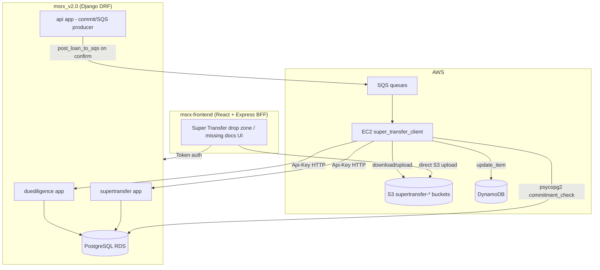
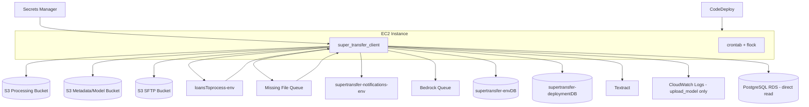
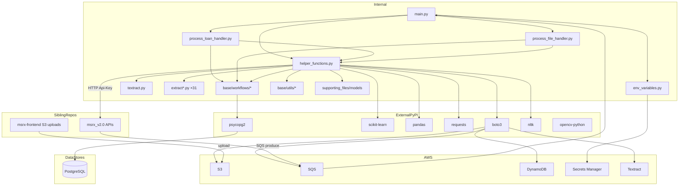

# Super Transfer Client — Complete Developer Onboarding Guide

**Repository:** `super_transfer_client`  
**Evidence rule:** Claims below cite files in this repository unless marked *Cannot be determined from this repository.*  
**Scope:** This guide covers **only** `super_transfer_client`. Integration with sibling repos (`msrx_v2.0`, `msrx-frontend`) is documented where the client code or sibling code explicitly references them.

---

## SECTION 1 — PROJECT OVERVIEW

### What is this project?

`super_transfer_client` is a **long-running Python worker service** deployed on **AWS EC2**. It:

1. Polls **Amazon SQS** queues for loan-processing and missing-file jobs.
2. Downloads mortgage loan document packages from **Amazon S3**.
3. **Classifies** (segregates) multi-page PDF “blob” packages into individual document types using ML + OCR.
4. **Extracts** structured field values from ~30 core document types using AWS Textract, Tesseract, and custom parsers.
5. Writes results back to **MSRX** (the main Django platform) via HTTP APIs authenticated with **API keys**.
6. Persists intermediate state in **DynamoDB**, uploads processed PDFs/metadata to **S3/SFTP**, and enqueues follow-on jobs (notifications, Bedrock validation).

Evidence: `scripts/main.py`, `scripts/process_loan_handler.py`, `README.md`, `context/SUPER_TRANSFER_MAP.md`.

### What business problem does it solve?

After an MSR (Mortgage Servicing Rights) seller **commits** loans on MSRX, buyers need **servicing transfer packages**: classified documents, extracted boarding/QC fields, exception checks, and delivery-ready file sets. Manual document review at scale is not feasible.

This client automates:

- **Document segregation** — splitting seller-uploaded PDF blobs into typed documents (Note, Closing Disclosure, Credit Report, etc.).
- **Field extraction** — populating boarding/QC data used by MSRX Due Diligence and Super Transfer modules.
- **Missing document detection** — identifying which required “core docs” were not found.
- **Artifact production** — renamed PDFs, stacked ZIPs, bookmarked combined PDFs, SFTP delivery copies.

### Why was this repository created?

The README identifies it as **“Super Transfer Client” v0.2** by **Blue Water Financial Technologies**. It exists as a **separate deployable package** because document processing is:

- **CPU/GPU intensive** (OCR, ML classification, parallel extraction threads).
- **Long-running** (visibility timeouts up to 3600s with heartbeats).
- **Poor fit for Django request/response** timeouts.

Evidence: `README.md`; `docs/knowledge/main.md` line 517: *“Super Transfer is out-of-process — separate EC2-style client + SQS.”*

### Which business process does it support?

**Post-commit Super Transfer / boarding / QC** in the MSRX mortgage trading lifecycle:

```
Upload tape → Price → Commit → Confirm → [Super Transfer] → QC exceptions → Boarding file → SFTP delivery
```

The client sits in the **[Super Transfer]** step: after documents land in S3, before/alongside QC clearing and buyer delivery.

Evidence: `msrx_v2.0/api/supporting/services/msr_commit.py` calls `post_loan_to_sqs` on commit confirm; `docs/knowledge/main.md` Journey F.

### Which users interact with it?

| Actor | Interaction |
|-------|-------------|
| **MSRX ops users (sellers/buyers)** | Upload documents via MSRX frontend; never touch this repo directly |
| **Platform engineers / DevOps** | Deploy via CodeDeploy (`appspec.yml`), manage crontab, `process_flag` |
| **Backend developers** | Maintain extraction logic, orchestration, API contracts |
| **Machine callers (MSRX Django)** | Produce SQS messages, receive API callbacks from this client |

No human-facing UI exists in this repository.

### Where does it fit in the MSRX ecosystem?



### Service type

| Classification | Answer |
|----------------|--------|
| Frontend | **No** |
| Backend API server | **No** (it is a consumer, not a server) |
| Worker service | **Yes** — primary role |
| Batch service | **Partial** — processes one loan/file per message, but runs perpetually |
| Shared library | **No** — standalone deployable unit |

### Responsibilities of THIS repository

- SQS polling loop and deployment gating (`scripts/main.py`)
- Document classification (Naive Bayes + TF-IDF models)
- Per-document-type extraction (`scripts/extract*.py`)
- Orchestration, borrower assignment, versioning, output file generation (`scripts/helper_functions.py`)
- AWS client initialization (S3, SQS, DynamoDB, Secrets Manager, Textract)
- Outbound MSRX API integration (missing files, exceptions/boarding staging, DD values/docs)
- CodeDeploy lifecycle hooks and cron management
- ML model artifact upload on deploy (`scripts/upload_model.py`)

### Responsibilities of OTHER repositories

| Responsibility | Repository | Evidence |
|----------------|------------|----------|
| User authentication, UI, document upload UX | `msrx-frontend` | `server/routes/superTransfer.js`, `server/superTransfer/s3Bucket.js` |
| SQS message production on commit | `msrx_v2.0` | `api/supporting/support_committing.py:post_loan_to_sqs` |
| Super Transfer REST APIs (exceptions, missing files, delivery) | `msrx_v2.0/supertransfer` | `supertransfer/urls.py` |
| Due Diligence loan/deal/field APIs | `msrx_v2.0/duediligence` | URLs referenced in `scripts/env_variables.py` |
| Boarding staging persistence (PostgreSQL) | `msrx_v2.0/msrx` | `msrx/models/boarding_staging.py` |
| Bedrock validation consumer | *Cannot be determined from this repository* | Client produces to `sqs_bedrock_queue_url`; consumer not in `super_transfer_client` |
| Initial DynamoDB loan record creation | *Cannot be determined from this repository* | Client reads DynamoDB at start of `processLoan`; no `put_item` in monorepo except commented notebook code |
| Missing-file SQS message production | *Cannot be determined from this repository* | Client consumes missing-file queue; no producer found in `BLUE-WATER` monorepo |

---

## SECTION 2 — ARCHITECTURE

### Full system architecture

```
┌─────────────────────────────────────────────────────────────────────────────┐
│                              BROWSER / USER                                  │
│  MSRX React SPA — Super Transfer screens (drop zone, missing documents)      │
└───────────────────────────────┬─────────────────────────────────────────────┘
                                │ HTTPS (Token cookie via Express BFF)
┌───────────────────────────────▼─────────────────────────────────────────────┐
│                         msrx-frontend (Express BFF)                          │
│  • uploadLoanDocs / uploadMissingDocuments → S3                              │
│  • Proxy Super Transfer management APIs to Django                            │
│  Path convention: SuperTransfer/{seller}/{buyer}/{loan_num}/                  │
└───────────────┬───────────────────────────────┬─────────────────────────────┘
                │                               │ S3 PUT
┌───────────────▼───────────────┐   ┌───────────▼─────────────────────────────┐
│      msrx_v2.0 (Django API)     │   │         AWS S3                           │
│  • Commit → post_loan_to_sqs    │   │  supertransfer-{dev|uat|demo|live}     │
│  • supertransfer/* endpoints    │   │  sftp.bluewater.com (Live/Demo output)   │
│  • duediligence/st* endpoints   │   │  metadata/model buckets (secrets)        │
│  • PostgreSQL RDS               │   └───────────┬─────────────────────────────┘
└───────────────┬─────────────────┘               │
                │ SQS send_message                │ download/upload
┌───────────────▼─────────────────┐   ┌───────────▼─────────────────────────────┐
│         AWS SQS                  │   │    super_transfer_client (EC2)          │
│  • loansToprocess-{env}        │──►│  scripts/main.py → processLoan/File     │
│  • missing-file queue (secret) │   │  • Textract / Tesseract / sklearn ML      │
│  • bedrock queue (produce only)│◄──│  • helper_functions.py orchestration    │
│  • supertransfer-notifications │   └───────┬───────────────┬───────────────────┘
└────────────────────────────────┘           │               │
                ┌────────────────────────────┘               │
┌───────────────▼──────────────┐   ┌─────────────────────────▼───────────────────┐
│      AWS DynamoDB             │   │  Outbound HTTP (Api-Key Authorization)      │
│  supertransfer-{env}DB        │   │  → /msrx/supertransfer/missing_loans/         │
│  supertransfer-deploymentDB   │   │  → /msrx/supertransfer/ec_exceptions/       │
│  (process_flag per env)       │   │  → /duediligence/stloans, stloanvalues, ... │
└──────────────────────────────┘   │  → /supertransfer/boarding_staging/           │
                                   └─────────────────────────────────────────────┘
┌─────────────────────────────────────────────────────────────────────────────┐
│  Background (Django side, NOT in this repo)                                  │
│  • APScheduler: document SFTP delivery, boarding file generation             │
│  • Bedrock SQS consumer (duediligence)                                       │
└─────────────────────────────────────────────────────────────────────────────┘
```

### Request/message travel (loan processing)

```
1. Seller confirms commit on MSRX
      ↓
2. msr_commit.py → post_loan_to_sqs(seller_id, buyer_id, loan_number)
      ↓  (only if S3 folder SuperTransfer/{seller}/{buyer}/{loan}/ is non-empty)
3. SQS message: {"seller-loan_id": "{seller}-{buyer}_{loan_number}"}
      ↓
4. super_transfer_client/scripts/main.py polls queue
      ↓
5. commitment_check() — direct PostgreSQL query (optional seller gate)
      ↓
6. processLoan() in process_loan_handler.py
      ↓
7. Download S3 → segregate → extract → post DD values → patch boarding staging
      ↓
8. send_missing_files + send_extracted_fields → Django APIs
      ↓
9. update_table → DynamoDB; upload PDFs → S3/SFTP
      ↓
10. Optional: SQS → notifications queue, bedrock queue
```

### Dependencies and why each exists

| Dependency | Type | Why |
|------------|------|-----|
| **boto3** | PyPI | AWS S3, SQS, DynamoDB, Secrets Manager, Textract |
| **psycopg2-binary** | PyPI | Direct PostgreSQL `commitment_check` without HTTP round-trip |
| **scikit-learn** | PyPI | Naive Bayes document page classifier |
| **pandas / numpy** | PyPI | Page-level text DataFrames for classification |
| **pypdf** | PyPI | PDF merge, split, page extraction |
| **pdf2image + poppler** | System/PyPI | PDF → image for OCR |
| **pytesseract** | PyPI | Local OCR fallback (cost reduction) |
| **amazon-textract-*** | PyPI | Parse Textract API responses |
| **opencv-python** | PyPI | Signature detection image processing |
| **nltk** | PyPI | Text tokenization for TF-IDF features |
| **requests** | PyPI | MSRX HTTP API calls |
| **GitPython** | PyPI | Detect active git branch → environment mapping |
| **nameparser** | PyPI | Borrower name normalization |
| **thefuzz / RapidFuzz** | PyPI | Fuzzy string matching in extraction |
| **Pillow** | PyPI | Image normalization for Textract byte limits |
| **config.py** (gitignored) | Local module | `account_id`, `region_name` — not in repo |
| **AWS Secrets Manager** | AWS | API keys, URLs, queue names, DB credentials |
| **msrx_v2.0** | Sibling repo | API contracts, SQS producer, PostgreSQL schema |
| **msrx-frontend** | Sibling repo | S3 upload path conventions |

---

## SECTION 3 — STARTUP FLOW

### Entry point

**File:** `scripts/main.py`  
**Invocation:** `python3.12 scripts/main.py` (via cron every minute with `flock`)  
**Last line:** `main()` called at module import time (line 140).

### Complete startup timeline

```
T+0ms   Python interpreter starts scripts/main.py
        │
T+1ms   Import helper_functions
        │   └─► ensure_model_context() runs at module level (helper_functions.py:182)
        │         ├─ ensure_nltk_data() — downloads NLTK corpora if missing
        │         ├─ initialize_msrx_variables() — loads Api-Key from Secrets Manager (lazy via env_variables)
        │         ├─ initialize_aws_variables() — S3, DynamoDB table, SQS clients
        │         └─ Loads ML pickles: naive_bayes_classifier.pkl, tf_idf.pkl,
        │            label_tokenizer.json, page_number_mappings.json, CSV fault tables
        │
T+2ms   Import process_file_handler, process_loan_handler
        Import env_variables (triggers lazy secret loading on first getter call)
        Import query_msrx, process_flag
        │
T+3ms   main() begins
        ├─ Lock() for thread-safe field dict updates during parallel extraction
        ├─ print API_key loaded status
        ├─ regenerate_local_loan_directory(local_download_dir) — wipes/recreates local_loan_files/
        │
T+4ms   while process_flag():   ← reads DynamoDB supertransfer-deploymentDB
        │                         process_flag=false → send_deployment_ready_email + exit
        │
        └─► INFINITE LOOP:
              1. sqs.receive_message(missing_file_queue) — WaitTimeSeconds=20, VisibilityTimeout=1200
              2a. IF missing file message:
                    processFile(res, lock) → delete message
              2b. ELSE sqs.receive_message(loan_queue)
                    commitment_check(res) → if committed:
                      start heartbeat Thread (extend visibility 3600s every 600s)
                      processLoan(res, lock)
                    delete message (even if commit check failed!)
              3. IF no messages: sleep 5s, regenerate local directory
              4. ON EXCEPTION: print, sleep 120s, continue
```

### Environment loading

| Step | File | Mechanism |
|------|------|-----------|
| Git branch → environment | `base/utils/git.py:get_active_git_branch()` | `Dev`, `UAT`, `Demo`, `Live`; unknown branches default to `Dev` |
| Secrets fetch | `scripts/env_variables.py:_ensure_env_loaded()` | AWS Secrets Manager: `API_KEYS`, `msrx-urls`, `SUPER_TRANSFER_AWS_VARIABLES`, `NotificationEmail` |
| Config module | `config.py` (gitignored) | `account_id`, `region_name` imported by `env_variables.py` and `textract.py` |
| Local path | `env_variables.LOCAL_DIRECTORY` | Parent of `scripts/` |

### Authentication initialization

No user login. Authentication is **machine-to-machine**:

```python
msrx_api_key = "Api-Key " + api_keys_secret.get(f"MSRX_API_KEY_{git_branch.upper()}")
```

Evidence: `base/workflows/runtime.py:43`.

### AWS initialization

`base/workflows/runtime.py:initialize_aws_variables()`:

- `boto3.resource("s3")` + `client("s3")` → processing bucket from secret
- `boto3.resource("dynamodb")` → processing table from secret
- `boto3.client("sqs")` → loan, missing-file, bedrock queue URLs from secret
- `textract.py` creates module-level `boto3.client("textract")`

### Database initialization

**No ORM, no connection pool.** PostgreSQL is opened per-call in `base/workflows/query_msrx.py:commitment_check()` via `psycopg2.connect()` and closed in `finally`.

### API registration / middleware / routing

**Not applicable** — this is not an HTTP server.

### Error handling

| Layer | Behavior |
|-------|----------|
| `main.py` outer loop | Broad `except`: print, sleep 120s |
| `process_loan_handler.py` | On failure: `update_loan_status(..., "Failed")`, `emit_loan_processing_status(..., "failed")` |
| HTTP calls | Mix of `request_with_retry` (3 retries, exponential backoff) and manual 5-attempt loops |
| DynamoDB `update_table` | Two-attempt update with fallback path |

### Scheduler / cron / worker startup

| Mechanism | File | Schedule |
|-----------|------|----------|
| **Cron** | `scripts/start_cron.sh` | `* * * * *` — every minute, `flock` prevents duplicate processes |
| **CodeDeploy BeforeInstall** | `appspec.yml` → `stop_cron.sh` | Kills python3, comments out cron |
| **CodeDeploy AfterInstall** | `start_cron.sh` | Re-enables cron |
| **CodeDeploy ApplicationStart** | `upload_model.py` | Uploads ML artifacts to S3 metadata bucket |

---

## SECTION 4 — FOLDER STRUCTURE

```
super_transfer_client/
├── scripts/                    # Runtime code, extractors, deployment shell scripts
├── base/                       # Shared workflows, utils, types, constants
├── supporting_files/           # ML model artifacts (pickles, JSON, CSV)
├── context/                    # Internal architecture docs (discovery baseline)
├── local_loan_files/           # Runtime workspace (gitignored, recreated on start)
├── appspec.yml                 # AWS CodeDeploy specification
├── README.md                   # Setup and cron instructions
└── config.py                   # GITIGNORED — required at runtime
```

### `scripts/` — Primary runtime

| Aspect | Detail |
|--------|--------|
| **Purpose** | Entry point, orchestration, document extractors, deployment hooks |
| **Contains** | `main.py`, `helper_functions.py` (~6900 lines), `process_*_handler.py`, `extract*.py`, `textract.py`, shell scripts |
| **Used by** | Cron, CodeDeploy, manual `python3 scripts/main.py` |
| **Called by** | OS scheduler only |
| **Start here?** | **Yes** — `main.py` → `process_loan_handler.py` → `helper_functions.py` |
| **Key files** | See table below |

| File | Role |
|------|------|
| `main.py` | SQS poll loop |
| `helper_functions.py` | God-module: AWS init, segregation, API calls, DynamoDB, filenames |
| `process_loan_handler.py` | Full loan pipeline orchestration |
| `process_file_handler.py` | Single missing-file reprocessing |
| `env_variables.py` | Secret resolution, URL builders |
| `textract.py` | Textract client + metadata JSON cache |
| `extract*.py` | One module per document type (Note, CD, W2, etc.) |
| `start_cron.sh` / `stop_cron.sh` | Deployment lifecycle |
| `upload_model.py` | Post-deploy model promotion to S3 |
| `clean_workspace.sh` | CodeDeploy git reset + cache cleanup |

### `base/workflows/` — Pipeline stages

| File | Purpose |
|------|---------|
| `runtime.py` | AWS + MSRX variable initialization |
| `query_msrx.py` | PostgreSQL commitment + boarding staging queries |
| `process_flag.py` | Deployment gate via DynamoDB + deployment email |
| `doc_seg.py` | Pre-segregated JSON zip handling (Closing Disclosure JSON paths) |
| `file_separator.py` | Intent/acknowledgement page renaming |
| `combine_output.py` | Consolidated field dict assembly, DD post helpers |
| `signatures.py` | Signature detection on extracted fields |

### `base/utils/` — Shared utilities

| File | Purpose |
|------|---------|
| `http_client.py` | `request_with_retry`, JSON validation |
| `extraction_common.py` | Shared Textract query-answer parsing (high-impact shared helper) |
| `aws.py` | Secrets Manager client, EC2 instance ID |
| `pdf_images.py` | PDF → image conversion |
| `doc_utils.py` | PDF stacking, bookmarked combine |
| `convert_to_bwft.py` | Field key normalization to BWFT schema |
| `git.py` | Active branch detection |
| `runtime_deps.py` | Import `config` / `env_variables` with path fallback |

### `base/types/` — Message contracts

`LoanResponseBody`, `MissingFileResponseBody`, `SQSMessage` TypedDicts in `base/types/misc.py`.

### `base/constants/` — Document taxonomy

`misc.py` defines `CORE_DOCS`, `MULTI_PAGE_DOC_LIST`, `COMBINE_DOC_LIST`, `PAGE_NO_STRIP_DOCS`, `OTHER_DOC_TYPE_STRIP_DOCS`, `ZIP_PREFIX_RANGES`.

### `supporting_files/document_recognition_model/main/`

| File | Purpose |
|------|---------|
| `naive_bayes_classifier.pkl` | Page-level document classifier |
| `tf_idf.pkl` | Feature vectorizer |
| `label_tokenizer.json` | Label ↔ token mapping |
| `page_number_mappings.json` | Page number OCR hints |
| `extracted_fields.json` | Baseline empty field template |
| `fields_to_doc_priority.json` | Field-to-document priority for output |
| `Fault_check_df.csv`, `last_page_df.csv` | Strip/sanity check reference data |

### `context/` — Internal documentation

Discovery baseline docs: `SUPER_TRANSFER_MAP.md`, `WORKFLOWS.md`, `DEPENDENCY_MAP.md`, `HOTSPOTS.md`.

### Dependency tree (internal)

```
main.py
├── helper_functions.py
│   ├── extract*.py (31 modules)
│   ├── textract.py
│   ├── base/workflows/combine_output.py
│   ├── base/workflows/query_msrx.py
│   ├── base/workflows/file_separator.py
│   ├── base/utils/* (extraction_common, pdf_images, http_client, ...)
│   └── env_variables.py → config.py (external)
├── process_loan_handler.py
│   ├── base/workflows/doc_seg.py
│   ├── base/workflows/signatures.py
│   └── transcript.py (stdout logging capture)
├── process_file_handler.py
└── base/workflows/process_flag.py
    └── base/workflows/query_msrx.py
```

---

## SECTION 5 — FEATURE MODULES

### Feature 1: Loan Queue Processing (primary)

| Dimension | Detail |
|-----------|--------|
| **Business purpose** | Process a full loan document package after commit/upload |
| **Frontend screens** | Super Transfer drop zone, bulk package upload (`msrx-frontend` — outside this repo) |
| **Backend APIs consumed** | `ec_exceptions` PATCH/POST, `missing_loans` POST, DD `stloans`, `stloanvalues`, `stdocuments`, `st_fields`, `stcompanies`, `api_loan_tracking` |
| **Database tables** | DynamoDB processing table; PostgreSQL `msrx_msrx_user`, `msrx_client_coissue_tape`, `msrx_client_coissue_seller` (commitment check only) |
| **AWS** | S3 download/upload, SQS consume, DynamoDB read/write, Textract, optional SFTP bucket |
| **Files** | `main.py`, `process_loan_handler.py`, `helper_functions.py` |
| **Key functions** | `processLoan`, `segregate_documents`, `return_ExtractFunctions`, `prepare_outputdict_and_values`, `send_extracted_fields`, `update_table` |
| **Output** | Segregated PDFs, `Extracted_Fields.json`, `super_transfer_filename_mapping.json`, DD values, boarding staging updates, missing file report |
| **Related repos** | `msrx_v2.0`, `msrx-frontend` |

### Feature 2: Missing File Reprocessing

| Dimension | Detail |
|-----------|--------|
| **Business purpose** | When seller uploads a previously missing document, re-extract and merge into existing loan state |
| **Trigger** | SQS missing-file queue (priority over loan queue in `main.py`) |
| **Files** | `process_file_handler.py`, `helper_functions.py:update_file_status` |
| **Output** | Updated DynamoDB state, patched DD values, updated missing files list |

### Feature 3: Document Segregation (Classification)

| Dimension | Detail |
|-----------|--------|
| **Business purpose** | Split blob PDF into typed documents |
| **Algorithm** | PDF → images → page text (Textract detect) → TF-IDF + Naive Bayes → page grouping → `first_pass` versioning |
| **Files** | `helper_functions.py:segregate_documents`, `strip_docs`, `check_docs_sanity_blob` |
| **Buyer customization** | Optional per-buyer model from S3 `customized_model/{branch}/{buyer_name}/` |
| **Output** | `docToLabel`, `docToPages`, `{blob}.csv` page predictions |

### Feature 4: Field Extraction (per document type)

31 mapped extractors in `return_ExtractFunctions()`:

| Label | Module | Function |
|-------|--------|----------|
| Note | `extractNote.py` | `note` |
| Closing_Disclosure | `extractCD.py` | `extractCD` |
| Loan_Application-New_Format | `extractNewLoanApplication.py` | `loanAppNew` |
| Credit_Report | `extractCreditReport.py` | `CreditReport` |
| Security_Instrument | `extractSecurityInstrument.py` | `extractDot` |
| Underwriting_Transmittal | `extractUnderwritings.py` | `underwriting` |
| DU_Findings | `extractDuFindings.py` | `dufindings` |
| LPA_Findings | `extractLpaFindings.py` | `lpafindings` |
| W2 | `extractW2.py` | `extractW2Data` |
| Paystub | `extractPayroll.py` | `extractPaystub` |
| ... | (22 more) | See `helper_functions.py:2471-2507` |

Extraction runs in **parallel threads** (one per recognized document).

### Feature 5: Borrower Assignment & Versioning

| Dimension | Detail |
|-----------|--------|
| **Business purpose** | Map multi-borrower W2s/paystubs/credit reports to correct borrower slots; pick latest doc versions |
| **Functions** | `reconcile_borrower_assignments`, `loan_versioning`, `doc_versioning`, `assign_borrowers_to_w2`, `merge_credit_reports` |
| **Company flags** | `use_borrower_note_order` from DD company API |

### Feature 6: Output File Generation & Renaming

| Dimension | Detail |
|-----------|--------|
| **Business purpose** | Produce buyer-ready filenames like `{loan_num}_Note.pdf` |
| **Functions** | `create_filenames`, `makeOutputFile`, `prepare_filename_mapping_context` |
| **S3 artifact** | `super_transfer_filename_mapping.json` |

### Feature 7: Stacked ZIP / Bookmarked PDF

| Dimension | Detail |
|-----------|--------|
| **Business purpose** | Buyer-configured delivery formats |
| **Flags** | `enable_stacked_zips`, `enable_stacked_bookmarks` from DD company |
| **Functions** | `stack_pdf`, `combine_stacked_pdfs` in `base/utils/doc_utils.py` |
| **Upload paths** | `{s3_folder}/stacked_zip/`, `{s3_folder}/stacked_bookmarked_pdf/` |

### Feature 8: MSRX API Integration (Outbound)

| API | Method | Purpose |
|-----|--------|---------|
| `/msrx/supertransfer/missing_loans/` | POST | Report missing core documents |
| `/msrx/supertransfer/ec_exceptions/` | PATCH | Push extracted boarding fields + trigger QC |
| `/msrx/supertransfer/ec_exceptions/` | POST | Create boarding staging record (status) |
| `/supertransfer/boarding_staging/{loan}/` | GET | Fetch existing boarding record |
| `/msrx/duediligence/stloans/` | PATCH | Update DD loan status (Processed/Failed) |
| `/msrx/duediligence/stloanvalues/` | POST/PATCH | Post/patch extracted field values |
| `/msrx/duediligence/stdocuments/` | POST | Register documents in DD |
| `/msrx/duediligence/st_fields/` | GET | Field ID mappings |
| `/msrx/duediligence/stcompanies/{id}/` | GET | Company feature flags |
| `/msrx/duediligence/api_loan_tracking/` | POST | Processing lifecycle telemetry |
| `/msrx/supertransfer/logs/` | POST | Extraction debug logs (used by individual extractors) |

### Feature 9: Deployment Gate (`process_flag`)

| Dimension | Detail |
|-----------|--------|
| **Business purpose** | Safely pause worker during CodeDeploy |
| **Mechanism** | DynamoDB `supertransfer-deploymentDB`, partition key `env` = git branch, attribute `process_flag` |
| **On false** | `send_deployment_ready_email()` → Outlook SMTP → sleep 600s |

### Feature 10: Model Artifact Promotion

`scripts/upload_model.py` runs on CodeDeploy ApplicationStart — uploads classifier artifacts to S3 metadata paths, logs to CloudWatch `/aws/s3/supertranfer/upload_model`.

### Feature 11: Commitment Gating

Before processing a loan message, `commitment_check()` queries PostgreSQL:

- Reads `msrx_msrx_user.user_details->transfer_settings->super_transfer_commit_check`
- If `"true"`: requires `msrx_client_coissue_tape` joined to `msrx_client_coissue_seller` with `status='confirmed'`
- If check fails: message is **still deleted** from queue (see Section 21 — non-obvious behavior)

---

## SECTION 6 — REQUEST FLOW (Complete Loan Processing Trace)

### Trigger: Seller confirms commit on MSRX

```
User clicks Confirm Commit (msrx-frontend)
  ↓
Express BFF → Django POST confirm commit
  ↓
msrx_v2.0/api/supporting/services/msr_commit.py
  post_loan_to_sqs(seller_id, buyer_id, loan_number)
  ↓
SQS loansToprocess-{env}
  MessageBody: {"seller-loan_id": "117-120_123456789"}
```

### Worker execution chain

```
main()                                                          [scripts/main.py:35]
  sqs.receive_message(loan_queue)                               [main.py:79]
  json.loads(message['Body']) → res                             [main.py:91]
  commitment_check(res)                                         [base/workflows/query_msrx.py:10]
    psycopg2.connect → query msrx_msrx_user                       [query_msrx.py:25-30]
    optional query msrx_client_coissue_tape                       [query_msrx.py:39-47]
  Thread(heartbeat, ...)                                        [main.py:104-108]
  processLoan(res, lock)                                        [process_loan_handler.py:79]
    table.query(seller-loan_id) → DynamoDB record               [process_loan_handler.py:84]
    create_loan_folder(docpath)                                 [helper_functions.py:3055]
    update_loan_status_boarding_staging(..., "In Process")      [helper_functions.py:653]
    emit_loan_processing_status(..., "started")                 [helper_functions.py:697]
    build_processing_context()                                  [helper_functions.py:271]
      get_company_id, get_docs_and_fields, get_stacked_version_flags
    list_of_uploaded_files + download_object_files              [S3 → local]
    merge_pdf (if multiple PDFs)                                [helper_functions.py:5015]
    segregate_documents()                                       [helper_functions.py:6493]
      create_df → predict_label (ML per page)
      first_pass → doc_versioning
    strip_docs, recheck_closing_disclosure, check_docs_sanity_blob
    Parallel: Thread per doc → ExtractFunctions[label](...)    [process_loan_handler.py:277-298]
    detect_signature()                                          [base/workflows/signatures.py]
    makeOutputFile(fields) → consolidated_dicts                 [helper_functions.py:2279]
    prepare_filename_mapping_context → rename PDFs
    dd_docs_intialization → post_docs_to_dd
    reconcile_borrower_assignments
    prepare_outputdict_and_values → send_values_to_DD
    update_loan_status(loan_id, "Processed")
    emit_loan_processing_status(..., "completed")
    send_missing_files() → POST missing_loans
    send_extracted_fields() → PATCH ec_exceptions
    update_table() → DynamoDB
    upload PDFs/metadata to S3/SFTP
    optional stack_pdf + upload stacked artifacts
    sqs.send_message(notifications_queue)
    optional sqs.send_message(bedrock_queue) per document
  delete_queue_message()                                        [helper_functions.py:2591]
```

---

## SECTION 7 — BUSINESS WORKFLOWS

### Workflow A: End-to-End Loan Processing

| Field | Value |
|-------|-------|
| **Purpose** | Transform uploaded blob → classified docs + extracted boarding data |
| **Start** | SQS loan message received |
| **End** | DynamoDB updated, S3 artifacts uploaded, MSRX APIs called, SQS message deleted |
| **Input** | SQS `LoanResponseBody`, S3 PDFs, DynamoDB loan metadata |
| **Output** | Segregated PDFs, extracted fields, boarding staging patch, missing file list |
| **Database** | DynamoDB update; PostgreSQL read-only for commit gate; Django DB updated via HTTP |
| **AWS** | S3, SQS, DynamoDB, Textract, Secrets Manager |
| **Automatic steps** | All steps in Section 6 |
| **Manual steps** | Seller document upload via MSRX UI (outside this repo) |
| **Business rules** | `CORE_DOCS` must be recognized or reported missing; company flags control stacking/validation |

### Workflow B: Missing File Reprocessing

| Field | Value |
|-------|-------|
| **Start** | SQS missing-file message: `{seller-loan_id, File, id, name}` |
| **End** | DynamoDB updated, DD values patched, missing files list updated |
| **Input** | Single PDF from S3 + existing DynamoDB state |
| **Priority** | Missing-file queue checked **before** loan queue every iteration |

### Workflow C: Deployment Pause/Resume

| Step | Action |
|------|--------|
| 1 | Operator sets `process_flag=false` in DynamoDB (manual — *mechanism not in repo*) |
| 2 | `stop_cron.sh` on CodeDeploy BeforeInstall — kills python3, removes flock |
| 3 | `git pull` / CodeDeploy file sync |
| 4 | `upload_model.py` on ApplicationStart |
| 5 | `start_cron.sh` re-enables cron |
| 6 | Worker reads `process_flag=true`, resumes polling |

### Workflow D: MSR Commit → Queue

| Field | Value |
|-------|-------|
| **Producer** | `msrx_v2.0/api/supporting/support_committing.py:post_loan_to_sqs` |
| **Gate** | S3 folder `SuperTransfer/{seller}/{buyer}/{loan}/` must exist and be non-empty |
| **Queue name** | `loansToprocess-{MSRX_ENV.lower()}` |
| **Account** | `AWS_ACCOUNT_ID` from Django env |

### Workflow E: Bedrock Validation Handoff

| Field | Value |
|-------|-------|
| **Trigger** | `validation_flag=true` from DD company settings |
| **Producer** | `process_loan_handler.py:816-833` |
| **Consumer** | *Cannot be determined from this repository* (`msrx_v2.0/duediligence/utils/support_bedrock_process_helpers.py` sends messages but is not the consumer) |

### Workflow F: Notification on Loan Processed

SQS message to `supertransfer-notifications-{branch}` with `{seller_id, buyer_id, loan_id, event_type: "loan_processed"}`.

*Consumer cannot be determined from this repository.*

---

## SECTION 8 — DATABASE

### DynamoDB — Processing Table

**Table names** (from `msrx_v2.0/duediligence/utils/reprocess_loan_helpers.py`):

| Environment | Table |
|-------------|-------|
| dev | `supertransfer-devDB` |
| uat | `supertransfer-uatDB` |
| demo | `supertransfer-demoDB` |
| live | `supertransfer-liveDB` |

**Primary key:** `seller-loan_id` (format: `{seller_id}-{buyer_id}_{loan_number}`)

**Attributes written by `update_table()`** (evidence: `helper_functions.py:2825-2858`):

| Attribute | Purpose |
|-----------|---------|
| `Reupload` | List of re-uploaded file names |
| `DocsUsedforOutputFile` | Which source doc fed each output dict |
| `OutputDict` | Consolidated boarding output sent to MSRX |
| `Files` | List of processed PDF filenames |
| `Missing_Files` | Core docs not found |
| `Extracted_Fields` | Full per-doc-type field dictionary |
| `Recognized_Files` | Core docs successfully identified |
| `loan_Status` | e.g. `"Loan Processed"` |
| `logs` | Processing log reference from initial record |
| `Operation` | `"UPDATE"` |
| `missing_files_request_sent` | bool |
| `extracted_fields_request_sent` | bool |
| `filename_mapping_json_uploaded` | bool |
| `origination_loan_number` | From output dict |
| `documents_in_label` | docToLabel map |
| `update_is_missing_file_upload` | bool flag |
| `porfolio_id`, `deal_id`, `loan_id` | DD identifiers |
| `docs_to_id`, `docs_id_used_for_output_file` | DD document ID maps |
| `extracted_fields_to_DD_sent` | Tracking which values posted |
| `docToPages` | Page range per document |
| `missing_files_processed` | Per-file processing tracker |

**Attributes read at start of `processLoan`** (from DynamoDB query result):

`LoanNum`, `sellerID`, `Buyer`, `Files`, `Recognized_Files`, `Missing_Files`, `documents_in_label`, `docs_id_used_for_output_file`, `Extracted_Fields`, `docToPages`, `Reupload`, `missing_files_processed`, `porfolio_id`, `deal_id`, `loan_id`, `logs`

**Initial record creation:** *Cannot be determined from this repository.*

### DynamoDB — Deployment Table

**Table:** `supertransfer-deploymentDB` (fixed name)  
**Key:** `env` = git branch (`Dev`, `UAT`, `Demo`, `Live`)  
**Attribute:** `process_flag` (boolean)

### PostgreSQL — Tables Queried Directly

| Table | Query | Purpose |
|-------|-------|---------|
| `msrx_msrx_user` | `user_details->transfer_settings->super_transfer_commit_check` | Per-seller commit gate flag |
| `msrx_client_coissue_tape` | Join with seller, filter `tape_loan_id`, `status='confirmed'` | Verify loan committed |
| `msrx_client_coissue_seller` | Join target for tape status | Commit confirmation |
| `msrx_boarding_staging` | Latest record by seller_loan_number/seller_id/buyer_id | `check_loan_record_boarding_staging` (used in output prep) |

**DB names by branch** (`env_variables.py:61-66`):

| Branch | Database |
|--------|----------|
| Dev | `msrx_internal_dev` |
| UAT | `msrx_uat_new` |
| Demo | `msrx_demo_new` |
| Live | `msrx_live_new` |

### PostgreSQL — Tables Updated Indirectly (via HTTP to Django)

This client does **not** write to PostgreSQL directly except the read-only commitment check. All writes go through Django APIs to tables including:

- `msrx_boarding_staging` (hundreds of boarding columns — `msrx/models/boarding_staging.py`)
- `supertransfer_loan`, `supertransfer_missingfile` (via `missing_loans` API)
- `duediligence_loan`, `duediligence_value`, `duediligence_document`, `duediligence_file`
- `supertransfer_qualitycontrol`

### ER-style relationship (logical)

```
MSRX_User (seller) ──┐
                     ├──► S3: SuperTransfer/{seller}/{buyer}/{loan}/
MSRX_User (buyer)  ──┘         │
                               ▼
                    DynamoDB[seller-loan_id] ◄──► processLoan state machine
                               │
              ┌────────────────┼────────────────┐
              ▼                ▼                ▼
    duediligence_loan   boarding_staging   supertransfer_missingfile
    (via stloans API)   (via ec_exceptions)  (via missing_loans)
```

---

## SECTION 9 — API DOCUMENTATION

This repository is an **API client**, not a server. Below are **every outbound API** it calls.

### Super Transfer APIs

#### POST `/msrx/supertransfer/missing_loans/`

| Field | Value |
|-------|-------|
| **Purpose** | Report list of missing core documents after processing |
| **Auth** | `Authorization: Api-Key {key}` |
| **Caller** | `send_missing_files()` |
| **Request body** | `seller-loan_id`, `sellerID`, `Missing_Files` (stringified set), `buyerID`, `logs` |
| **Django handler** | `ReceiveMissingLoans.post` — `supertransfer/views/views.py:65` |
| **Permission** | `HasAPIKey` |

#### PATCH `/msrx/supertransfer/ec_exceptions/`

| Field | Value |
|-------|-------|
| **Purpose** | Push extracted boarding fields; triggers QC exception evaluation |
| **Auth** | Api-Key |
| **Caller** | `send_extracted_fields()`, `update_loan_status_boarding_staging()` |
| **Request body** | `seller_id`, `buyer_id`, `super_transfer_loan_number`, `updates` (JSON string) |
| **Django handler** | `ECExceptions.patch` — `supertransfer/views/exceptions.py:95` |

#### POST `/msrx/supertransfer/ec_exceptions/`

| Field | Value |
|-------|-------|
| **Purpose** | Create new boarding staging loan with status (e.g. "In Process") |
| **Caller** | `update_loan_status_boarding_staging()` when no existing record |
| **Django handler** | `ECExceptions.post` — `exceptions.py:37` |

#### GET `/supertransfer/boarding_staging/{loan_number}/`

| Field | Value |
|-------|-------|
| **Purpose** | Fetch existing boarding staging record |
| **Caller** | `get_loan_from_boarding_staging()` |
| **Note** | URL built without `/msrx/` prefix — depends on `msrx_base_url` secret format |

#### POST `/msrx/supertransfer/logs/`

| Field | Value |
|-------|-------|
| **Purpose** | Send extraction debug logs from individual extractors |
| **Used by** | `extractNote.py`, `extractTitle.py`, `extractUnderwritings.py`, etc. |

### Due Diligence APIs (all Api-Key, `HasAPIKey` on Django views)

| Method | URL suffix | Purpose | Caller function |
|--------|-----------|---------|-----------------|
| GET | `/msrx/duediligence/stdeals/{deal_id}` | Deal metadata, SFTP path | `get_sftp_path_from_deal` |
| GET | `/msrx/duediligence/stcompanies/{company_id}/` | Feature flags | `get_stacked_version_flags` |
| GET | `/msrx/duediligence/st_fields/` | Field ID mappings | `get_field_id`, `get_field_mapping` |
| GET | `/msrx/duediligence/stdocuments/{company_id}/` | Document type IDs | `get_document_id` |
| POST | `/msrx/duediligence/stdocuments/` | Register documents | `post_docs_to_dd` |
| GET | `/msrx/duediligence/stloanvalues/?id={loan_id}` | Fetch posted values | `get_posted_values` |
| POST/PATCH | `/msrx/duediligence/stloanvalues/` | Post/patch extracted values | `post_values`, `send_batch_values` |
| PATCH | `/msrx/duediligence/stloans/?id={loan_id}` | Update loan status | `update_loan_status` |
| POST | `/msrx/duediligence/stfiles/` | Update file status | `update_file_status` |
| POST | `/msrx/duediligence/api_loan_tracking/` | Processing telemetry | `emit_loan_processing_status` |
| GET | `/msrx/supertransfer/seller_info/` | Buyer display name | `get_user_name` |

### Inbound APIs

**None.** This repository exposes no HTTP endpoints.

---

## SECTION 10 — AWS

### Services used



### S3 Buckets

| Bucket | Source | Purpose |
|--------|--------|---------|
| `supertransfer-dev` | Django `ebdjango/settings/dev.py` | Dev document storage |
| `supertransfer-uat` | `uat.py` | UAT |
| `supertransfer-demo` | `demo.py` | Demo |
| `supertransfer-live` | `live.py` | Production |
| `sftp.bluewater.com` | `env_variables.get_sftp_bucket()` Live/Demo | SFTP delivery staging |
| `super-transfer-testbucket` | `env_variables.get_sftp_bucket()` Dev/UAT | Test SFTP |
| Metadata bucket | `SUPER_TRANSFER_AWS_VARIABLES` secret | Textract cache JSONs, ML models |
| `supertransfer-reprocess-staging` | Django `reprocess_loan_helpers.py` | Reprocess backups (not used by client directly) |

**Object path convention:** `SuperTransfer/{sellerID}/{buyerID}/{loan_number}/`

### SQS Queues

| Queue | Direction | Evidence |
|-------|-----------|----------|
| `loansToprocess-{env}` | Inbound (consumed) | Django producer: `support_committing.py:180` |
| Missing file queue | Inbound (consumed) | URL from secret `missing_file_sqs_queue_url_{env}` |
| Bedrock queue | Outbound (produced) | `process_loan_handler.py:831` |
| `supertransfer-notifications-{env}` | Outbound (produced) | `env_variables.get_notifications_queue_url()` |

### Secrets Manager

| Secret ARN pattern | Contents |
|--------------------|----------|
| `API_KEYS` | `MSRX_API_KEY_{ENV}` per environment |
| `msrx-urls` | `msrx_{env}_base_url`, `db_host`, `db_user`, `db_password_{env}` |
| `SUPER_TRANSFER_AWS_VARIABLES` | `s3_bucket_{env}`, `dynamodb_table_{env}`, SQS URLs |
| `NotificationEmail` | SMTP credentials for deployment emails |

### DynamoDB

| Table | Purpose |
|-------|---------|
| `supertransfer-{env}DB` | Per-loan processing state |
| `supertransfer-deploymentDB` | `process_flag` per environment |

### Textract

- `detect_document_text` — page text for classification
- `analyze_document` — forms/tables/queries for extraction
- `analyze_id` — borrower ID documents
- Metadata JSON cache avoids duplicate calls (`textract.py:read_json` / `save_response_to_json`)

### CloudWatch

Only `upload_model.py` writes to log group `/aws/s3/supertranfer/upload_model`.

### IAM

*Cannot be determined from this repository.* EC2 instance role permissions are implied (S3, SQS, DynamoDB, Secrets Manager, Textract) but no IAM policy files exist in repo.

### EC2

- Deployed to `/home/ec2-user/super_transfer_client/`
- Cron uses `flock` on `cron.lock`
- `get_current_instance_id()` reads EC2 metadata for loan tracking
- README references GPU (`nvidia-smi`) for deployment kills — GPU usage in classification *cannot be confirmed from Python code* (sklearn CPU-based)

### Lambda

*Not used by this repository.*

---

## SECTION 11 — AUTHENTICATION

### This client's authentication model

| Aspect | Detail |
|--------|--------|
| **Login** | None — worker service |
| **Session/JWT/Cookies** | None |
| **Auth mechanism** | `Authorization: Api-Key {MSRX_API_KEY_{ENV}}` header |
| **Key storage** | AWS Secrets Manager `API_KEYS` secret |
| **Django permission** | `HasAPIKey` (django-rest-framework-api-key) on consumed endpoints |

### Auth flow diagram

```
super_transfer_client startup
  ↓
env_variables._ensure_env_loaded()
  ↓
Secrets Manager → API_KEYS secret
  ↓
msrx_api_key = "Api-Key " + secret["MSRX_API_KEY_DEV|UAT|DEMO|LIVE"]
  ↓
Every requests.post/patch/get includes:
  headers = {"Authorization": msrx_api_key}
  ↓
Django HasAPIKey permission validates against rest_framework_api_key table
```

### PostgreSQL direct access

Uses credentials from `msrx-urls` secret (`db_host`, `db_user`, `db_password_{env}`) — **not** Api-Key. This is a separate trust boundary.

### Roles / permissions

No role model in this client. Api-Key is all-or-nothing per environment.

---

## SECTION 12 — CONFIGURATION

### No `.env` file

Environment is determined by **git branch name**, not `.env`. `.env` is gitignored but not used by `env_variables.py`.

### `config.py` (REQUIRED, GITIGNORED)

```python
# Expected contents (inferred from imports):
account_id = "..."   # AWS account for secret ARNs
region_name = "us-east-1"
```

Evidence: `.gitignore:137`, `env_variables.py:8`, `textract.py:8`.

### `scripts/env_variables.py` — Central configuration hub

| Setting | Source |
|---------|--------|
| All MSRX API URLs | Built from `msrx_base_url` secret + path suffixes |
| S3/DynamoDB/SQS names | `SUPER_TRANSFER_AWS_VARIABLES` secret |
| DB connection | `msrx-urls` secret |
| HTTP timeouts | `get_msrx_http_timeout_seconds()` → 30s |
| Retry delays | 10s base, 30s max |

### Git branch → environment mapping

| Branch | Environment |
|--------|-------------|
| `Dev` | Development (default for unknown branches) |
| `UAT` | UAT |
| `Demo` | Demo |
| `Live` | Production |

### Feature flags (fetched at runtime from DD Company API)

| Flag | Effect |
|------|--------|
| `enable_stacked_bookmarks` | Generate combined bookmarked PDF |
| `enable_stacked_zips` | Generate stacked ZIP delivery |
| `enable_validations` | Enqueue Bedrock validation messages |
| `use_borrower_note_order` | Borrower ordering from Note vs Underwriting |

### Seller-level flag (PostgreSQL)

`user_details.transfer_settings.super_transfer_commit_check` — gates loan processing on seller commit confirmation.

### Deployment configuration

| File | Purpose |
|------|---------|
| `appspec.yml` | CodeDeploy hooks |
| `scripts/start_cron.sh` | Enable cron, chmod 777 |
| `scripts/stop_cron.sh` | Disable cron, `pkill -9 python3` |
| `scripts/clean_workspace.sh` | Git hard reset to deployed branch |

### Runtime configuration

| Variable | Value |
|----------|-------|
| `TESSDATA_PREFIX` | `/usr/local/share/tessdata` (set in cron) |
| `TESSERACT_SEMAPHORE` | `max(1, cpu_count // 2)` |
| `IMAGE_CONVERSION_SEMAPHORE` | Same |

---

## SECTION 13 — THIRD-PARTY SERVICES

| Service | Why | Connection | Files | If it fails |
|---------|-----|------------|-------|-------------|
| **AWS Textract** | OCR/forms/queries on document images | boto3 client `us-east-1` | `textract.py`, all `extract*.py` | Fallback to Tesseract in some extractors; classification may fail |
| **Tesseract OCR** | Cost-free OCR fallback | `pytesseract` local binary | `extractDuFindings.py`, `extractAffidavit.py`, `extractNewLoanApplication.py` | Missing fields; depends on `TESSDATA_PREFIX` |
| **Poppler** | PDF → image conversion | System package `poppler-utils` | `pdf2image` via `base/utils/pdf_images.py` | Segregation fails |
| **MSRX Django API** | Persist all business results | HTTPS + Api-Key | `helper_functions.py` | Retries (3-5 attempts); loan may process but MSRX out of sync |
| **PostgreSQL RDS** | Commitment gate | `psycopg2` direct | `query_msrx.py` | Loans may be skipped or processed without gate |
| **Outlook SMTP** | Deployment notification emails | `smtp-mail.outlook.com:587` | `process_flag.py` | Silent failure; deployment may proceed without notice |
| **NLTK corpora** | Tokenization for TF-IDF | Downloaded at runtime | `helper_functions.py:ensure_nltk_data` | Classification fails on first run without network |

---

## SECTION 14 — FILE RELATIONSHIPS

### Critical files and dependency impact

| File | Imported by | If removed |
|------|-------------|------------|
| `scripts/main.py` | Cron only | **Worker stops entirely** |
| `scripts/helper_functions.py` | Both handlers, runtime init | **Everything breaks** — monolithic dependency |
| `scripts/env_variables.py` | Every module | No secrets, no URLs, no AWS resources |
| `config.py` | `env_variables`, `textract` | **ImportError at startup** |
| `base/workflows/runtime.py` | `helper_functions`, `combine_output` | AWS/MSRX init fails |
| `base/workflows/query_msrx.py` | `main.py`, `helper_functions` | Commit gating breaks |
| `base/workflows/process_flag.py` | `main.py` | Deployment gate breaks |
| `scripts/textract.py` | All extractors, `signatures.py` | OCR/extraction fails |
| `base/utils/extraction_common.py` | W2, Payroll, PropInsurance, etc. | Cross-document extraction regressions |
| `supporting_files/.../naive_bayes_classifier.pkl` | `helper_functions` | Classification fails |
| `scripts/process_loan_handler.py` | `main.py` | Loan processing unavailable |
| `scripts/process_file_handler.py` | `main.py` | Missing file reprocessing unavailable |
| Each `extract*.py` | `helper_functions.return_ExtractFunctions` | That document type not extracted |

### Import graph (simplified)

```
main.py
  → helper_functions.py (eager init at import)
       → 31× extract*.py
       → textract.py → config.py
       → base/workflows/*
       → base/utils/*
  → process_loan_handler.py → helper_functions + doc_seg + signatures
  → process_file_handler.py → helper_functions + signatures
  → env_variables.py → config.py, base/utils/aws.py
  → query_msrx.py → env_variables.py
  → process_flag.py → boto3, env_variables.py
```

---

## SECTION 15 — EXECUTION FLOW (Call Graphs)

### Startup call graph

```
python3 scripts/main.py
└── main()
    ├── helper_functions [module init]
    │   └── ensure_model_context()
    │       ├── ensure_nltk_data()
    │       ├── initialize_msrx_variables()
    │       ├── initialize_aws_variables()
    │       └── pickle.load(classifier, tfidf) + json.load(tokenizer)
    ├── regenerate_local_loan_directory()
    └── while process_flag()
        ├── process_flag()
        │   └── DynamoDB query supertransfer-deploymentDB
        ├── sqs.receive_message (missing file)
        │   └── processFile()
        └── sqs.receive_message (loan)
            ├── commitment_check()
            └── processLoan()
```

### processLoan call graph (abbreviated)

```
processLoan(res, lock)
├── table.query(DynamoDB)
├── build_processing_context()
│   ├── initialize_portfolio()
│   ├── get_company_id()
│   ├── get_docs_and_fields()
│   │   ├── get_bwft_company_id()
│   │   ├── get_document_id()
│   │   └── get_field_id()
│   └── get_stacked_version_flags()
├── download_object_files(S3)
├── merge_pdf() [if multi-PDF]
├── segregate_documents()
│   ├── create_df() → Textract per page
│   ├── predict_label() → ML classify
│   └── first_pass() → version selection
├── strip_docs() → page-level deblob
├── [parallel] ExtractFunctions[label](doc, ...)
├── detect_signature()
├── makeOutputFile()
├── prepare_filename_mapping_context()
│   └── create_filenames()
├── dd_docs_intialization()
├── reconcile_borrower_assignments()
├── prepare_outputdict_and_values()
│   └── send_values_to_DD()
├── update_loan_status("Processed")
├── send_missing_files()
├── send_extracted_fields()
├── update_table(DynamoDB)
├── upload_pdf_files_to_s3()
├── stack_pdf() [optional]
└── sqs.send_message(notifications, bedrock)
```

---

## SECTION 16 — DEPENDENCY GRAPH



---

## SECTION 17 — CONNECTION WITH OTHER REPOSITORIES

### `msrx_v2.0` (Django backend)

| Integration | Mechanism | Evidence |
|-------------|-----------|----------|
| **SQS producer** | `post_loan_to_sqs` on commit confirm | `api/supporting/services/msr_commit.py:133` |
| **API consumer** | Client calls `supertransfer/*` and `duediligence/st*` endpoints | `env_variables.py:100-113` |
| **Shared PostgreSQL** | Client reads `msrx_*` tables; Django owns writes | `query_msrx.py` |
| **Shared S3 buckets** | Same `supertransfer-{env}` buckets | Django settings + client secrets |
| **Shared DynamoDB** | Django deletes items on reprocess | `duediligence/utils/reprocess_loan_helpers.py` |
| **Shared API keys** | `rest_framework_api_key` validated on Django side | `HasAPIKey` on views |
| **Shared path convention** | `SuperTransfer/{seller}/{buyer}/{loan}/` | Client + `s3Bucket.js:35` |
| **Background schedulers** | Django runs SFTP delivery independent of client | `support_super_transfer.py` |

### `msrx-frontend` (Express BFF + React)

| Integration | Mechanism | Evidence |
|-------------|-----------|----------|
| **S3 upload** | Express uploads docs to same S3 prefix | `server/superTransfer/s3Bucket.js` |
| **Missing doc upload** | `uploadMissingDocuments` → S3 only (no SQS in frontend) | `server/routes/superTransfer.js:197` |
| **Bulk package** | Chunked upload → manifest parse → S3 | `uploadBulkPackage` |
| **UI proxy** | Transfer management, exceptions, missing docs | `msrxRoutes.js` |

### Integration NOT found in monorepo

| Integration | Status |
|-------------|--------|
| Missing-file SQS message producer | *Cannot be determined from this repository* |
| DynamoDB initial `put_item` | *Cannot be determined from this repository* |
| Bedrock SQS consumer | *Cannot be determined from this repository* (producer exists in both client and `duediligence`) |
| Notifications SQS consumer | *Cannot be determined from this repository* |

---

## SECTION 18 — OPERATIONAL FLOW

### Cron jobs

| Job | Schedule | Command |
|-----|----------|---------|
| ST worker | `* * * * *` (every minute) | `flock cron.lock python3.12 scripts/main.py` |

`flock` ensures only one instance runs. If processing takes >1 minute, cron launch is a no-op.

### Background jobs (in this repo)

Single-threaded SQS loop with **parallel extraction threads** per loan (not a job queue framework).

### Message queues

| Queue | Priority | Visibility | Heartbeat |
|-------|----------|------------|-----------|
| Missing file | **First** | 1200s initial | None |
| Loan | Second | 1200s initial | Extended to 3600s every 600s during `processLoan` |

### Retry logic

| Layer | Strategy |
|-------|----------|
| HTTP (`request_with_retry`) | 3 retries, exponential backoff, retry on 429/5xx |
| `send_missing_files` / `send_extracted_fields` | 5 manual attempts, 10-30s backoff |
| `main.py` loop errors | Sleep 120s, continue |
| SQS | At-least-once delivery; local `current_processing` dedup (not durable across restarts) |

### Error recovery

- Failed loans: DD status → `"Failed"`, tracking → `"failed"`, but DynamoDB may be partially updated
- No dead-letter queue handling in client code
- Deployment: `process_flag` + cron stop/start

### Monitoring

| Signal | Location |
|--------|----------|
| stdout prints | Redirected to `/home/ec2-user/DO_NOT_DELETE_THIS.txt` via cron |
| Per-loan `.log` files | `transcript.py` captures stdout per processing run |
| CloudWatch | `upload_model.py` only |
| MSRX loan tracking API | `emit_loan_processing_status` → `api_loan_tracking` |
| Django activity logs | API call outcomes logged server-side |

### Notifications

- Deployment ready: Outlook email to list in `NotificationEmail` secret
- Loan processed: SQS `supertransfer-notifications-{env}`
- New doc upload: Django `NewDocumentsNotification` → email (triggered by frontend, not client)

---

## SECTION 19 — BUSINESS KNOWLEDGE (Glossary)

| Term | Meaning in code |
|------|-----------------|
| **Super Transfer** | Post-commit mortgage servicing rights document transfer pipeline; this repo is the processing worker |
| **Blob PDF** | Seller-uploaded multi-document PDF merged into one file; stored in loan folder root before segregation (`blob_filename`) |
| **Segregation / Classification** | `segregate_documents()` — ML page classifier splits blob into typed single-doc PDFs |
| **Core Docs** | `CORE_DOCS` list in `base/constants/misc.py` — required document types; missing set = `core_Docs - RecognizedFiles` |
| **seller-loan_id** | Primary identifier: `{seller_id}-{buyer_id}_{loan_number}` |
| **Boarding Staging** | `msrx_boarding_staging` table — extracted fields + exception state; updated via `ec_exceptions` API |
| **Funding File** | *Not referenced in super_transfer_client* |
| **Boarding File** | Generated by Django `support_boarding_file_generation.py`, not this client |
| **Deal** | DD `Deal` model — linked via `deal_id` in SQS message / DynamoDB |
| **Portfolio** | DD portfolio — `porfolio_id` (note: typo preserved in code) |
| **Program** | DD program associated with loan — determines required doc types |
| **Buyer / Seller** | `MSRX_User` IDs — `sellerID`, `Buyer` in DynamoDB; map to S3 path segments |
| **Loan** | In client context: a single mortgage loan's document package, not the Django `Loan` model directly |
| **Document Type** | String label like `Note`, `Closing_Disclosure` — keys in `docToLabel` and `return_ExtractFunctions` |
| **Missing File** | A `CORE_DOCS` entry not found during processing — reported to MSRX |
| **Extracted Fields** | Nested dict: `{docTypeDict: {filename: {field: value}}}` — accumulated by parallel extractors |
| **Output Dict** | Consolidated boarding fields sent to `ec_exceptions` PATCH |
| **QC / Exceptions** | Django `bulk_quality_check` triggered when extracted fields arrive |
| **Intend_LE_CD** | Special label for intent/estimate/disclosure acknowledgement pages — `file_separator.separate_docs` |
| **RECHECK** | Suffix on filenames for secondary versions of documents (e.g. CD recheck flow) |
| **Stacked ZIP / Bookmarked PDF** | Buyer delivery formats controlled by company flags |
| **Bedrock validation** | Optional AI validation queue — documents enqueued when `enable_validations=true` |
| **Commitment check** | Seller-level gate requiring confirmed commit before processing |
| **SFTP path** | Per-deal delivery directory on `sftp.bluewater.com` bucket |
| **MISMO XML** | Parsed by frontend on upload; can PATCH exceptions directly (bypasses this client) |

---

## SECTION 20 — COMPLETE DEVELOPER ROADMAP

### Phase 1 — Orientation (Day 1–2)

1. Read `README.md` and `context/SUPER_TRANSFER_MAP.md`
2. Trace `scripts/main.py` end-to-end
3. Understand `seller-loan_id` format and S3 path convention
4. Set up local `config.py` (ask team for template — **not in repo**)
5. Review `base/types/misc.py` message contracts

### Phase 2 — Infrastructure (Day 3–5)

6. Understand `env_variables.py` secret structure
7. Map git branch → environment → DB/bucket/queue names
8. Read `base/workflows/process_flag.py` deployment model
9. Study `appspec.yml` + cron scripts
10. Review sibling repo integration: `post_loan_to_sqs` in `msr_commit.py`

### Phase 3 — Core pipeline (Week 2)

11. Walk through `process_loan_handler.py` with a printed flowchart
12. Study `segregate_documents()` — classification is the foundation
13. Read `return_ExtractFunctions()` mapping
14. Pick **one** extractor (start with `extractCD.py` or `extractNote.py`) and trace fully
15. Understand `makeOutputFile()` and `prepare_outputdict_and_values()`

### Phase 4 — API contracts (Week 2–3)

16. Read Django `ECExceptions` patch handler (`exceptions.py`)
17. Read `ReceiveMissingLoans` (`views.py`)
18. Explore DD `stloanvalues` and `stdocuments` views in `msrx_v2.0`
19. Run `scripts/testExceptions.py` against a dev endpoint (with valid key)

### Phase 5 — Edge cases (Week 3–4)

20. Missing file flow: `process_file_handler.py`
21. Borrower assignment: `reconcile_borrower_assignments`
22. Document versioning: `loan_versioning`, `doc_versioning`, `first_pass`
23. Strip logic: `strip_docs`, `check_page_doc_strip`
24. Textract cache: `textract.py` metadata JSON pattern

### Phase 6 — Operations (Week 4)

25. Learn deployment procedure from `README.md` (cron comment/uncomment, GPU kill)
26. Understand `process_flag` DynamoDB gate
27. Learn incident triage from `context/SUPER_TRANSFER_HOTSPOTS.md`

### Phase 7 — Independent development (Week 5+)

28. Add/modify an extractor for a new document type
29. Add a field to `extracted_fields.json` + `fields_to_doc_priority.json` + extractor
30. Test with `Manual_Loan_Process.ipynb`
31. Understand impact of `extraction_common.py` changes across extractors
32. Coordinate API contract changes with `msrx_v2.0` team

---

## SECTION 21 — THINGS A NEW DEVELOPER WILL MISS

### Hidden workflows

- **Missing-file queue has priority** over loan queue on every poll iteration
- **MISMO XML upload** on frontend can PATCH boarding data directly, bypassing this client entirely
- **Django SFTP delivery schedulers** run independently in `msrx_v2.0` — client only uploads to SFTP bucket path
- **`commitment_check` failure still deletes SQS message** — loan is silently dropped from queue

### Implicit assumptions

- DynamoDB record **must pre-exist** before `processLoan` — client does not create it
- `msrx_base_url` secret must be formatted correctly for mixed `/msrx/supertransfer/` vs `/supertransfer/` paths
- Git branch on EC2 **must** match deployed environment (`Dev`/`UAT`/`Demo`/`Live`)
- Seller loan numbers in S3 may use `+` instead of space — code replaces with space (`LoanNum.replace("+", " ")`)

### Business rules buried in code

- `CORE_DOCS` list defines "missing" — ~100+ doc types in constants
- `first_pass` runs twice for docs not found in first pass
- HOEPA flag derived from underwriting + compliance dicts
- Prepayment penalty indicator cross-referenced between Note and Closing Disclosure
- Multiple borrower detection merges loan apps and credit reports

### Configuration pitfalls

- **`config.py` is gitignored** — repo will not run without it
- Unknown git branch defaults to `Dev` — dangerous on misconfigured EC2
- `stop_cron.sh` runs `pkill -9 python3` — kills **all** python3 on the instance
- Cron sets `chmod -R 777` on entire app directory

### Magic values

- SQS visibility: 1200s receive, 3600s heartbeat extension
- Textract max bytes: 4,500,000 with JPEG compression fallback
- HTTP timeout: 30s; 5 MSRX retry attempts in send functions
- `docs_id` fetch retries until `len(docs_id) > 40`
- Notification queue account: hardcoded `634018989711` in `env_variables.py:266`

### Feature flags (runtime, not in repo config)

- Company-level: `enable_stacked_bookmarks`, `enable_stacked_zips`, `enable_validations`, `use_borrower_note_order`
- Seller-level: `super_transfer_commit_check` in PostgreSQL JSON

### Manual operations

- Deployment requires commenting/uncommenting cron per `README.md`
- `process_flag` must be toggled in DynamoDB for graceful shutdown
- `Manual_Loan_Process.ipynb` for ad-hoc loan runs
- `resetCustDict.py`, `resetLoanDict.py` — utility scripts (inspect before running)

### Common bugs / race conditions

- `current_processing` dedup is **in-memory only** — restarts allow duplicate processing
- Parallel extraction threads share `fields` dict protected by `lock` — deadlock risk if extractor holds lock too long
- `os.chdir(docpath)` in handlers — global process state, not thread-safe for concurrent loans (mitigated by single-message processing)
- Message deleted even when `commitment_check` returns false

### Performance bottlenecks

- `helper_functions.py` monolith — entire module loaded at import
- NLTK corpora downloaded on every fresh instance
- Per-page Textract calls during classification
- `pkill -9 python3` during deploy — no graceful shutdown

### Security concerns

- Direct PostgreSQL access with credentials from Secrets Manager
- `chmod 777` on deployment
- Api-Key in memory for process lifetime
- No input sanitization on `seller-loan_id` before SQL parameterization (uses parameterized queries — OK)

### Technical debt

- 6900-line `helper_functions.py` god module
- `processLoan` exception handler: `pass` after print — swallows failures
- Mixed retry implementations (shared vs manual)
- Typo `porfolio_id` propagated throughout
- `TODO: Log exception` in `main.py:133`
- Sparse tests (`testExceptions.py` only tests API POST shape)

---

## SECTION 22 — CODE REVIEW (Staff Engineer Perspective)

### Architecture quality: **C+**

The SQS worker pattern is appropriate for the workload, but orchestration, extraction, transport, and state management are fused into `helper_functions.py`. The `base/` extraction shows recent refactoring effort, but the core remains monolithic.

### Folder quality: **B-**

`base/workflows` and `base/utils` are well-named. Thirty-one `extract*.py` files in `scripts/` flat directory is hard to navigate. `context/` docs are valuable but can drift from code.

### Naming: **C**

Inconsistent spelling (`porfolio_id`, `intialization`, `msrx` vs `MSRX`). Function names mix camelCase (`processLoan`) and snake_case (`process_file_handler`).

### Scalability: **B-**

Parallel per-document extraction threads scale within a single loan. Single-message SQS processing limits throughput per instance. Horizontal scaling = more EC2 instances with cron (risk of duplicate processing without stronger idempotency).

### Maintainability: **C**

High coupling, minimal tests, environment embedded in git branch. Changes to `extraction_common.py` or `CORE_DOCS` have blast radius across all loans.

### Performance: **B**

Textract metadata caching is good. Semaphores limit Tesseract/image conversion concurrency. NLTK download on cold start is wasteful.

### Security: **B-**

Parameterized SQL. Secrets Manager usage is correct. `chmod 777` and `pkill python3` are operational risks. Api-Key is appropriate for machine auth.

### Testing: **D**

No unit tests for segregation, extraction, or orchestration. One manual API test script. Jupyter notebooks for manual processing only.

### Best practices gaps

- No structured logging (print statements only)
- No metrics/alerting integration (except upload_model CloudWatch)
- No DLQ handling
- Global `os.chdir()` in handlers

### Improvement opportunities

1. Split `helper_functions.py` into `orchestration/`, `classification/`, `api_client/`, `state/`
2. Add idempotency keys on DynamoDB updates
3. Do not delete SQS messages when `commitment_check` fails — or move to DLQ
4. Structured logging with loan correlation ID
5. Pre-bake NLTK corpora in AMI/CodeDeploy
6. Integration tests with redacted PDF fixtures
7. Document DynamoDB initial record contract (or move creation into this repo)

---

## SECTION 23 — QUESTIONS FOR THE TEAM

### Business

1. Who creates the initial DynamoDB `seller-loan_id` record, and what triggers it?
2. What is the complete list of "core docs" per buyer/seller — is `CORE_DOCS` constant universal or should it be configurable?
3. When a loan fails processing, what is the ops playbook for requeue?
4. What SLAs exist for queue latency and processing time per environment?
5. Which buyers use customized classification models in S3?

### Architecture

6. What publishes messages to the **missing-file SQS queue**?
7. What consumes the **notifications** and **bedrock** SQS queues?
8. Why do some API URLs use `/msrx/supertransfer/` and others `/supertransfer/`?
9. Is there a Lambda or S3 event trigger for DynamoDB record creation on upload?
10. Should `commitment_check` failures delete the SQS message or requeue?

### Database

11. What is the full DynamoDB schema including attributes set at creation time?
12. Is direct PostgreSQL access from EC2 intentional long-term, or should it move to an API?
13. What is the retention policy for DynamoDB processing records?

### AWS

14. What IAM role/policy is attached to the EC2 instances?
15. Are there DLQs configured on SQS queues?
16. Is GPU actually used in production, or is README guidance outdated?
17. What is in the metadata S3 bucket vs the processing bucket?

### Deployment

18. Can we get a template `config.py` checked into a secure vault or documented?
19. Who toggles `process_flag` in DynamoDB during deployments?
20. Why `chmod 777` and `pkill -9 python3` — are there safer alternatives?
21. How many EC2 instances run per environment?

### Operational

22. What monitoring/alerting exists beyond `DO_NOT_DELETE_THIS.txt`?
23. What is the incident runbook for queue backlog?
24. How are Textract costs tracked and budgeted?

### Security

25. How often are Api-Keys rotated?
26. Is direct RDS access from EC2 approved by security policy?
27. Are loan documents (NPI) logged anywhere inadvertently in print statements?

### Future roadmap

28. Is there a plan to decompose `helper_functions.py`?
29. Will Bedrock validation replace any existing extractors?
30. Is Celery or another queue framework being considered?

---

## SECTION 24 — COMPARE WITH THE HANDOVER

**Status:** *Cannot be determined from this repository.* No Super Transfer handover meeting transcript, recording notes, or `handover` document exists in `BLUE-WATER` or agent transcripts.

Below is a **best-effort mapping** of topics commonly covered in Super Transfer discussions (from `docs/knowledge/main.md` Journey F and `context/` docs) to code artifacts:

| Likely handover topic | Files | Functions | Database | AWS | Workflow |
|----------------------|-------|-----------|----------|-----|----------|
| "Client polls SQS forever" | `scripts/main.py`, `start_cron.sh` | `main()`, `process_flag()` | `supertransfer-deploymentDB` | SQS | Deployment + processing loop |
| "Processes loan packages" | `process_loan_handler.py` | `processLoan()` | DynamoDB processing table | S3 download | Workflow A |
| "Splits blob PDFs" | `helper_functions.py` | `segregate_documents()`, `strip_docs()` | — | Textract | Classification |
| "Extracts boarding fields" | `extract*.py`, `helper_functions.py` | `return_ExtractFunctions()`, `makeOutputFile()` | DD via HTTP | Textract cache S3 | Extraction |
| "Sends results to MSRX" | `helper_functions.py` | `send_extracted_fields()`, `send_missing_files()` | `boarding_staging`, `missingfile` via API | — | API integration |
| "Commit triggers queue" | *msrx_v2.0* `msr_commit.py` | `post_loan_to_sqs()` | `msrx_client_coissue_tape` | `loansToprocess-{env}` | Workflow D |
| "Upload docs to S3" | *msrx-frontend* `s3Bucket.js` | `uploadLoanDocs()` | — | `supertransfer-{env}` | Manual upload |
| "Missing doc re-upload" | `process_file_handler.py` | `processFile()` | DynamoDB + DD | S3 | Workflow B |
| "Deployment process" | `appspec.yml`, `stop/start_cron.sh` | — | `process_flag` | CodeDeploy | Workflow C |
| "QC exceptions" | *msrx_v2.0* `exceptions.py` | `ECExceptions.patch`, `bulk_quality_check` | `boarding_staging`, `qualitycontrol` | — | Post-extraction |
| "SFTP delivery to buyer" | *msrx_v2.0* `support_super_transfer.py` | `place_file_in_sftp()` | `BuyerSFTP` | SFTP | Django scheduler (not client) |
| "Boarding file generation" | *msrx_v2.0* `support_boarding_file_generation.py` | — | `BoardingFileRules` | SFTP | Django scheduler (not client) |
| "Company feature flags" | `helper_functions.py` | `get_stacked_version_flags()` | DD Company | — | Stacking/validation |
| "Commitment must be confirmed" | `query_msrx.py` | `commitment_check()` | `msrx_msrx_user`, coissue tables | — | Gate before process |
| "Reprocess a loan" | *msrx_v2.0* `reprocess_loan_helpers.py` | `reprocess_loan()` | Deletes DynamoDB + DD records | S3 backup | Manual ops |

### Topics that may appear in handover but are **NOT in `super_transfer_client`**

| Topic | Where it lives |
|-------|----------------|
| Super Transfer UI / drop zone | `msrx-frontend` |
| Exception review UI | `msrx-frontend` + `msrx_v2.0/supertransfer` |
| Boarding file Excel generation | `msrx_v2.0/supertransfer/supporting/` |
| Scheduled SFTP document delivery | `msrx_v2.0/supertransfer/support_super_transfer.py` |
| User login / permissions | `msrx_v2.0/api/views/auth.py` |
| DynamoDB record creation on upload | *Cannot be determined from this repository* |
| Missing-file SQS enqueue | *Cannot be determined from this repository* |
| Bedrock validation execution | *Cannot be determined from this repository* |

---

## Quick Reference Card

```
ENTRY:     scripts/main.py → main()
ENV:       git branch → Secrets Manager → config.py
AUTH:      Authorization: Api-Key {key}
LOAN KEY:  {seller_id}-{buyer_id}_{loan_number}
S3 PATH:   SuperTransfer/{seller}/{buyer}/{loan}/
QUEUES:    missing-file (first) → loan → produce notifications/bedrock
DEPLOY:    appspec.yml + cron + process_flag DynamoDB gate
MONOLITH:  scripts/helper_functions.py (~6900 lines) — start any debug here
DOCS:      context/SUPER_TRANSFER_*.md
```

This guide is derived entirely from code in `super_transfer_client` and explicitly referenced sibling files in `BLUE-WATER`. For anything marked *Cannot be determined from this repository*, ask the team using Section 23 questions.